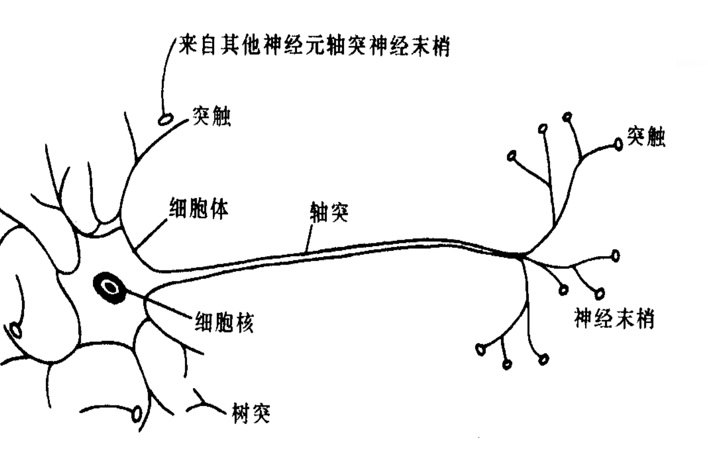
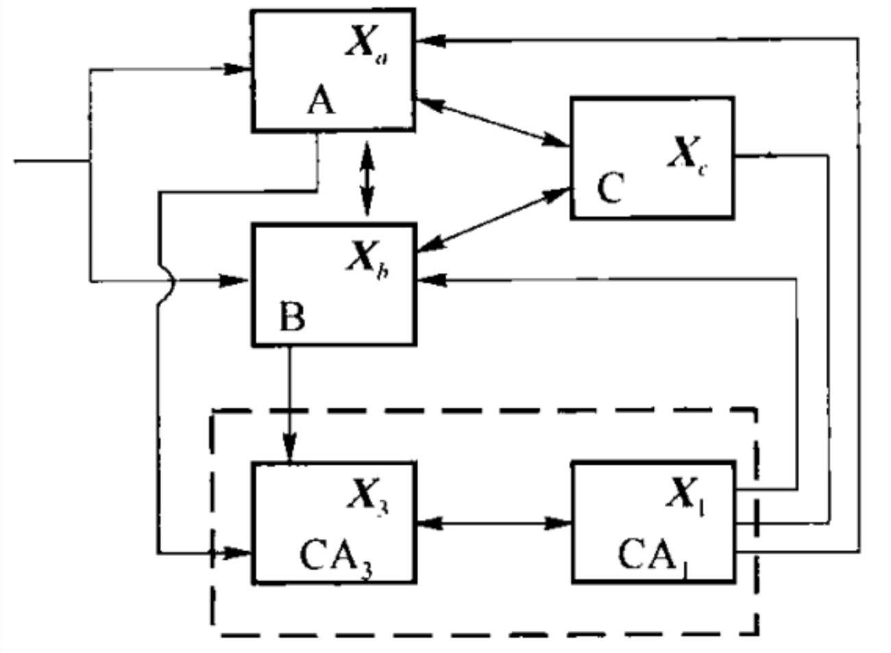
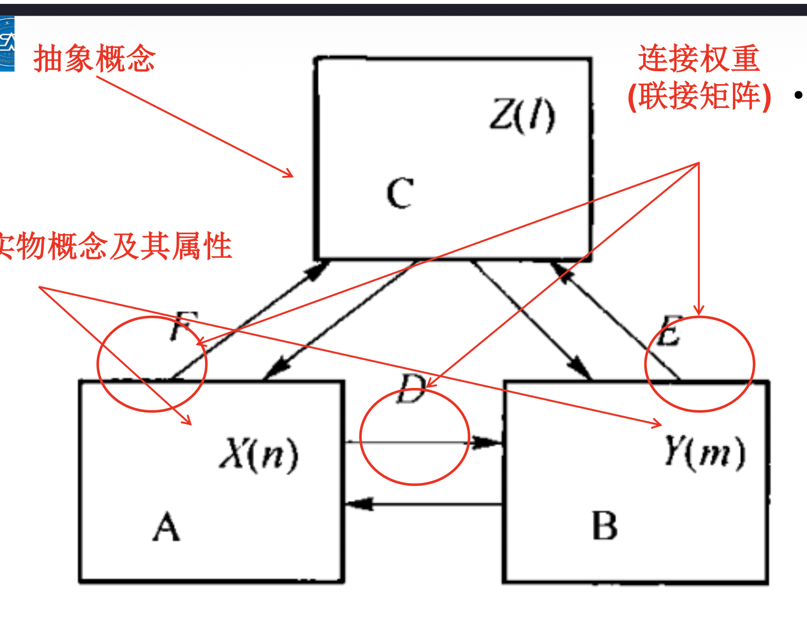

# 人工大脑

## 人工大脑概述

### 人工大脑的基本概念

*   **定义与背景**
    *   大脑复杂性：大脑是结构与机能极其复杂的系统，脑科学旨在破解智力起源与意识本质。
    *   人工大脑：是人脑（或动物脑）的模型、延伸和扩展，是具有人脑现象、行为、特性和功能的人造系统。代表了人造器官的最高水平。
    *   科技发展阶段：人类社会发展分为**机械化、电气化、自动化、计算机化、网络化、先进自动化、智能化和知识化**8个阶段。
    *   当前定位：现在我们所处的先进自动化阶段已经发展到趋近顶峰，下一个阶段智能社会开始逐步进入人们的视野。人工智能是智能化社会的标志，而人工大脑可以说是人工智能领域的一个具体应用。人工智能是智能化社会的标志，人工大脑是人工智能的具体应用之一。

*   **蓝脑计划**
    *   **发起者**：瑞士洛桑综合理工学院亨利·马克拉姆教授，获瑞士政府、欧盟及IBM支持。
    *   **目标**：通过在神经元层次上模拟大脑行为（逆向工程），复制人类大脑，旨在治疗阿尔茨海默氏症和帕金森氏症，并制造出能“思考”的机器。
    *   **技术手段**：使用拥有1万个处理器的IBM“蓝色基因”超级计算机模拟。
    *   **进展**：
        *   初始目标模拟老鼠新大脑皮层单元（1万神经元、3千万突触）。
        *   2015年：论文登上《Cell》封面，模拟了含有207种亚型的大鼠神经网络（3.1万神经元，3700万突触）。
        *   2018年：推出首张小鼠大脑数字3D图谱。
        *   原定“10年内模拟人脑”的计划未能如期实现。

*   **碳纳米管人工大脑**
    *   **研究方**：加利福尼亚南部大学（艾丽斯·帕克教授）。
    *   **技术核心**：利用碳纳米管（极小碳分子结构）制造神经键（突触）电路。
    *   **现状**：已构建出呈现神经元机能的电路，属于“必不可少的第一步”。
    *   **挑战**：如何复制大脑的可塑性；构建包含1000亿神经元的人工大脑工程浩大，可能需数十年。

### 人工大脑的分类

*   **按实现方式分类**
    1.  **类似生命的模型**：系统具有类似生命系统胚胎发育的功能，结构和组成单元能变化形成复杂系统。
    2.  **社会模型**：系统视为动态过程，局部单元连接使全局功能突现，全局状态也影响局部单元。
    3.  **传统模型**：包括人工神经网络（ANN）等神经系统学习模型。

*   **按人造方法和技术分类**
    1.  **生物人工脑（BAB）**：使用克隆、转基因等生物技术生成（如“人工羊”多莉的脑）。
    2.  **工程人工脑（EAB）**：使用计算机软件、光电硬件等工程技术制造（如ART的“细胞自动机—仿脑机”）。
    3.  **生物工程人工脑（BEAB）**：结合生物与工程方法。

*   **按工程实现方法分类**
    1.  **基于神经工程（NE）**：基于人工神经网络（ANN），由并行处理单元组成，构成神经计算机。
    2.  **基于AI**：采用启发式算法（HA）、专家系统（ES）、通用问题求解（GPS）等，从功能上模拟人脑（构建规则知识库）。
    3.  **基于超级计算机**：利用超级计算机的算力（如1997年击败卡斯帕罗夫的“深蓝”），但缺乏自我学习和直观获得知识的能力。

## 人工大脑相关数学模型

### 大脑的统一模型

*   **大脑网络层次**
    *   **7个层次**：分子、神经元、神经元群、神经网络、大脑皮层、功能分区、神经枢。
    *   **3种网络类型**：
        *   **结构性网络**：基于解剖学，由突触电/化学连接构成。
        *   **功能性网络**：描述神经元集群统计性连接关系，**无向网络**。
        *   **效用性网络**：描述节点间非线性动力学影响及信息流向，**有向网络**。

*   **大脑机能联合区**
    任何心理活动都需四个联合区参与：
    1.  保证、调节紧张度和觉醒状态。
    2.  接受、加工和存储信息。
    3.  制定程序、调节控制心理活动和行为。
    4.  评估信息和产生情绪体验。

*   **信息处理机制（统一模型）**
    1.  **信息融合机制**：外部信息传入大脑，在意识作用下分类、综合、抽象形成概念并存储。
    2.  **信息加工机制**：
        *   **脑波**：α（安静）、β（兴奋）、θ（困倦）、δ（睡眠）。
        *   **加工模式**：受控加工（有注意参与）与自动加工（无注意参与），两者可相互转换。其中，受控加工模式是受控制的、有注意参与的加工模式，自动加工模式是不受控制的、不需要注意参与的加工模式。同时，这两种加工模式又可以相互转变。
    3.  **决策机制**：
        *   引入阈值概念。
        *   **注意/受控模式**：激发区域激活能量 > 阈值 -> 进入有意识状态。
        *   **非注意/自动模式**：激活能量 < 阈值 -> 进入无意识状态（并行系统处理熟悉任务）。
    4.  **输出机制**：动作和表情通常是混合体，既有有意识成分（如瞄准靶心），也有无意识成分（如肌肉调整）。

### 神经元模型

*   **生物神经元结构**：基本单位，特化于信息传递。
    *   **胞体**：提供物质和能量。
    *   **轴突**：传出信息。
    *   **树突**：收集和接受信息。
    *   **突触**：信息转换关键部位。
*   **人工神经元**：模拟生物神经元，是建立神经网络的基础。

### 感知模型

*   **感知机**：20世纪50年代末Rosenblatt提出。
*   **结构**：三层（感知层输入 -> 联合层 -> 决策层输出）。
*   **特点**：部分模拟脑结构。
*   **连接**：感知层与联合层连接随机；联合层与输出层连接可塑（通过学习改变）。
*   **功能**：通过“示教”学会分类事物。

### 记忆模型

*   **记忆的分类**
    *   **感觉记忆**：保持0.25~4秒，容量大，具有形象性。
    *   **短时记忆**：保持5秒-1分钟，容量有限（5-9个组块），包含工作记忆。
    *   **长时记忆**：保持时间无限，容量无限，是心理活动的知识基础。
*   **神经生理基础**：拉什里的实验显示记忆的保持是整个大脑皮层的机能。“细胞集合”理论：神经细胞间是个庞大而复杂的通路，任何一个神经细胞都无法离开细胞集合单独起效。近年来的研究显示记忆的功能是广泛的神经网络参与下完成的。
    *   **海马**：负责巩固记忆（短时转长时），损伤导致顺行性遗忘；对空间记忆重要。
    *   **杏仁核**：情绪相关记忆。
    *   **前额叶**：前额叶在情景记忆、工作记忆、空间记忆、时间顺序记忆以及记忆的编码、存储和提取中都有重要作用。

*   **短时记忆模型**
    *   **机制**：神经兴奋的电活动造成突触暂时变化；乙酰胆碱等导致后去极化电位（ADP），在脑电振荡下维持发放。
    *   **组块**：利用长时记忆信息，将小单位联合成大单位，提高存储容量。
    *   **指针式神经网络模型**：
        *   **组成**：指针网络（有限环路，存指针）+ 信息内容表达区（多级联想记忆，存内容）。
        *   **原理**：记忆时，内容区兴奋，指针环路依次兴奋并建立突触联系（Hebb律）；回忆时，指针兴奋通过联系激活内容区。

*   **海马记忆功能模型**
    *   **结构**：两级联想记忆模型。皮层区A、B（感觉事件）+ 高级区C（事件全体）。
    *   **海马部分**：CA3对应皮层A、B区，CA1参与处理。
*   
    *   **作用**：作为记忆系统一部分，实现记忆功能的神经网络模拟。

### 学习模型

*   **定义**：系统在重复工作中增强或改进自身能力，使下次执行更好（西蒙观点）。
*   **目的**：使人机“自知”，实现和谐交互。
*   **概率统计模型**：
    *   **事件集**：
        *   $R = \{R_1, ..., R_N\} $：人机行为事件集。
        *   $U = \{U_1, ..., U_M\}$：用户行为事件集。
        *   $W = \{A, B, C\}$：用户反馈（肯定、无反应、否定）。
    *   **概率更新规则**：
        *   肯定（A）：$P(R_i)$ 增加（乘以 $1+0.1$）。
        *   否定（C）：$P(R_i)$ 减少（乘以 $1-0.1$）。
        *   无反应（B）：$P(R_i)$ 不变。
    *   **行为分类**：根据概率大小，将行为分为正向事件集（$P > 1/N$）、一般事件集、负向事件集（$P < 1/N$）。

### 思维模型

*   **定义**：联想、判断、推理和决策等脑功能。
*   **神经活动分类**：有意识（感知外部环境）与无意识（内环境及运动命令）。
*   **多级递阶结构**：基于经济有效原则，利于信息压缩、存储和利用。
*   **两级结构联想记忆神经网络模型（TLAM）**：
    *   **区域**：A、B区（实物概念及属性），C区（抽象概念）。
    *   **连接**：各区间神经元均有突触联系，权重由矩阵D、E、F表示。
    *   **功能**：存储不同抽象程度的概念及其联系，并进行加工。
    

### 情感模型

*   **核心结构**：杏仁核，位于情感回路中心。
*   **传导通路**：
    1.  **下层通道**：感觉刺激 -> 丘脑 -> 杏仁核（快速、粗糙）。
    2.  **上层通道**：感觉刺激 -> 丘脑 -> 感觉皮层（细致加工） -> 杏仁核。
*   **功能机制**：
    *   杏仁核接收不同感觉联合区信息，并投射到下丘、中脑等其他部位,通过这些广泛的投射,杏仁核促进情绪性激活记忆的巩固，因此,杏仁核是大脑中情感学习的主要部位。
    *   情绪性激活反应在杏仁核里是持久的,情绪反应一旦学习，连接难以改变。
    *   前额皮层负责情绪调节（加强、维持或减弱）。杏仁核在学习了情绪反应的同时给海马的神经元一个刺激,让海马得知并记住这个刺激。
    

