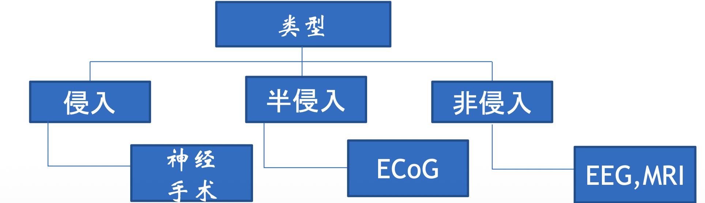

# 脑机接口概述

## 人类大脑与神经成像背景

### 人类大脑的基本特征
*   **物理属性**：体积约1.3升，重量约1.5公斤（占体重2%），功耗约20瓦（占全身20%）。
*   **复杂结构**：
    *   已知宇宙中最复杂的结构之一。
    *   神经元数量约1000亿（NIH数据为860亿）。
    *   每个神经元通过1000-10000根神经纤维连接，神经纤维总数超过100T（万亿）。
    *   脑功能通过大量相互连接的神经元和突触通路形成的动态网络实现。
*   **研究意义**：人类脑研究的重大挑战目标包括神经结构机制、神经退行性疾病（帕金森、阿兹海默症）机理、以及脑损伤（肿瘤、中风）治疗。

### 神经成像技术分类
*   **结构成像**：关注脑部解剖结构。
    *   包括：核磁共振（MRI）、扩散张量成像（DWMRI）、断层成像（CT）。
*   **功能成像**：关注脑部活动和代谢。
    *   包括：功能磁共振（fMRI）、脑电图（EEG）、脑磁图（MEG）、脑皮层电图（ECoG）、功能近红外成像（fNIRS）。

## 脑机接口的基本概念与分类

### 脑机接口（BCI）的定义
*   **定义**：脑机接口是在人或动物脑与外部设备间创建的直接连接通路。
*   **核心机制**：不依赖外周的神经与肌肉组织，直接提取大脑神经信号转换为控制外部设备的命令。

### 脑机接口的分类与对比
根据信号获取方式，脑机接口主要分为侵入式、半侵入式和非侵入式。

*   **非侵入式**
    *   **代表技术**：EEG（脑电图）、fMRI、NIRS。
    *   **EEG原理**：通过头皮电极检测大脑皮层神经元群同步活动产生的电位分布。
    *   **特点**：无创、便携；时间分辨率高（-0.05s），但空间分辨率低（-10mm），信号信噪比相对较低。

*   **侵入式**
    *   **代表技术**：INR（植入式神经记录）。
    *   **原理**：在神经外科手术中将电极直接植入大脑灰质。
    *   **特点**：信号质量最高，空间分辨率极高（SUA可达0.05mm），时间分辨率高；但易引起创伤组织积聚，导致信号变弱或消失，存在手术风险。

*   **半侵入式**
    *   **代表技术**：ECoG（脑皮层电图）。
    *   **原理**：电极嵌入放置于皮层上方、硬脑膜下方的薄塑料垫片上。
    *   **特点**：信号质量优于EEG，空间分辨率（-1mm）和时间分辨率（-0.003s）较好，风险较侵入式低，但仍需开颅手术。

*   **其他成像方法对比**：
    *   **MEG（脑磁图）**：检测神经元活动产生的磁场，定位精准（mm级），追踪脑活动传播，但设备昂贵且不便携。
    *   **fMRI**：基于血氧水平依赖（BOLD）信号，间接反映脑活动，时间分辨率低（~1s），空间分辨率高（~1mm）。
    *   **fNIRS**：通过近红外光检测脑血氧变化，便携但穿透深度有限。

## 脑机接口控制信号

### 常用控制信号类型
脑机通过解码特定的生理现象来获取控制信号，目前主要包括以下四种：

1.  **VEP（视觉诱发电位）**
    *   **原理**：大脑视觉皮层对视觉刺激加工处理的信号。
    *   **特点**：无需训练，传输速率高（60-100 bits/min）。
    *   **应用**：控制飞行器方向、电话拨号系统。

2.  **SCP（慢皮质电位）**
    *   **原理**：大脑信号中缓慢的电压变化。
    *   **特点**：需要长期训练，传输速率较低（5-12 bits/min）。
    *   **应用**：肌萎缩侧索硬化症（ALS）患者的思维翻译工具、光标击中控制。

3.  **P300**
    *   **原理**：在相关（罕见）刺激事件出现后约300ms出现的一个正向电位峰值。
    *   **特点**：无需训练，依赖于“Oddball”范式（小概率刺激），传输速率中等（20-25 bits/min）。
    *   **应用**：虚拟打字系统（通过注视闪烁光标）、机械臂控制。

4.  **SMR（感觉运动节律）**
    *   **原理**：与运动行为同步的节律变化，涉及事件相关去同步化（ERD）和同步化（ERS）。
    *   **特点**：需要训练，通过想象肢体运动（如想象左右手运动）来调节节律。
    *   **应用**：广泛应用于运动想象BCI系统（如Wadsworth, Berlin, Graz系统）。

## 脑机接口的发展历史与里程碑

### 关键历史节点
*   **1924年**：Hans Berger发现EEG（人脑脑电波）。
*   **1969年**：华盛顿大学利用猴子进行脑电生物反馈研究。
*   **1990年代**：Nicolelis实现提取夜猴皮层运动神经元信号控制机器人手臂。
*   **1999年**：哈佛大学Garrett Stanley解码猫丘脑神经元信号重建视觉图像。
*   **2000年后**：Donoghue小组实现恒河猴通过脑电控制屏幕光标追踪目标。
*   **2009年**：USC Theodore Berger小组研制出模拟海马体功能的神经芯片（大鼠实验）。
*   **2014年**：
    *   巴西世界杯，截瘫患者通过脑机接口外骨骼开球。
    *   华盛顿大学实现首例直接脑对脑交流（通过网络传输脑电）。
*   **2016年**：明尼苏达大学Bin He团队实现非侵入式（意念）控制三维空间内的机械臂抓取和飞行器飞行。
*   **2017年**：斯坦福大学实现瘫痪患者通过“意念”在屏幕上高速输入文字（39个字母/分钟）。

## 脑机接口的商业化与应用

### 主要商业化方向
1.  **医疗健康（核心领域）**
    *   **恢复方向**：针对多动症、中风、癫痫、瘫痪的神经反馈训练和康复。应用较广，已有可穿戴设备。
    *   **强化方向**：植入芯片以增强记忆、连接AI（人类增强 HI）。代表公司有Neuralink, Kernel。难度高，主要在军用阶段。
    *   **保健方向**：冥想减压，通过实时脑波音频反馈提升效果。
2.  **VR/AR交互**
    *   提升交互体验，用意念控制菜单导航和选项，替代语音和手势。代表公司：MindMaze。
3.  **教育科技**
    *   实时探测学生注意力值，辅助教师调整教学。代表公司：BrainCo。
4.  **智能家居**
    *   结合IoT，用意念控制灯光、门、窗帘及服务机器人。

### 市场规模与投资
*   **狭义市场**（BCI设备）：预计5年内达25亿美元。
*   **广义市场**（影响领域）：预计5年内达数千亿美元（涵盖ADHD治疗、大脑检测、教育科技、游戏等）。
*   **投资大事记**：Neuralink (Elon Musk)、Kernel (Bryan Johnson)、BrainCo、陈天桥加州理工学院捐赠等。

## 脑机接口面临的挑战与未来

### 主要挑战
1.  **带宽问题**
    *   目前可同时记录的神经元数量翻倍速度较慢（平均7.4年）。
    *   预计要到2100年才能记录100万个神经元，2225年记录所有神经元（1000亿）。
    *   提高信号采集通道数和带宽是关键技术瓶颈。
2.  **双向交互难题**
    *   **从脑到机（读）**：如何准确捕获大脑的输出信号。
    *   **从机到脑（写）**：如何将信息精准输入大脑或刺激神经元（涉及神经编码和伦理）。

### 未来展望
*   脑机接口操作系统可能成为继PC、移动端、语音之后的下一代人机交互系统。
*   跨学科融合：解决工程上（植入材料、微型化）和理论上（神经解码算法）的双重挑战。
