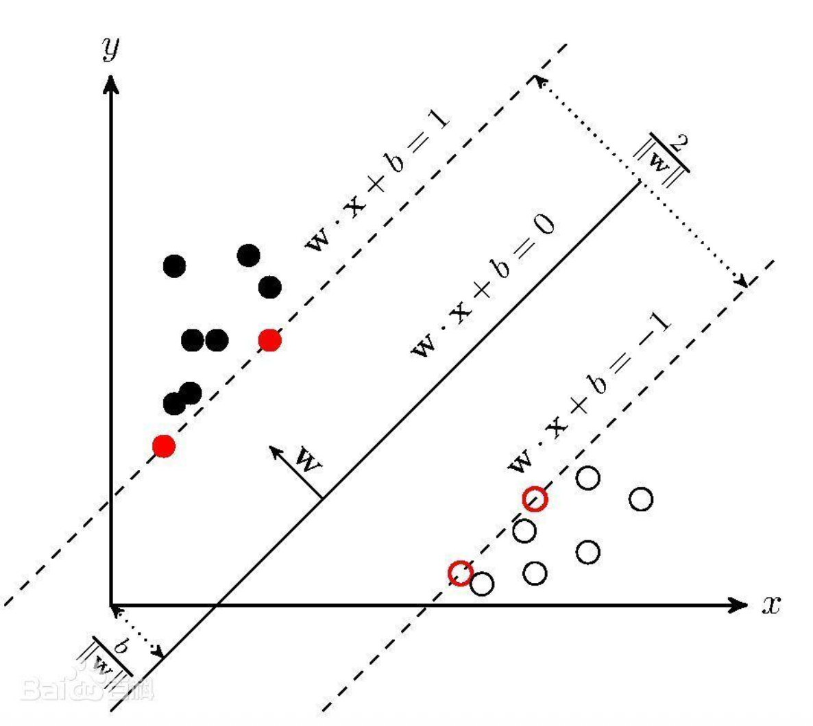
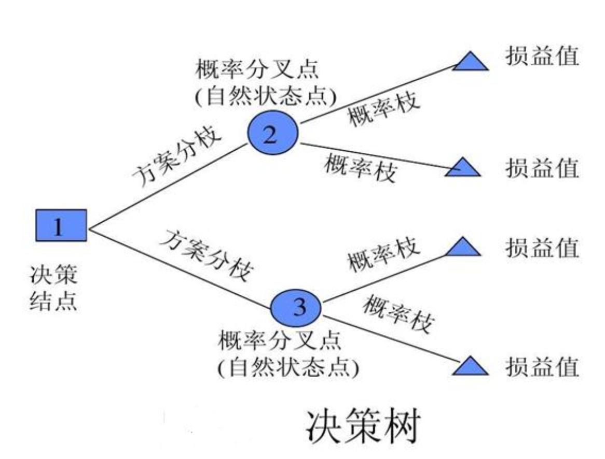
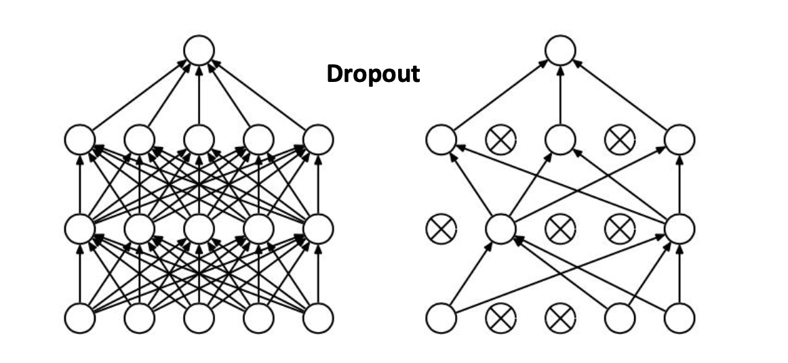
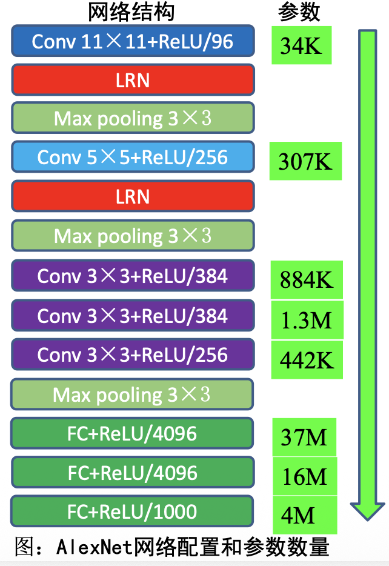

# 目标分类 Image Classification

## 一、目标分类概述

### 1.1 目标分类的定义
- 目标分类（Classification）：将图像结构化为某一类别的信息，用事先确定好的类别来描述图片，解决图中内容是什么的问题。


### 1.2 传统目标分类总体框架
- 传统目标分类主要包含以下几个阶段：预处理、特征选择和提取、建模、匹配。


#### 1.2.1 预处理
- 预处理是尽可能在不改变图像承载的本质信息的前提下，使得每张图像的表观特性（如**颜色分布、整体明暗、尺寸大小**等）尽可能的一致，有利于之后的处理过程。
- 预处理通常包括三种基本运算：
  1. 格式转换：统一格式，实现模式的有效描述，适合下一步的运算。
  2. 滤波运算：凸显一些特征，抑制一些特征。
  3. 归一化（正则化）：规范数值范围。

#### 1.2.2 特征提取
- 由图像或波形所获得的数据量是相当大的。为了有效地实现分类识别，就要对原始数据进行变换，得到最能反映分类本质的特征。
- 特征提取方法：
  1. 颜色特征：颜色特征描述了图像或图像区域所对应的景物的表面性质，常用的颜色特征有颜色通道直方图特征等。
  2. 纹理特征：图像的某种局部性质，比如水平纹理等。
  3. 形状特征：形状是刻画物体的基本特征之一，用形状特征区别物体非常直观，形状特征分析在模式识别和视觉检测中具有重要的作用。
  4. 空间特征：空间特征是指图像中分割出来的多个目标之间的相互的空间位置。

### 1.3 传统目标分类方法

#### 1.3.1 支持向量机（SVM）
- SVM是一种二分类模型，它的目的是寻找一个超平面对样本进行分割，分割的原则是间隔最大化，最终转化为一个凸二次规划问题来求解。


#### 1.3.2 KNN (K-Nearest Neighbor)
- KNN（K最近邻）就是K个最近邻居的意思，说的是每个样本都可以用它最接近的K个邻近值来代表。
- KNN分类算法步骤：
  1. 准备数据，对数据进行预处理。
  2. 计算测试样本点（也就是待分类点）到其它每个样本点的距离。
  3. 对每个距离进行排序，然后选择出距离最小的K个点。
  4. 对K个点所属的类别进行比较，根据少数服从多数的原则，将测试样本点归入在K个点中占比最高的那一类。


#### 决策树（Decision Tree）
- 决策树是一种依托于策略抉择而建立起来的树。机器学习中，决策树是一个预测模型，它代表的是对象属性与对象值之间的一种映射关系。
- 树中每个节点表示某个对象，而每个分叉路径则代表的某个可能的属性值，从根节点到叶节点所经历的路径对应一个判定测试序列。


## 二、经典目标分类网络

### 2.1 卷积神经网络发展


**左侧：早期背景（Neocognitron → LeCun → LeNet）**
+ Neocognitron（1980s，早期受生物启发模型）
首个提出“层级、局部感受野、特征池化”概念的模型，为 CNN 思想打基础。
+ LeCun1989 / LeNet（1990s）
经典的卷积 + 池化 + 全连接结构，被用于手写数字识别（MNIST）。这条线说明：现代 CNN 的思想有历史根源，但规模和训练方法还比较浅。

**中心：AlexNet（2012）——历史突破**
+ 为什么重要：在 ImageNet 大规模分类竞赛上大幅领先，标志着深度学习在视觉领域进入实用阶段。
+ 关键技术/因素：
	+ ReLU（非线性激活）：加快训练收敛、缓解梯度衰减。
	+	Dropout（随机失活）：缓解过拟合。
	+	GPU 加速 + 大数据：训练更深、更大的网络成为可能。
	+	更大的模型与数据增强。
	+	图上把 AlexNet 标为“历史突破”，并以它为分叉点，指向后续多个研究方向。


**分支一：网络加深（Deeper Networks）**
+ VGG16 → VGG19
用一系列小卷积核（3×3）堆叠来变深，证明“更深、更统一的卷积堆栈”能提升性能。结构简单、易复现，但参数多、计算量大。
+ MSRANet（图中写法）
图中这里表示微软研究院等提出的一些更深/改进网络（可理解为朝着更深/更复杂结构演进的尝试）。
+ ResNet（残差网络）（图右侧）
通过**残差连接（skip connections）** 解决了更深网络的训练困难（梯度消失/退化问题），允许堆叠成百层甚至上千层。ResNet 是“加深网络”方向的重大突破。
+ Inception-ResNet（结合）
将 Inception 模块（多尺度卷积）与残差连接结合，既利用多尺度特征又获益于残差加速收敛。


**分支二：增强卷积模块功能（模块化设计）**
+ NIN（Network-in-Network）
提出在卷积层中使用小型的“可学习网络”（如 1×1 卷积）来提升非线性表达能力，强调“用更强的局部函数近似代替单纯卷积”。
+ GoogLeNet（Inception v1）
引入 Inception 模块（并行不同大小卷积 + 池化然后拼接），实现多尺度特征融合，参数效率高。GoogLeNet 在 ImageNet 上表现优异，参数比 VGG 少很多。
+ Inception V3 / V4
对 Inception 模块做多轮改进（如分解卷积、更深的 factorization、批量归一化等），进一步提升性能与效率。
+ 这一支线体现的思想是：不是单靠变深，而是设计更强、更高效的模块来提升表示能力。

**网络加深 + 收敛加速” → ResNet / Inception-ResNet**

这部分强调两条重要策略的结合：
1.	把网络做更深（多层）以获得更强表达；
2.	用结构/连接（如残差）加速收敛并保留训练稳定性。

因此 ResNet（残差）和 Inception-ResNet（把两个思想结合）成为后来热门的设计模式。

**分支三：从分类任务到检测任务（目标检测发展）**
+ R-CNN（Region-based CNN） 和 SPP-Net（Spatial Pyramid Pooling）
  + R-CNN：先用外部算法（Selective Search）生成候选区域（region proposals），对每个候选区域裁剪并用 CNN 分类。昂贵但开创了基于 CNN 的检测路线。
  + SPP-Net：提出 Spatial Pyramid Pooling，解决不同候选框大小输入到固定全连接层的问题，从而加速检测。
+ Fast R-CNN
将整个图像送入 CNN 得到特征图，再在特征图上对每个候选区域做 RoI pooling，显著加速并提高精度。
+ Faster R-CNN
引入 Region Proposal Network (RPN)，用网络自己生成候选框，检测流程端到端，速度和精度都有质的提升。
+ 这条线展示从“把图像分成很多小任务再分类”到“端到端候选框生成与分类”的演变。

**分支四：增加新的功能单元（用于语义分割、对齐、时序等）**
+ Inception V2（图中作为增强模块的延续）
类似前述，是 Inception 系列的另一个改进版本。
+ FCN（Fully Convolutional Network）
把全连接层替换为卷积层，能输出与输入相同空间分辨率的预测，主要用于 语义分割（每像素分类）。
+ STNet（图中写法，实际常见的是 STN — Spatial Transformer Network）
空间变换网络：提供可学习的空间变换（旋转、缩放、平移等）以实现对图像/特征的对齐或变换不变性，提高模型对几何变形的鲁棒性。
+ CNN + RNN / LSTM
将 CNN 用作特征提取器，再用 RNN/LSTM 处理序列信息（例如图像描述生成 caption、视频帧序列分析、OCR 中的序列识别等）。适用于需要时序建模的视觉任务。

### 2.2 LeNet5

- LeNet5是手写字体识别模型，发表于1998年。
- LeNet5通过巧妙的设计，利用卷积、参数共享、池化等操作提取特征，避免了大量的计算成本，最后再使用全连接神经网络进行分类识别。
- LeNet5具备的特点：
  1. 卷积神经网络使用三个层作为一个系列：卷积，池化，非线性。
  2. 使用卷积提取空间特征。
  3. 使用池化技术进行下采样（subsample）。
  4. 使用双曲线（tanh）或S型（sigmoid）形式的非线性激活函数。
  5. 多层神经网络（MLP）作为最后的分类器。
  6. 使用权值共享技术，层与层之间进行局部稀疏连接，避免大的计算成本。

```python
import torch
import torch.nn as nn

class LeNet(nn.Module):
    def __init__(self):
        super().__init__()
        self.conv = nn.Sequential(
            nn.Conv2d(1, 6, 5),       # ⭐ 引入卷积层
            nn.Tanh(),
            nn.AvgPool2d(2),          # ⭐ 引入池化
            nn.Conv2d(6, 16, 5),
            nn.Tanh(),
            nn.AvgPool2d(2)
        )
        self.fc = nn.Sequential(
            nn.Linear(16*5*5, 120),
            nn.Tanh(),
            nn.Linear(120, 84),
            nn.Tanh(),
            nn.Linear(84, 10)
        )

    def forward(self, x):
        x = self.conv(x)
        return self.fc(x.view(x.size(0), -1))
```
### 2.3 AlexNet

- AlexNet在LeNet基础上进行了更宽更深的网络设计，首次在CNN中引入了**ReLU、Dropout和Local Response Norm (LRN)** 等技巧。
- 技术特点：
  - 使用ReLU（Rectified Linear Units）作为CNN的激活函数，解决了Sigmoid在网络较深时的梯度弥散问题。
  - **为避免过拟合，训练时前两个全连接层使用Dropout，随机忽略一部分神经元。**
  
  - 使用重叠的**最大池化**(max pooling)，避免平均池化的模糊化效果。
  - 提出了**LRN层（卷积之后进行归一化处理）**，对局部神经元的活动创建竞争机制。
  - 数据增强：利用**随机裁剪和镜像翻转操作**增加训练数据量，降低过拟合。
  - 利用GPU强大的并行计算能力加速网络训练过程，并采用GPU分块训练的方式解决显存对网络规模的限制。
  

```python
class AlexNet(nn.Module):
    def __init__(self):
        super().__init__()
        self.conv = nn.Sequential(
            nn.Conv2d(3, 64, 11, 4, 2),
            nn.ReLU(),                 # ⭐ ReLU，大幅加速训练
            nn.MaxPool2d(3, 2),
            nn.Conv2d(64, 192, 5, padding=2),
            nn.ReLU(),
            nn.MaxPool2d(3, 2),
            nn.Conv2d(192, 384, 3, padding=1),
            nn.ReLU(),
            nn.Conv2d(384, 256, 3, padding=1),
            nn.ReLU(),
            nn.Conv2d(256, 256, 3, padding=1),
            nn.ReLU(),
            nn.MaxPool2d(3, 2)
        )
        self.fc = nn.Sequential(
            nn.Dropout(),              # ⭐ Dropout 防过拟合
            nn.Linear(256*6*6, 4096),
            nn.ReLU(),
            nn.Dropout(),
            nn.Linear(4096, 4096),
            nn.ReLU(),
            nn.Linear(4096, 1000)
        )

    def forward(self, x):
        x = self.conv(x)
        return self.fc(x.view(x.size(0), -1))
```

**随机裁剪有什么作用？**
+ 数据增强：对原始图像（如图中的猫）随机裁剪不同区域，生成多样的训练样本，间接扩大数据集规模，为模型提供更丰富的视觉输入。
+ 提升泛化能力：让模型在训练中学习到目标在不同位置、不同局部的特征，避免对图像布局的过度依赖，从而在测试时能适应目标位置的变化，有效缓解过拟合。
+ 增强特征鲁棒性：迫使模型聚焦目标的核心特征（如猫的形态、纹理），而非背景或边缘的次要信息，使学到的特征更具通用性，即使目标在图像中位置改变，也能稳定识别。


**卷积的参数量**：
> 参数量=卷积长✖️卷积宽✖️Cin(输入通道数)✖️Cout(卷积核个数)


### 2.4 Network in Network (NiN)
- NiN使用较少参数就取得了AlexNet的效果（参数大小为230M，而NiN仅为29M）。
- 主要创新点：
  1. MLP Convolution Layers：在常规卷积后接若干1x1卷积，增强网络抽象能力。所谓MLPConv其实就是在常规卷积（感受野大于1的）后接若干1x1卷积，输入的每个特征图视为一个神经元，特征图通过1x1卷积就类似多个神经元线性组合，这样就像是MLP（多层感知机）。该网络相对于普通卷积层（感受视野大于1 ）的抽象能力得以增强。
  

  2. Global Average Pooling：NiN最后使用全局平均值池化，然后全连接，因为没有参数，可以避免产生过拟合，同时可以对空间信息进行汇总，因此对输入的空间转换具有更强的鲁棒性。替代全连接层效果：减少参数数量，减少计算量，减少过拟合。

```python
class NIN(nn.Module):
    def __init__(self):
        super().__init__()
        self.model = nn.Sequential(
            nn.Conv2d(3, 192, 5, padding=2),
            nn.ReLU(),
            nn.Conv2d(192, 160, 1),  # ⭐ 1×1卷积增强非线性
            nn.ReLU(),
            nn.Conv2d(160, 96, 1),
            nn.ReLU(),
        )

    def forward(self, x):
        return self.model(x)
```
### 2.5 VGGNet
- VGGNet探索了卷积神经网络的深度和其性能之间的关系，通过反复的堆叠`3*3`的小型卷积核和`2*2`的最大池化层，成功的构建了16~19层深的卷积神经网络。

- 结构特点：
  - 网络包含5组卷积操作，每组包含1-4个连续的卷积层，每两个卷积层之间为ReLU层。
  - 不同级别的网络层数逐渐加深，网络的表达能力也逐渐增强。
  - 对卷积核和池化大小进行了统一，网络中进行3×3的卷积操作和2×2的最大池化操作。
  - 采用卷积层堆叠的策略，将多个连续的卷积层构成卷积层组。
  - 和单个卷积层相比，卷积组可以提高感受野范围，增强网络的学习能力和特征表达能力；和具有较大核相比，采用多个具有小卷积核的卷积层串联的方式能够减少网络参数。
  - 在前两个全连接层中使用dropout技术
- 训练和测试：
  - 多尺度策略：训练阶段，将图像缩放到不同尺寸S，并随机裁剪224×224的训练样本；测试阶段，将图像缩放到尺寸Q，并对网络最后的卷积层使用滑动窗口进行分类预测，对不同窗口的分类结果取平均。

```python
class VGGBlock(nn.Module):
    def __init__(self, in_ch, out_ch, n_convs):
        super().__init__()
        layers = []
        for _ in range(n_convs):
            layers += [
                nn.Conv2d(in_ch, out_ch, 3, padding=1),
                nn.ReLU()               # ⭐ 小卷积 + 堆叠
            ]
            in_ch = out_ch
        layers.append(nn.MaxPool2d(2))
        self.block = nn.Sequential(*layers)

    def forward(self, x):
        return self.block(x)


class VGG16(nn.Module):
    def __init__(self):
        super().__init__()
        self.features = nn.Sequential(
            VGGBlock(3, 64, 2),
            VGGBlock(64, 128, 2),
            VGGBlock(128, 256, 3),
            VGGBlock(256, 512, 3),
            VGGBlock(512, 512, 3)
        )
        self.classifier = nn.Sequential(
            nn.Linear(512*7*7, 4096),
            nn.ReLU(),
            nn.Linear(4096, 4096),
            nn.ReLU(),
            nn.Linear(4096, 1000)
        )

    def forward(self, x):
        x = self.features(x)
        return self.classifier(x.view(x.size(0), -1))

```
### 2.6 GoogleNet :  从Inception V1到V4
Google Inception Net首次出现在ILSVRC2014的比赛中（和VGG同年），就以较大优势取得第一名，具体内容发表于CVPR 2015的《Going deeperwith convolutions》，指的就是Inception V1版本。

最大特点是控制了计算量和参数的同时，获得了非常好的分类性能，top-5错误率为6.67%，只有AlexNet的一半不到。

早期的V1 结构借鉴了NiN的设计思路，对网络中的传统卷积层进行修改，一直不断改进延伸到 V4，解决限制深度神经网络性能的主要问题：
+ 参数空间大，容易过拟合，且训练数据集有限；
+ 网络结构复杂，计算资源不足，导致难以应用；
+ 深层次网络结构容易出现梯度弥散，模型性能下降。

GoogleNet（Inception V1）共包括22个权重层，首次提出使用较为复杂的多分支网络模块搭建网络。网络的基本构建块是“Inception模块”。该模块的中心思想是将所有基本处理块（发生在常规顺序卷积网络中）并行放置并组合它们的输出特征表示。这样设计的好处是可以将多个Inception模块堆叠在一起以创建一个巨大的网络，而无需担心网络不同阶段的每个单独层的设计。这一模式引领了后续研究中网络搭建的主流模式。

#### 2.6.1 Inception Module 结构图


+ 经典的Inception模块的基本结构有四个分支：
  + 第一个分支对输入进行`1*1`的卷积。提取细粒度的局部特征，同时可通过调整输出通道数实现 “降维 / 升维”，减少后续计算量。
  + 第二个分支先使用`1*1`卷积进行降维，然后连接`3*3`卷积，提取中等感受野的特征，`1×1`卷积先压缩通道数，降低`3×3`卷积的计算成本。
  + 第三个分支先使用`1*1`卷积进行降维，然后连接`5*5`卷积,提取大感受野的特征，同样通过`1×1`卷积减少`5×5`卷积的计算量。
  + 第四个分支是`3*3`最大池化（步长为1）后直接使用`1*1`卷积。保留全局上下文信息，1×1卷积压缩通道数，与其他分支维度匹配。

最后沿深度进行特征串接，将这些不同的互补特征组合在一起以获得更有用的特征表示。“**沿深度进行特征串接**”指的是在“通道维度”上拼接多个分支的输出特征图。假设四个分支的输出特征图形状分别为 $H \times W \times C_1$、$H \times W \times C_2$、$H \times W \times C_3$、$H \times W \times C_4$（其中 $H$ 是高度，$W$ 是宽度，$C$ 是通道数）；串接后，特征图的形状会变为 $H \times W \times (C_1 + C_2 + C_3 + C_4)$即通道数是各分支通道数的总和，高度和宽度保持不变。这种操作的核心是融合多分支提取的不同尺度、不同类型的特征，让网络同时具备细粒度细节和全局上下文的表达能力。

#### 2.6.2 Inception V1
Inception V1最大的改变就是设计Inception模块叠加的形式构造网络。通过9个Inception模块堆叠在一起。注意：每个Inception模块中每个层的滤波器数量是不同的，属于超参。

Inception模块将`1x1`，`3x3`，`5x5`的卷积和`3x3`的池化堆叠在一起，主要特点是提高了网络内部计算资源的利用率，一方面增加了网络的宽度，另一方面各分支的感受野不同，增加了网络对多尺度的适应性。

**参数少效果好的原因：** 
1. 去除最外层的全连接层，用**全局平均池化层**。该层提供更快的计算，具有更好的分类准确性和更少的参数数量。
2. 另一个直观特征是中间层中的多个输出分支的可用性。从初始层扩展的分类分支，能够通过各个路径将强反馈信号传递到初始层，有效避免梯度消失问题。
3. Inception V1还在全连接层之前，对每个输出分支**使用dropout技术**进行正则化。

**问题：Inception V1网络的缺点？** 答：每个分支的滤波器（卷积核）个数是超参。

#### 2.6.3 Inception V2 
Inception V2 借鉴了VGG 用两个`3*3`的卷积代替`5*5`的大卷积的方法，在降低参数的同时建立了更多的非线性变换，使得CNN 对特征的学习能力更强：


Inception V2提出了著名的 **Batch Normalization**（以下简称BN）方法。


#### 2.6.4 Batch Normalization方法
BN 是一个非常有效的正则化方法，可以让大型卷积网络的训练速度加快很多倍，同时收敛后的分类准确率也可以得到大幅提高。BN 在用于神经网络某层时，会对每一个 mini-batch 数据的内部进行标准化（normalization）处理，使输出规范化到 N(0,1) 的正态分布，减少了内部神经元数据分布的改变。BN 起到了正则化的作用，所以可以减少或者取消 Dropout 和 LRN，简化网络结构。


**Batch Normalization算法原理**
深层神经网络存在的问题(从当前层的输入分布来分析)：在深层神经网络中，中间层的输入是前一层神经网络的输出。因此，之前层的神经网络参数的变化会导致当前层输入的分布发生较大的差异。在使用随机梯度下降法来训练神经网络时，每次参数更新都会导致网络中每层的输入分布发生变化。越是深层的神经网络，其输入的分布会改变的越明显。

**解决方法(归一化操作)**：从机器学习角度来看，如果某层的输入分布发生了变化，那么其参数需要重新学习，这种现象称为内部协变量偏移。为了解决内部协变量偏移问题，就要使得每一层神经网络输入的分布在训练过程中要保持一致。最简单的方法是对每一层神经网络都进行归一化操作，使其分布保持稳定。


BN是由Google于2015年提出，这是一个深度神经网络训练的技巧，它不仅可以加快模型的收敛速度，而且更重要的是在一定程度缓解了深层网络中“梯度弥散”的问题，从而使得训练深层网络模型更加容易和稳定。


如上图所示，每层BN步骤主要分为4步：
1. 求每一个训练批次数据的均值；
2. 求每一个训练批次数据的方差；
3. 使用求得的均值和方差对该批次的训练数据做归一化，获得0-1分布。其中ε是为了避免除数为0时所使用的微小正数；
4. 尺度变换和偏移：将xi乘以γ调整数值大小，再加上β增加偏移后得到yi，这里的γ是尺度因子，β是平移因子，由网络学习，保证在归一化之后的非线性特征。


#### 2.6.5 Inception V3 
V3引入了 **Factorization into small convolutions** （小卷积因子分解）的思想，将一个较大的二维卷积拆成两个较小的一维卷积，比如将`7*7`卷积拆成`1*7`卷积和`7*1`卷积，或者将`3*3`卷积拆成`1*3`卷积和`3*1`卷积，如下图所示。


引入了 Factorization into small convolutions 的思想的好处：
1. 节约了大量参数，加速运算并减轻了过拟合；
2. 增加了一层非线性扩展模型表达能力；
3. 这种非对称的卷积结构拆分，其结果比对称地拆为几个相同的小卷积核效果更明显，可以处理更多、更丰富的空间特征，增加特征多样性。


Inception V3 还优化了 Inception Module 的结构，现在 Inception Module 有`35*35`、`17*17`和`8*8`三种不同结构。这些 Inception Module 只在网络的后部出现，前部还是普通的卷积层。并且 Inception V3 除了在 Inception Module 中使用分支，还在分支中使用了分支（`8*8`的结构中）。最终取得 top-5 错误率 3.5%。


在卷积神经网络的结构中，“**网络的前部**” 和 “**后部**” 是基于特征提取的阶段和特征图的抽象程度来划分的：
+ 网络前部：靠近输入层，负责提取低级、基础的视觉特征（如边缘、纹理），通常使用普通卷积层即可高效完成。
+ 网络后部：靠近输出层，负责整合高级、语义化的特征（如物体类别、全局结构），需要更复杂的模块来处理特征的多尺度融合与抽象。


#### 2.6.6 Inception V4
Inception V4 相比 V3 主要是结合了微软的 ResNet，将错误率进一步减少到3.08%。


#### 2.6.7 Inception 各版本对比总结
| 版本 | 算法创新（核心改进） | Test Error |
|------|-----------------------------|------------|
| **Inception V1** | • 多分支结构：1×1、3×3、5×5 卷积 + 3×3 pooling<br>• 使用 MLPConv、全局平均池化<br>• 扩宽网络、提升多尺度适应性 | **6.67%** |
| **Inception V2** | • 引入 Batch Normalization，替代 Dropout & LRN<br>• 大幅加速训练、提高准确率<br>• 用两个 3×3 卷积替代一个 5×5（减少计算） | **4.8%** |
| **Inception V3** | • 卷积因子化：3×3 → 1×3 + 3×1<br>• 更深层非线性表达能力<br>• 减少参数，加速推理 | **3.5%** |
| **Inception V4** | • Inception Module + Residual Connection 结合（Inception-ResNet）<br>• 加速训练并显著提高性能<br>• 进一步优化模块结构 | **3.08%** |


### 2.7 Residual Neural Net(ResNet)
ResNet(Residual Neural Net)由微软研究院Kaiming He等4名华人提出，通过使用Residual Unit成功训练152层深的神经网络，在ILSVRC 2015比赛中获得了冠军，取得3.57%的错误率，同时参数比VGG少，效果非常突出。发表于论文《Deep Residual Learning for Image Recognition》

#### 2.7.1 残差网络背景

网络变深带来的两个主要问题
+ **梯度消失 / 梯度爆炸（Vanishing / Exploding Gradients）**
  + 随着反向传播层数增加，链式法则会把梯度乘以大量小于 1（或大于 1）的因子，导致梯度趋近 0（或迅速变大），使低层参数更新极慢或不稳定。
  + 直接结果是训练变慢或无法收敛。

+ **退化问题（Degradation / Optimization Difficulty）**
  + 在一定深度之后，增加网络层数反而使得训练误差（training error）上升，即更深的网络无法拟合比浅网络更简单的函数。相应的现象在CIFAR-10和ImageNet都有出现。
  + 这**不是过拟合（overfitting）**——训练误差变差说明优化出了问题：更深网络更难被优化到与浅层模型相当的训练误差。


**为什么会出现退化（直观与数学上的理解）**

**直观理解**
+ 难以优化：更深的网络引入了更多非线性变换、更多参数，优化路径变得复杂，梯度在深层传播时会出现消失或方向上噪声累积，导致 SGD 难以找到好解。
+ 恒等映射困难：对于某些任务，理论上深层模型至少能实现与浅层模型相同的表现（可以把额外层学成恒等映射），但在实际训练中，让若干层“学出恒等映射”对优化器并不容易。

**数学理解**
假设我们希望层堆叠后能实现某个映射 H(x)。传统层直接学习一个映射 H(x)。
+ ResNet 的想法：学习残差函数 F(x) := H(x) - x，于是最终层输出为 y = F(x) + x。
+ 如果最优 H(x) 实际上接近恒等映射（即 H(x) $\approx$ x），那么 F(x) 很容易接近 0，比直接去学习接近恒等映射的 H(x) 更容易（学习“变化”比学习完整映射容易）。
+ 这使得深层网络更容易学习到「不增加损失」或「微小修正」的变换，从而避免退化。


ResNet为了解决不断增加神经网络深度时，出现性能退化(Degradation)的问题，提出使用全等映射，直接前一层输出到后面的思想，实现了对非常深的模型的稳定学习。原因在于残差特征映射通常比在传统架构中学习的无参考映射简单得多。

#### 2.7.2 残差块原理
假定某段神经网络的输入是 x，期望输出是 H(x)，即 H(x) 是期望的复杂潜在映射，但学习难度就比较大；如果我们直接把输入 x 传到输出作为初始结果，通过下图“shortcut connections”（跳跃连接），那么此时我们需要学习的目标就是 F(x)=H(x)-x，于是 ResNet 相当于将学习目标改变了，不再是学习一个完整的输出，而是最优解 H(X) 和全等映射 x 的差值，即残差 F(x)。


#### 2.7.3 两层及三层残差块


两层残差学习单元中包含两个相同输出通道数的`3*3`卷积，因为残差等于目标输出减去输入，即H(x)-x，因此输入和输出维度和尺度要保持一致；三层残差学习单元使用了Network In Network和Inception Net中的`1*1`卷积，并且是在中间`3*3`的卷积前后都是用了`1*1`卷积，有先降维再升维的操作，称为“瓶颈架构”。

#### 2.7.4 残差结构
ResNet与普通直连的卷积神经网络最大的区别：
+ ResNet 有很多旁路的支线将输入直接连到后面的层，使得后面的层可以直接学习残差，这种结构也被称为**快捷连接**。
+ 传统的卷积层或全连接层在信息传递时，或多或少会存在信息丢失、损耗等问题；ResNet通过直接将输入信息绕道传到输出，保护信息的完整性，整个网络则只需要学习输入、输出差别的那一部分，简化学习目标和难度。


首先对输入做了卷积操作，之后包含4个残差块（ResidualBlock）, 最后进行全连接操作以便于进行分类任务，网络构成示意图如下所示。


**ResNet-18网络结构图**


### ResNeXt
- ResNeXt融合了GoogleNet和ResNet设计的优势，可以看作是ResNet网络的升级版。
- 利用残差网络中提出的跳跃式连接，并将它们与Inception模块中的多分支架构相结合。
- 与ResNet的区别：每个分支采用相同的拓扑结构，本质是分组卷积（Group Convolution），通过变量基数（Cardinality）来控制组的数量。
- 优点：网络结构更加模块化，简单明了；需要手动调节的超参数更少，仅需调节基数（cardinality），即分支数；相同的参数，效果更好。

### FractalNet
- FractalNet（分型网络）通过一种分形的结构，达到了类似于教师-学生机制、深度监督的效果。
- 分形设计模块由多个分支组成，每个分支具有不同数量的卷积层，且每一层的输入来自前面所有层的输出。
- 在训练时利用"路径丢弃"策略来实现网络的正则化："局部路径丢弃"和"全局路径丢弃"。

### DenseNet
- DenseNet从特征的角度考虑，通过特征重用和旁路(Bypass)设置达到更好的效果和更少的参数。
- 优点：加强了feature的传递，减轻了梯度消失；加强了特征的重用；一定程度上减少了参数数量。
- Dense Block结构：在传统的卷积神经网络中，如果L层，那么就会有L个连接，但在DenseNet中，会有L(L+1)/2个连接。

### AdderNet
- AdderNet被称为CVPR2020最佳分类网络，主要思想是用加法代替卷积层特征计算的乘法，从而实现减少深度网络的计算。
- 创新：使用加法网络(AdderNets)来交换深度神经网络中的这些大规模乘法，采用L1距离代替欧氏距离，全程不涉及乘法。
- 优点：计算成本更低，更适合在移动设备运行。

## 三、CV 领域常用数据集

### 3.1 数据集介绍

#### 3.1.1 ImageNet 
ImageNet 是深度学习图像识别领域最经典、影响力最大的基准数据集之一。它基于 WordNet 语义体系构建，用于图像分类、目标检测等任务。

主要特点：
+ 1400 多万张图像
+ 2.2 万个类别（WordNet synsets）
+ 每个类别通常含有数百～数千张图
+ 大量图像具有精准的类别标签与物体框标注
+ 被广泛用于训练深度网络（如 AlexNet、VGG、ResNet 等）
+ 应用于分类、检测、定位等多种任务

ImageNet 对计算机视觉的发展具有里程碑意义，尤其是 ILSVRC（ImageNet竞赛） 推动了深度学习模型的大幅进步。


#### 3.1.2 WebVision 

WebVision 是从互联网爬取的**弱标注（noisy labeling）** 大规模数据集，旨在模拟真实世界图像的噪声与不确定性。

主要特点：
+ 数据来自 Google Image 和 Flickr 等自动爬取的网络资源，这意味着标签噪声较大、质量不均、符合真实应用场景
+ 约 1000 个类别（与 ImageNet ILSVRC 2012 类别一致）
+ 240 万+ 张图像
+ 数据噪声远高于 ImageNet，更具“真实环境困难性”
+ 适用于弱监督学习、噪声标签学习、鲁棒性训练

WebVision 很适合研究“模型抗噪能力”、“大规模弱标签训练”等课题。


#### 3.1.3 Open Images 

Open Images 是谷歌发布的超大规模图像数据集，也是世界最大的带目标框标注的数据集 之一。

主要特点：
+ 约 900 万张图像
+ 数千类图像类别
+ 147 万张图像带有检测标注，1460 万个目标框，600 多种类别
+ 标注由专业人员完成，确保质量高
+ 平均每张图像包含 8.4 个目标，场景复杂度高
+ 除检测框外，还包含：
	+ 关系标注（Visual Relationships）
	+ 语义分割
	+ 物体属性等多种标注任务

Open Images 覆盖对象多、标注丰富，是当前最强大的综合视觉数据集之一，常用于检测、分割、多标签分类等任务。


#### 3.1.4 COCO （Microsoft COCO）

COCO（Common Objects in Context） 是当前应用最广的目标检测/实例分割数据集之一。

特点：
+ 33 万张图像
+ 80 类常见物体
+ 超过 250 万个实例标注
+ 支持 目标检测、实例分割、关键点检测（人体姿态）、字幕生成
+ 样本场景复杂，包含大量遮挡、密集目标

**COCO 是检测与分割任务的首选标准数据集。**


#### 3.1.5 PASCAL VOC 

PASCAL VOC 是较早的检测和分割标准数据集，是 COCO 出现前的主流基准。

特点：
+ VOC 2007/2012 最常用
+ 包含 2 万张图像
+ 20 个物体类别
+ 提供分类、检测、分割、动作识别等标注
+ 规模不大，但仍常用于快速实验与模型对比


#### 3.1.6 CIFAR （CIFAR-10 / CIFAR-100）

被广泛用于轻量级模型、学生作业、模型原型设计。

CIFAR-10：
+ 6 万张 32×32 彩色图片
+ 10 个类别

CIFAR-100：
+ 100 个类别
+ 小图像、挑战性小 → 适合测试模型稳定性


#### 3.1.7 MNIST / Fashion-MNIST

经典入门图像数据集，被视为“Hello World”。

MNIST：
+ 7 万张手写数字（0-9）
+ 灰度图（28×28）

Fashion-MNIST：
+ Zalando 发布的服饰图像数据集
+ 相比 MNIST 更具区分性与难度


#### 3.1.8 Places365 / Places2

面向 场景分类 的超大规模数据集。

特点：
+ 180 万张图像
+ 365 种场景类别
+ 包括室内外场景（如厨房、卧室、街道、海滩）

广泛用于场景理解、图像生成、语义分割等任务。


#### 3.1.9 Cityscapes

专注于自动驾驶领域的语义分割任务。

特点：
+ 5000 张高分辨率图片带精细像素标注
+ 2 万张弱标注图像
+ 街景数据来自 50 个欧洲城市
+ 高质量像素级标注，适用于道路场景分割与自动驾驶研究


#### 3.1.10 KITTI

另一大类自动驾驶数据集，涵盖多种任务。

包含：
+ 立体视觉 (Stereo)
+ 光流 (Optical Flow)
+ 3D 目标检测
+ 深度估计
+ 车道线、跟踪等

来自真实道路环境，是 3D 视觉的重要基准。

#### 3.1.11 LFW（Labeled Faces in the Wild）

用于人脸识别的真实场景数据集。

特点：
+ 1.3 万张人脸图像
+ 包含光照、遮挡、表情变化等复杂因素
+ 面向 人脸验证、人脸识别 任务


#### 3.1.12 CelebA / CelebA-HQ

大规模人脸属性学习数据集。

特点：
+ 20 万+ 张人脸
+ 每张图像标注 40 个面部属性（如眼镜、笑容、性别等）
+ CelebA-HQ 提供高质量高清图

常用于GAN生成、属性编辑等任务。


#### 3.1.13 LSUN

针对场景和物体生成任务设计的超大规模数据集。

特点：
+ 百万级图像规模
+ 场景类别：卧室、客厅、教堂等
+ 广泛用于图像生成（如 StyleGAN）训练


#### 数据集类型总结分类

| 任务类别 | 数据集 |
|---------|--------|
| **图像分类** | ImageNet<br>CIFAR-10 / CIFAR-100<br>MNIST / Fashion-MNIST<br>Places365<br>LSUN（部分） |
| **目标检测 / 实例分割** | COCO<br>Open Images<br>PASCAL VOC<br>Cityscapes<br>KITTI（3D 检测） |
| **轻量快速调试** | CIFAR<br>MNIST<br>PASCAL VOC |
| **生成式任务（GAN / 扩散）** | LSUN<br>CelebA / CelebA-HQ<br>ImageNet（常用于生成模型） |
| **自动驾驶** | Cityscapes<br>KITTI<br>Waymo Open Dataset |


