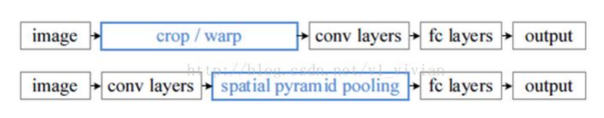
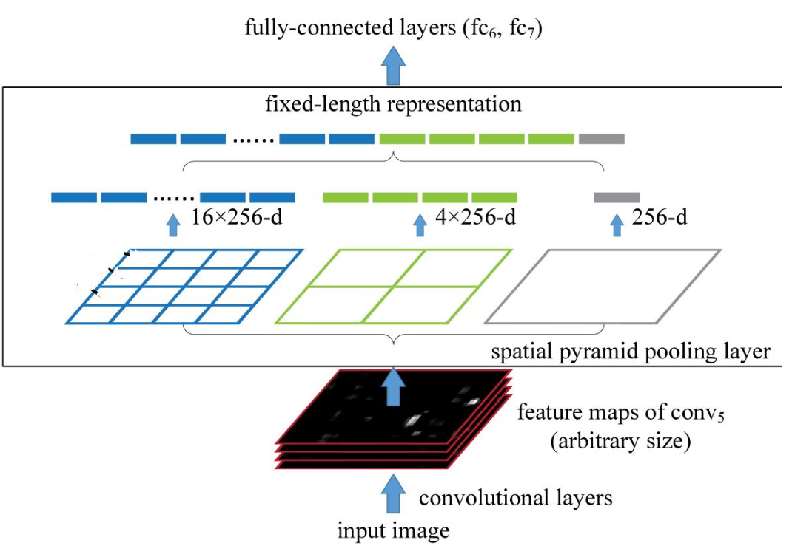
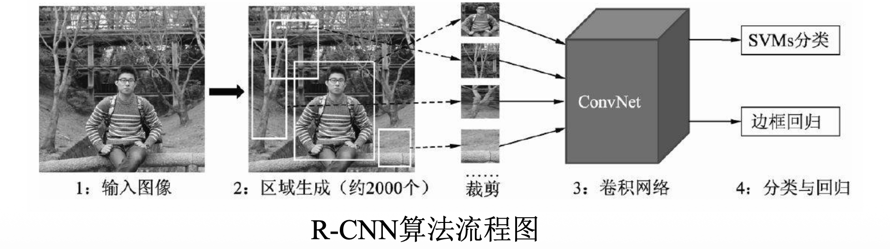
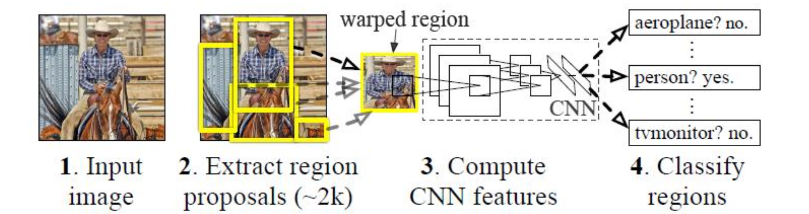
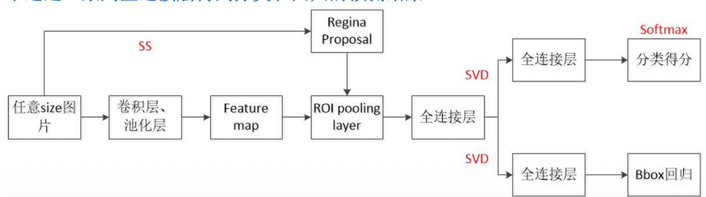
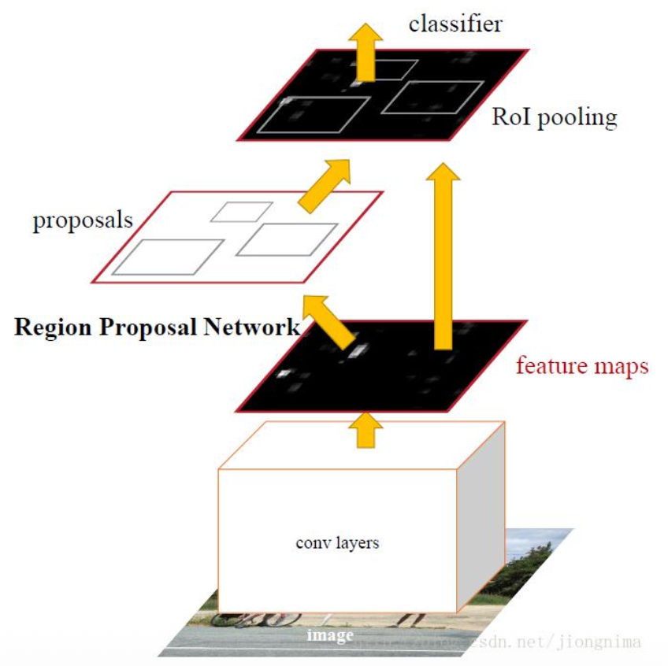
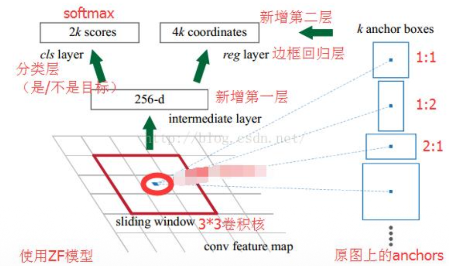
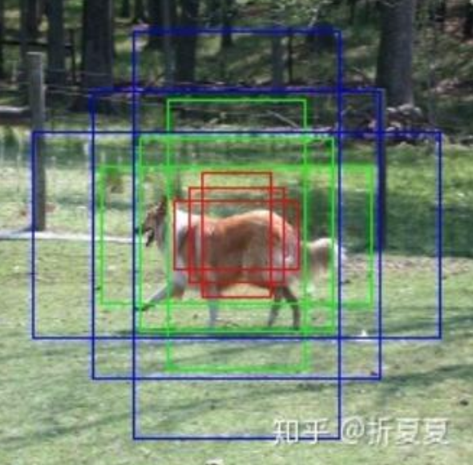
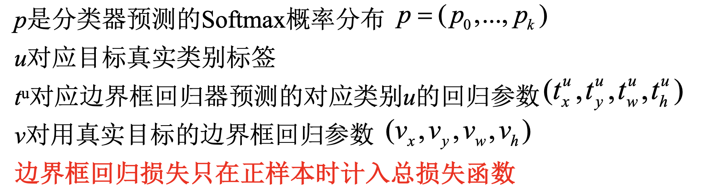

# 目标检测  Object Detection

## 一、引入

### 1.1 目标检测概念
- **任务**：找出图像中所有感兴趣的目标（物体），确定它们的位置和大小，是机器视觉领域的核心问题之一。
- **挑战**：各类物体有不同的外观、形状、姿态，加上成像时光照、遮挡等因素的干扰。
- **应用**：人脸检测（金融支付、刑事鉴定、身份证进站出站等）、交通元素检测、口罩检测等。

### 1.2 目标检测分类

#### 1.2.1 传统的机器学习方法
1. **V-J检测算法**（2001年）：主要用于人脸检测。
2. **HOG + SVM**（2006年）：主要用于行人检测。
3. **DPM算法**（2008年）：传统目标检测的巅峰之作。

#### 1.2.2 基于DL方法
通常分为两大类：
+ 两阶段检测器（Two-Stage Detectors）：最经典的结构是 R-CNN 系列，R-CNN，Fast R-CNN,Faster R-CNN（引入 RPN）,Mask R-CNN（扩展到 instance segmentation）
+ 一阶段检测器（One-Stage Detectors）:代表方法有YOLO 系列（YOLOv1, YOLOv3, v5, v8…），SSD（Single Shot MultiBox Detector）还有RetinaNet（引入 Focal Loss）

**它们最大的差异在于：**

是否先生成候选区域（Region Proposal）再分类。

**两阶段目标检测**1.生成候选区域（Region Proposal）2.对每个候选区域进行分类 & 边界框回归,优点是精度高，因为通过 RPN 或 selective search 得到更精准的候选框，再对每个区域做细粒度分类与回归。对小目标/复杂场景更鲁棒。缺点是速度较慢，pipeline 更复杂，难以满足实时性。

**一阶段目标检测**：直接从图像生成类别 + 边界框，不需要 region proposal，一步输出所有 bounding boxes 和类别得分。优点是速度快，适合实时应用，pipeline 简单。结构更平滑、易部署。缺点是精度相对较低，尤其是在处理小目标、密集目标时（后期 YOLOv7、YOLOv8 + Transformer 已逐渐缩小差距）RetinaNet 提出的 Focal Loss 就是为了解决“正负样本极不平衡”问题，从而提升一阶段精度。

### 1.3 传统目标检测介绍

1. **候选框提取**：通常使用**滑动窗口**方法。
2. **特征提取**：
   - 底层特征：颜色、纹理等手工设计的特征
   - 中层特征：基于学习的特征
   - 高层特征：语义特征
3. **分类器**：使用预训练的分类器对特征进行分类。
4. **NMS算法**：非极大值抑制，消除多余的候选框。

#### 1.3.1 V-J算法
- **Haar特征提取**：白色区域像素点相对于黑色区域像素点的差分。
- **训练人脸分类器**：使用Adaboost等机器学习算法。
- **候选框选取**：采用滑动窗口方法。

#### 1.3.2 HOG + SVM检测算法
- **HOG特征**：方向梯度直方图，通过计算和统计图像局部区域的梯度方向直方图构成特征向量。
- **流程**：
  1. 提取HOG特征
  2. 训练SVM分类器
  3. 使用滑动窗口提取目标区域，分类
  4. NMS算法筛选候选框
  5. 输出检测结果

### 1.4 基于DL的目标检测发展历程
基于DL的目标检测算法的发展有两条主线：

- **基于Object Proposal的检测主线**（两阶段检测网络）：
  R-CNN → SPPNet → Fast R-CNN → Faster R-CNN → FPN → Mask R-CNN
  - 优点：检测精度高
  - 缺点：耗时
  
- **一体化卷积网络的检测主线**（一阶段检测网络）：
  YOLO → SSD → RetinaNet
  - 优点：检测速度快
  - 缺点：精度相对较低

**除 了 一阶段和二阶段的分类之外，还可根据是否使用锚框来进行分类：anchor-based、anchor-free：**

## 二、两阶段目标检测网络

###  2.1 Selective Search 算法
首先将图像划分为小区域，并通过简单的聚类生成区域集合；然后根据定义的相似度不断合并相邻区域构成新的候选框，其本质上是一种基于在原始聚类后的区域集合上，依照邻域的相似度，从小到大的进行滑动窗口。

具体算法实现步骤如下：
+ Step1: 计算区域集R里当前区域与每个相邻区域的相似度S={s1,s2,…};
+ Step2: 找出相似度最高的两个区域，将其合并为新集，添加进R；
+ Step3: 从S中移除所有与step2中有关的子集；
+ Step4: 计算新集与所有子集的相似度。

注：相似度主要考虑：颜色、纹理、尺寸、交叠。

### 2.2 SPP 空间金字塔
卷积神经网络(CNN)由卷积层和全连接层组成，其中卷积层对于输入数据的大小并没有要求，唯一对数据大小有要求的则是第一个全连接层，因此导致基本上所有的CNN都要求输入数据固定大小。固定输入数据大小有两个问题：

1. 很多场景所得到数据并不是固定大小的，例如街景文字基本上其高宽比是不固定的，如下图示红色框出的文字。
2. 虽然可以对图片进行切割，但是切割的话很可能会丢失到重要信息。

空间金字塔(SPP)发布于何凯明2014年的论文：《Spatial Pyramid Pooling in Deep Convolutional Networks for Visual Recognition》，主要的创新点在于解决CNN输入图像大小必须固定的问题，从而可以使得输入图像高宽比和大小任意。

从下图可知，最左边有16个蓝色小格子的图，它的意思是将从conv5得到的特征映射分成16份，另外16x256中的256表示的
是channel，即SPP对每一层都分成16份，每份分别池化；中间的4个绿色小格子和右边1个紫色大格子也同理，即将特征映射分别分成4x256和1x256份。

通过SPP层，特征映射被转化成了16x256+4x256+1x256 = 21x256的矩阵，包含不同图像粒度的特征，在送入全连接时扩展成一维矩阵，即1x10752，因此第一个全连接层的参数就可以设置成10752，这样也就有效解决了从卷积层到全连接层之间的一个过渡问题，从而可以使得输入图像高宽比和大小任意。

SPP在最后一个卷积层后设计了空间金字塔池化层，使得输入全连接的提取特征大小固定，优点如下：
1. 首先是使网络输入可以不是一个固定的尺寸，最大程度避免拉伸、裁剪造成图像的信息损失；
2. 其次建立了原始图像不同粒度区域与提取特征的映射关系，对于给定区域，可以直接多尺度计算特征，避免重复卷积，使得分类和检测网络的精度有所提升。

### 2.3 ROI Pooling 层
ROIs Pooling顾名思义，是Pooling层的一种，主要是针对ROIs的Pooling，它的特点是输入特征图尺寸不固定，但是输出特征图尺寸固定。

ROI pooling具体操作如下：
1. 根据输入图像，将ROI映射到feature map对应位置；
2. 将映射后的区域划分为相同大小的sections（sections数量与输出的维度相同）；
3. 对每个sections进行max pooling操作。

ROI Pooling和 SPP的区别：

### 2.4 R-CNN 系列

#### 2.4.1 R-CNN

R-CNN算法流程具体过程主要包含4步：
1. 候选区域生成。提取候选区域（ Region Proposal ），具体采用Selective Search算法，先将图像分割成小区域，然后合并包含同一物体可能性高的区域，并输出候选框，在这一步需要提取约2000个候选区域。在提取完后，还需要将每一个区域进行归一化处理，得到固定大小的图像。

> 问题：为什么要归一化每个区域的大小？归一化会引入什么问题？
> 
> 答：CNN网络对输入图像的大小有固定要求，归一化可以保证每个候选区域都能输入到CNN网络中进行特征提取。但是归一化会引入变形问题，导致部分目标信息丢失。

2. CNN特征提取。将上述固定大小的图像，利用CNN网络得到固定维度的特征输出。

3. SVM分类器。使用线性二分类器对输出的特征进行分类，得到是否属于此类的结果，并采用难样本挖掘来平衡正负样本的不平衡。

4. 位置精修。通过一个回归器，对特征进行边界回归以得到更为精确的目标区域。最后使用NMS
和边缘检测再次修正

**R-CNN存在的其它问题**：
1. 测试速度慢：测试一张图片约5 3 s（CPU）。用Selective Search算法提取候选框用时约2秒，一张图像内候选框之间存在大量重叠，提取特征操作冗余。
2. 训练速度慢：过程极其繁琐。
3. 训练所需空间大：对于SVM和bbox回归训练，需要从每个图像中的每个目标候选框提取特征，并写入磁盘。对于非常深的网络，如VGG16、VOC07训练集上的5K图像上提取特征需要数百GB的存储空间。

#### 2.4.2 Fast R-CNN

Fast R-CNN算法流程可分为三个步骤：
1. 一张图像生成1K~2K个候选区域(使用Selective Search方法)；
2. 将图像输入CNN网络得到相应的特征图，将SS算法生成的候选框投影到特征图上获得相应的特征矩阵；
3. 将每个特征矩阵通过**ROI Pooling**层缩放到7*7大小的特征图，接着将特征图展平通过一系列全连接层得到分类和回归的预测结果。

**缺点**：
- 仍使用Selective Search算法提取候选区域
- 无法实现真正的端到端训练

#### R-CNN、Fast R-CNN的候选框生成存在的问题：
这类目标检测框架通常可以分为两个阶段：
1. region proposal：给定一张输入image找出objects可能存在的所有位置。这一阶段的输出应该是一系列object可能位置的边界框。这些通常称之为region proposals或者 regions of interest（ROI），在这一过程中用到的方法有基于滑窗的方式和selective search算法。
2. final classification：确定上一阶段的每个region proposal是否属于目标一类或者背景。

这样的框架存在的一些问题：
+ 产生大量的region proposals 会导致性能问题，很难达到实时目标检测。
+ SS等传统区域生成方法在处理速度方面是次优。
+ SS是传统方法，无法做到端到端的训练。

#### 2.4.3  Faster R-CNN
Faster R-CNN是何凯明等大神在2015年提出目标检测算法，可以简单的看做“区域生成网络RPNs + Fast R-CNN”的融合，用区域生成网络（RPN）代替Fast R-CNN中的Selective Search方法。Faster R-CNN同样使用VGG16作为网络的backbone，推理速度在GPU上达到5fps（包括候选区域的生成），准确率也有进一步的提升。在2015年的ILVRC以及COCO竞赛中获得多个项目的第一名。

**Faster R-CNN 算法流程分为三个步骤：**
1. 将图像输入网络得到相应的特征图；
2. 使用RPN结构生成候选框，将RPN生成的候选框投影到特征图上获取相应的特征矩阵；
3. 将每个特征矩阵通过ROI Pooling层缩放到7*7大小的特征图，接着将特征图展平通过一系列全连接层得到预期结果。

- **优点**：
  - 实现了真正的端到端目标检测
  - 显著提高了速度和精度
  - 生成建议框仅需10ms

Faster R-CNN网络结构

##### RPN结构
RPN的核心思想是使用CNN直接产生Region Proposal，使用的方法本质上就是滑动窗口（只需在最后的特征卷积层上滑动一遍），其首次提出的Anchor机制结合边框回归可以得到多尺度多长宽比的Region Proposal。

RPN网络也是全卷积网络（FCN，fully-convolutional network），可以针对生成检测建议框的任务端到端地训练，能够同时预测出object的得分和边界，具体实现只是在CNN上额外增加了2个卷积层（全卷积层cls和reg）。

1. 将特征图的每个位置编码成一个特征向量（256d for ZF and 512d for VGG）。
2. 对每个位置输出一个objectness score和regressed bounds for k个region proposal，即在每个卷积映射位置输出这个位置上多种尺度（3种）和长宽比（3种）的k个（3*3=9）区域建议的物体得分和回归边界。

RPN先与特征图进行3x3卷积 ，映射到一个低维向量，再将这个低维向量分别送入两个全连接层(1x1卷积)，即bbox回归层（reg层）和box分类层（cls层）。3x3卷积+1x1卷积的MLPConv方式保证reg-layer和cls-layer关联了最后一个特征卷积层的全部特征空间。

+ reg层：预测proposal的anchor对应的proposal的(x, y, w, h)。
+ cls层：判断该proposal是前景(object)还是背景(non-object)。

##### Anchor Box
什么是Anchor？提前在图像上预设好的不同大小，不同
长宽比的框，先验框示意如右图所示。为什么引入Anchor？
使得模型更容易学习。Anchor由Faster R-CNN中的RPN首次
引入，大幅提升了检测的精度。

Anchor为什么要使用不同尺寸和长宽比？为了得到更大的交并比
(IoU)。通过设置不同的尺度的先验框，就有更高的概率出现对于目标物体有良好匹配度的先验框（体现为高IoU）

Anochor Box的尺寸该怎么选择？目前anchor box的选择主要有三种方式：
+ 人为经验选取
+ 通过已有标注数据进行k-means聚类
+ 作为超参数进行学习

#### Faster R-CNN 训练
考虑到RPN和Faster R-CNN共享卷积的结构，直接采用RPN Loss + Fast R-CNN Loss的交替训练方法 （RPN先训练，共享卷积先训练且在两个子网络都训练、再微调RPN和Fast RCNN）

1. 利用ImageNet预训练分类模型初始化前置卷积网络层参数，并开始单独训练RPN网络参数。（除了RPN网络外，前置卷积层也受到训练）
2. 利用RPN网络生成的目标建议框去训练Fast RCNN网络参数（包括前置卷积层参数（第二次训练）+全连接层参数）。
3. 固定利用Fast RCNN训练好的前置卷积层参数，再微调RPN网络独有的卷积层以及全连接层参数。
4. 同样保持固定前置卷积网络层参数和RPN网络参数，再微调Fast RCNN网络的全连接层参数。最后RPN网络与Fast RCNN网络共享前置卷积网络层参数，构成一个统一网络。

**交替训练方法**：
1. 单独训练RPN网络
2. 使用RPN生成的候选框训练Fast R-CNN
3. 固定前置卷积层参数，微调RPN
4. 固定前置卷积层和RPN参数，微调Fast R-CNN

##### 损失函数

##### IoU（交并比）
- **定义**：两个方框面积之间的交并比
- **作用**：确定每个Anchor属于哪个真实方框

##### NMS（非极大值抑制）
- **作用**：消除冗余的预测框
- **算法思想**：若两个方框之间的IoU值大于阈值，去除得分较低的方框

### 拓展

#### 特征金字塔结构（FPN）
- **提出背景**：解决目标检测中的多尺度问题
- **核心思想**：将低分辨率、高语义信息的高层特征和高分辨率、低语义信息的低层特征进行自上而下的侧边连接
- **优势**：
  - 所有尺度下的特征都有丰富的语义信息
  - 提高小目标检测性能

#### Cascade R-CNN
- **核心思想**：级联多个检测网络，使用不同IoU阈值确定正负样本
- **解决mismatch问题**：
  - 训练阶段：使用IoU > threshold的正样本
  - 推理阶段：使用所有proposal
- **优势**：
  - 逐stage提高proposal的IoU值
  - 每个stage的detector都能专注于检测特定IoU范围内的proposal

## 三、一阶段目标检测网络

### YOLO系列

#### YOLOv1
- **核心思想**：将整张图片作为输入，直接在输出层对BBox的位置和类别进行回归
- **实现方法**：
  - 将图像分成S×S的网格
  - 每个网格预测C个类别的概率和B个Bounding Box的位置信息及置信度
- **网络结构**：输入448×448，输出7×7×30的张量
- **优点**：
  - 速度快
  - 全局上下文信息
  
- **缺点**：
  - 对相互靠近的物体和小物体检测效果不好
  - 同一类物体出现新长宽比时泛化能力弱

#### YOLOv2
- **改进**：
  1. **Batch Normalization**：提高收敛性，去除Dropout依赖
  2. **高分辨率图像分类器**：提高分辨率适应能力
  3. **使用先验框**：提高召回率
  4. **聚类提取先验框尺度**：使用k-means聚类方法确定锚框尺寸
  5. **约束预测边框位置**：使用Sigmoid函数限制位置预测
  6. **细粒度特征检测**：引入passthrough层
  7. **多尺度训练**：随机选择不同尺寸的图片
  
- **基础网络**：Darknet-19

#### YOLOv3
- **改进**：
  1. **调整基础网络结构**：引入残差模型（DarkNet-53）
  2. **多尺度特征检测**：使用FPN结构，在3个不同尺度的特征图上检测
  3. **物体分类**：使用多个Logistic二分类器取代Softmax
  
- **特点**：
  - 加强了对小物体的识别能力
  - 支持多标签对象

#### YOLOv4
- **网络组成**：
  - 骨干网络：CSPDarknet53
  - Neck网络：SPP + PANet
  - Head网络：YOLOv3
  
- **改进**：
  1. **CSP结构**：加强CNN学习能力，减少计算瓶颈和内存消耗
  2. **FPN + PAN结构**：增强特征融合能力，提高小目标检测
  3. **数据增强**：Mosaic数据增强、光照畸变、几何畸变等
  4. **边界框回归**：使用CIOU_Loss
  5. **NMS改进**：使用DIOU_NMS

#### YOLOv5
- **改进**：
  1. **输入端**：自适应锚框计算、自适应图片缩放
  2. **骨架网络**：Focus结构、CSP结构
  3. **Neck网络**：FPN + PAN结构
  4. **Head输出层**：使用GIOU_Loss和DIOU_NMS
  
- **版本**：YOLOv5s、YOLOv5m、YOLOv5l、YOLOv5x

#### YOLOv8
- **改进**：
  1. **骨架网络**：C2f模块替代C3模块，引入深度可分离卷积
  2. **Neck网络**：优化版本的PANet
  3. **Head输出层**：解耦头(Decoupled Head)，无锚框(Anchor-Free)预测方法
  
- **特点**：
  - 统一的Python包和命令行界面
  - 更准确的预测

### SSD网络
- **全称**：Single Shot MultiBox Detector
- **特点**：
  - 一次性完成classification + bounding box regression
  - 基于特征金字塔的检测方式
  - 引入Prior box（类似于Anchor box）
  
- **网络结构**：SSD300网络，使用多个不同大小的特征图进行检测
- **Prior Box生成**：
  - 以feature map上每个点的中点为中心
  - 生成同心prior box
  - 设置不同的尺寸和纵横比

- **优点**：
  - 运行速度与YOLO相当
  - 检测精度与Faster R-CNN相当
  
- **缺点**：
  - 需要人工设置prior box参数
  - 小目标召回率一般

### RetinaNet
- **提出背景**：解决one-stage目标检测中正负样本比例严重失衡的问题
- **Focal Loss**：
  - 降低大量简单负样本在训练中的权重
  - 增加困难样本的权重
  - 公式：FL(p) = -α(1-p)^γ * log(p)
  
- **网络结构**：ResNet + FPN + 2FCN子网络
- **特点**：
  - 使用Focal Loss解决类别不平衡
  - 简洁高效的结构

### DetNet
- **提出背景**：解决大物体定位困难和小物体检测困难的问题
- **网络特点**：
  - 引入空洞卷积，兼顾大感受野和高分辨率
  - 避免FPN的多次上采样
  - 各Stage特征图尺寸相同，可直接传递相加
  
- **Bottleneck结构**：使用空洞数为2的3×3卷积取代步长为2的3×3卷积
- **优势**：
  - 增加感受野同时保持较高分辨率
  - 减少计算量
  - 有利于小物体检测

