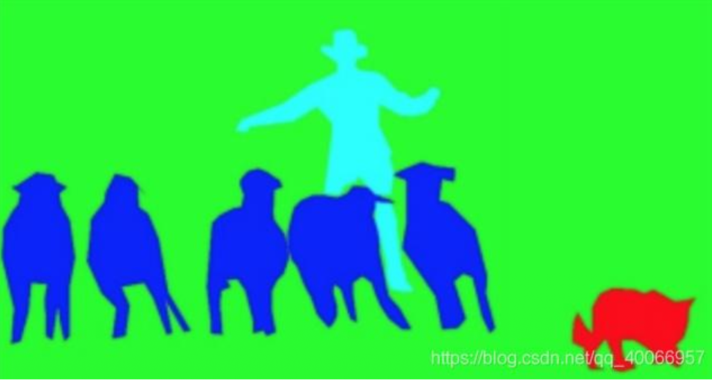

# 深度学习之目标分割

## 一、目标分割概述

### 目标分割概念
- **定义**：在计算机视觉领域，目标分割（Object Segmentation）是指将数字图像细分为多个图像子区域（像素的集合）的过程。
- **目的**：简化或改变图像的表示形式，使得图像更容易理解和分析，通常用于定位图像中的物体和边界（线、曲线等）。
- **结果**：图像上子区域的集合，或是从图像中提取的轮廓线的集合（例如边缘检测）。一个子区域中的每个像素在某种特定的度量下或是由计算得出的特性都是相似的。

### 目标分割任务分类
1. **语义分割(Semantic Segmentation)**
   - 把图像中每个像素赋予一个类别标签（比如汽车、建筑、地面、天空等）
   - 不需要区分同一类的不同个体（如标注为人，羊，狗，草地，而不需要羊1，羊2，羊3等）
  

2. **实例分割(Instance Segmentation)**
   - 目标检测和语义分割的结合
   - 相对目标检测的边界框，实例分割可精确到物体的边缘
   - 相对语义分割，实例分割需要标注出图上同一物体的不同个体
  

3. **全景分割(Panoptic Segmentation)**
   - 要求图像中的每个像素点都必须被分配给一个语义标签和一个实例ID
   - 语义标签指的是物体的类别，实例ID则对应同类物体的不同编号
   - 具体要求：
     - 图像中的每个像素点都有一个对应的语义类别和一个实例ID，如果无法确定可以给予空标注
     - 所有语义类别要么属于stuff（不可数目标，如天空、草地），要么属于things（可数目标，如汽车、行人），不能同时属于二者；且stuff类别没有实例ID（即ID统一为一个）
  

### 传统目标分割
1. **灰度阈值分割**
   - 具有直观和易于实现的特点
   - 适用于图像由暗对象和亮对象这两类具有不同灰度级的区域组成的情况
   - 示例：报纸和书本的分割

2. **图像分割**
   - 根据灰度、彩色、空间纹理、几何形状等特征把图像划分成若干个互不相交的区域
   - 使得这些特征在同一个区域内的表现出一致性或者相似性，而不同的区域间表现出明显的不同
   - 主要方法：OSTU, 分水岭, FCM, N-Cut等
   - 特点：主要是无监督学习，分割出的结果并没有语义的标注

### 目标分割的应用
1. **自动驾驶**
   - 语义分割提供有关道路上自由空间的信息
   - 检测车道标记和交通标志等信息
   - 由于安全性至关重要，需要以最高精度执行任务

2. **医疗影像分析**
   - 应用于肿瘤图像分割、蛀牙诊断等
   - 结合神经网络与医疗诊断成为研究热点
   - 智能医疗研究逐渐成熟

3. **服装分类**
   - 服装解析与其它服务相比是一项非常复杂的任务
   - 需要基于衣服的语义、人体姿势的可变性和潜在的大量类别的更高级别判断
   - 在电子商务中具有巨大的价值

## 二、语义分割网络

### 语义分割反卷积
- **定义**：可以理解为卷积操作的逆运算，但反卷积操作不可以复原卷积之前的输入值，只能复原输入特征图尺寸。
- **具体步骤**：
  1. 首先将卷积核反转（上下左右方向进行逆序操作）
  2. 将之前的卷积结果作为输入，做补0扩充操作（往每一个元素后面补0）
  3. 在扩充后的输入基础上再对整体边界补0（右下侧不用再补）
  4. 将补0后的卷积结果作为真正的输入，反转后的卷积核为filter，进行步长为1的卷积操作

### 语义分割通用架构
- 常见架构：**编码器-解码器网络**
- **编码器**：通常是一个预训练的分类网络（如VGG、ResNet）
- **解码器**：实现语义分割的关键，将编码器学习到的可判别特征从语义上投影到像素空间
- **解码过程**：语义放大，需要机制将编码器不同阶段学到的可判别特征投影到像素空间
- **可采用的结构**：跳跃连接、金字塔池化等

### Fully Convolution Networks (FCNs)
- **主要贡献**：
  - 为语义分割引入了端到端的全卷积网络
  - 重新利用ImageNet的预训练网络用于语义分割
  - 使用反卷积层进行上采样
  - 引入跳跃连接来改善上采样粗糙的像素定位

- **与CNN区别**：
  - 分类CNN在网络最后有全连接层FC，经过softmax后获得label类别概率信息，但只能标识整个图片的类别
  - FCN把后面几个FC都换成Conv，获得二维特征图feature map，后接softmax获得每个像素点的分类信息

- **网络细节分析**：
  - FCN-32s：对原图像进行多次卷积池化操作，保留pool3的特征图，以及pool4的特征图。最后将conv7的特征图进行32倍的上采样得到原图大小的结果
  - FCN-16s：在FCN-32s的基础上进行fine tuning，把pool4层和conv7的2倍上采样结果相加之后进行一个16倍的上采样
  - FCN-8s：在FCN-16s的基础上进行fine tuning，把pool3层和2倍上采样的pool4层和4倍上采样的conv7层加起来，再进行一个8倍的上采样

- **损失函数**：采用二分类交叉熵进行计算

- **缺点**：
  1. 训练比较麻烦，需要训练三次才能够得到FCN-8s
  2. 得到的结果还是不够精细，上采样的结果比较模糊和平滑，对图像中的细节不敏感
  3. 对各个像素进行分类，没有充分考虑像素与像素之间的关系，忽略了空间规整（spatial regularization）步骤

### SegNet
- **提出目的**：解决自动驾驶或者智能机器人的图像语义分割
- **版本**：SegNet与Bayesian SegNet
- **结构**：基于VGG-16的前13个卷积层，每个编码器层都对应一个解码器层
- **新颖之处**：解码器使用在相应编码器的最大池化步骤中计算的池化索引来执行非线性上采样

- **Encoder过程**：
  - 通过卷积提取特征，使用same卷积（卷积后保持图像原始尺寸）
  - 池化采用最大池化，并保存通过max选出的权值在2x2 filter中的相对位置

- **Decoder过程**：
  - 使用same卷积，为upsampling变大的图像丰富信息
  - Pooling之后，每个filter会丢失了3个权重，但在Upsamping层中可以得到在Pooling中相对Pooling filter的位置，保持位置的准确性

- **Bayesian SegNet**：
  - 在编码模块和解码模块都增加了dropout层（dropout_ratio=0.5）
  - 增加后处理操作（统计多次推理结果的均值和方差）
  - 通过后验概率，得到图像语义分割结果的置信度

- **对比**：
  - SegNet和UNet的区别：UNet上采样使用反卷积，而SegNet使用上池化pooling；UNet没有conv5和maxpooling5，而SegNet有
  - SegNet和Bayesian SegNet的区别：Bayesian SegNet增加dropout和后处理操作，本质是一种模型集成

- **总结**：
  - SegNet编码器部分的特征可以被很好的保存
  - SegNet的pooling操作可以解决推理过程中内存消耗大的问题
  - SegNet对于给定的编码器，使用更大的解码器可以提升分割的精度
  - SegNet对边界细节分割效果非常好
  - Bayesian SegNet在SegNet基础上增加dropout和后处理操作

### PSPNet (Pyramid Scene Parsing Network)
- **提出目的**：对不同区域的语境进行聚合，使模型拥有了理解全局语境信息的能力
- **性能**：在2016年ImageNet场景分析挑战赛、Pascal VOC 2012数据集和Cityscapes数据集中排名第一

- **场景解析的重要性**：
  1. 语境关系不匹配：缺乏收集语境信息的能力会增大错误分类的概率
  2. 类别混淆：人工分类时容易出现混淆的类别（如田野和土地）
  3. 不明显的类别：小物体容易被忽略，大物体可能会超过FCN的感受野，导致预测不连续性

- **网络结构**：
  - 使用带有扩展网络策略且预训练过的ResNet模型提取特征图，最终特征图尺寸为输入图像的1/8
  - 对特征图使用金字塔池化获取语境信息，金字塔池化模块分4个层级，其池化核大小分别为图像的全部、1/4、1/9和1/25
  - 将融合得到的全局特征与原始特征图连接起来
  - 通过一层卷积层生成最终的预测图

- **金字塔池化模块**：
  - 作用：在深层神经网络的最终层特征图上，设计有层次的全局先验结构，包含不同尺度、不同子区域间的信息
  - 与SPPNet区别：SPPNet生成的不同层次的特征图最终被展平并concate起来送入全连接层；PSPNet将融合得到的全局特征与原始特征图连接起来

- **辅助损失函数**：
  - 提出通过辅助损失函数来产生初始结果，然后通过最终的损失函数来学习残差
  - 在第四阶段（即res4b22残差块）后应用另一个分类器
  - 辅助损失函数有助于优化学习过程，而主分支损失函数承担起了最大的责任

- **总结**：
  - PSPNet将像素级特征扩展到专门设计的全局金字塔池化中，局部和全局的线索共同作用使最终的预测更加可靠
  - 提出了一种双损失函数的训练优化策略，具有深度监督的loss

### DeepLab系列
#### DeepLab v1
- **解决的问题**：
  - DCNN有两个问题要处理：重复池化和下采样导致分辨率大幅下降，位置信息丢失难以恢复；空间不变性导致细节信息丢失

- **主要贡献**：
  - 速度：带空洞卷积的DCNN可以保持8FPS的速度，全连接CRF平均推断需要0.5s
  - 准确：在VOC语义分割挑战中获得了第一的成绩，准确率超过第二名的方法7.2%
  - 简单：DeepLab是由两个非常成熟的模块(DCNN和CRFs)级联而成

- **改进VGG16的步骤**：
  - 把全连接层（fc6、fc7、fc8）改成卷积层
  - 把最后两个最大池化层（pool4、pool5）的步长2改成1，去掉了下采样
  - 把最后三个卷积层（conv5_1、conv5_2、conv5_3）的dilate rate设置为2，且第一个全连接层对应的卷积层的dilate rate设置为4
  - 把最后一个全连接层fc8对应卷积的通道数从1000改为21

#### 空洞卷积 (Dilated/Atrous Convolution)
- **定义**：在标准的 convolution map 里注入空洞，以此来增加感受野
- **实现方式**：在卷积核中间填充0，常用方式是输入等间隔采样
- **作用**：
  - 扩大感受野：在不降低分辨率的情况下扩大感受野
  - 捕获多尺度上下文信息：通过设置不同dilation rate获取多尺度信息
- **注意**：一般在中高卷积层使用，不适合用于前面几层卷积层

#### Fully connected CRF
- **目的**：为每个像素对都建立 pairwise potential，对DCNN的结果进行后处理
- **解决的问题**：DCNN的pooling带来的平移不变性而导致的位置精确度问题
- **能量函数**：$E(y) = \sum_{i} \psi_{i}(y_{i}) + \sum_{i<j} \psi_{ij}(y_{i}, y_{j})$

#### DeepLab v2
- **主要贡献**：
  - 使用空洞卷积代替原来下采样的方法，得到更高像素的特征图，增加感受野大小
  - 使用ASPP代替原来对图像做预处理尺寸缩放的方法，使得输入图片可以具有任意尺度
  - 使用全连接的CRF，利用低层的细节信息对分类的局部特征进行优化（后续已弃用）

- **多尺度空间金字塔池化(ASPP)**：
  - 受SPP启发，采用多孔金字塔池化方法
  - 通过不同的空洞卷积对图像进行不同程度的缩放，再相加融合输出feature map
  - 对pool5输出的feature map进行四种rate不同的空洞卷积处理，再将四种处理后的结果进行相加融合

#### DeepLab v3
- **主要贡献**：
  - 改进 ASPP，增加了1x1的卷积
  - 串行部署 ASPP 的模块

- **改进ASPP**：
  - 向ASPP中添加了BN层
  - 将image-level的特征与ASPP得到的特征图进行拼接
  - 改进的ASPP包括1x1卷积，rates=(6,12,18)的空洞卷积和image-level的特征

- **深层次的空洞卷积**：
  - 将空洞卷积应用在级联模块
  - 使用不同采样率的空洞卷积保持输出步幅的为out_stride = 16

- **性能对比**：
  | 年份 | 模型 | 分数（VOC2012） |
  |------|------|----------------|
  | 2014 | FCN | 59.9 |
  | 2015 | SegNet | 76.2 |
  | 2015 | Dilated Convolutions | 75.3 |
  | 2014&2016 | DeepLab (v1 & v2) | 79.7 |
  | 2016 | RefineNet | 84.2 |
  | 2016 | PSPNet | 85.4 |
  | 2017 | Large Kernel Matters | 83.6 |
  | 2017 | DeepLab v3 | 85.7 |

### U-Net
- **特点**：经典的全卷积网络（没有全连接操作），可以输入任意尺寸的图片，输出也是图片
- **网络结构**：
  - **压缩路径（contracting path）**：由卷积和Max Pooling构成，4个block，每个block使用3个有效卷积和1个Max Pooling降采样，每次降采样后Feature Map的个数乘2
  - **扩展路径（expansive path）**：4个block，每个block通过反卷积将Feature Map的尺寸乘2，同时将其个数减半，然后和左侧对称的压缩路径的Feature Map合并

- **损失函数**：使用带边界权值的损失函数
  - $L(\lambda) = \sum_{x \in \Omega} \lambda(x) \log(p(x))$
  - 其中$\lambda: \Omega \to [1, K]$是像素点的权值，目的是给图像中贴近边界点的像素更高的权值，使模型有分离边界的能力

- **总结**：
  - U-Net是比较早的使用多尺度特征进行语义分割任务的算法之一，其U形结构启发了后面很多算法
  - 缺点：有效卷积增加了模型设计的难度和普适性；其通过裁边的形式和Feature Map并不是对称的

### U-Net++
- **解决的问题**：
  1. 最佳的深度是在先验上未知的，需要广泛的架构搜索或不同深度模型的低效率集成来测试
  2. 跳接施加了不必要的限制性融合方案，仅在编码器和解码器子网的相同比例的特征图上强制融合

- **主要改进**：
  1. 通过不同深度的U-Net的有效集成来缓解未知的网络深度，这些U-Net可以部分共享一个编码器，并通过深度监督（deep supervision）同时进行共同学习
  2. 重新设计skip connection以在解码器子网络上聚合语义尺度不同的特征，从而产生高度灵活的特征融合方案
  3. 设计一种剪枝方案以加快UNet++的推理速度

- **网络结构**：将1~4层的U-Net全结合起来，共享一个特征提取器，不同层次的特征由不同的decoder路径来还原

- **深监督**：把不同深度的模型的输出用一定的方法统计起来，可以观测到不同深度的输出，从而更好的设计网络的深度

- **剪枝**：在测试阶段对网络进行剪枝操作，扔掉对前面输出完全没有影响的部分

## 三、实例分割网络

### 实例分割概念
- **目标检测**：不仅需要提供图像中物体的类别，还需要提供物体的位置（bounding box）
- **语义分割**：需要预测出输入图像的每一个像素点属于哪一类的标签
- **实例分割**：在语义分割的基础上，还需要区分出同一类不同的个体

### 实例分割存在的问题
- **小物体分割问题**：深层神经网络的感受野大但分辨率低，细节丢失；浅层神经网络的感受野窄但细节丰富，但缺少语义信息
- **处理几何变换的问题**：CNN本质上并不是空间不变的
- **处理遮挡的问题**：遮挡会造成目标信息的丢失，可使用deformable ROI pooling等方法解决
- **处理图像退化的问题**：光照，低质量的摄像机和图像压缩等

### Mask RCNN
- **荣誉**：ICCV 2017最佳论文
- **基础**：在Faster-RCNN的基础上改进，用于解决图像实例分割问题
- **速度**：5FPS

- **改进**：
  - 添加了预测分割mask的分支（并列的FCN层）
  - 将ROI Pooling 层替换成了ROI Align层

#### ROI Align
- **解决的问题**：RoIPool的输出大小固定导致像素无法对齐的问题
- **处理方法**：使用双线性插值算法，没有使用量化操作，因此没有引入量化误差
- **效果**：提高了检测精度，同时有利于实例分割

#### 网络结构
- 整个的网络结构包含两部分：
  - Backbone：用来提取特征
  - Head：对每一个ROI进行分类、框回归和mask预测

- **两种架构**：
  - Faster R-CNN/ResNet
  - Faster R-CNN/FPN

#### 损失函数
- 每个ROI的Loss函数：$L = L_{cls} + L_{box} + L_{mask}$
- Mask损失函数：$L_{mask}(Cls_k) = \text{Sigmoid}(Cls_k)$，平均二值交叉熵损失
- 推理时，通过分类分支预测的类别来选择相应的mask预测，使mask预测和分类预测解耦

#### 实验对比
- 在多个数据集上表现优异，特别是在COCO数据集上

### PANet
- **荣誉**：CVPR 2018
- **基础**：在Mask-RCNN基础上改进
- **主要贡献**：
  - 自底向上的路径增强，缩短了信息传播路径，利用了低层特征的精准定位信息
  - 自适应特征池化，每个proposal利用金字塔所有层的特征，避免了proposal的单一视角
  - 全连接层融合，为了给掩码预测增加信息来源，使用不同视角的信息

- **解决的问题**：
  - Mask-RCNN模型的信息传播还不够充分，低层特征到高层特征的传递路径过长
  - FPN中每个proposal只负责金字塔特定的一层，掩码预测只基于单一视角

#### 网络架构
- **自底向上路径增强**：
  - 网络的低层特征中含有更多的位置信息，高层特征中含有更多的语义信息
  - FPN将高层的语义信息回向传递，利用高层语义信息来提高低层的效果
  - PANet将低层信息直接向上进行传递，提高底层信息的利用率

- **自适应特征池化**：
  - FPN中的每个proposal根据其大小分配给不同的特征层，但按大小分配本身有缺陷
  - PANet特征池化层让每个proposal聚合了多层的信息，对分类及定位更加有利
  - 融合操作可采取max、sum、或相乘

- **全连接层融合**：
  - 采用融合FC层和FCN的结果进行mask预测
  - FCN层根据局部感受野给出每个像素的预测，在不同空间位置共享参数
  - FC层是位置敏感的，有能力适应不同的空间位置，并利用整个特征图的全局信息

#### 性能对比
- 在多个数据集上表现优异，特别是在COCO数据集上

## 四、全景分割网络

### 全景分割概念
- **任务要求**：图像中的每个像素点都必须被分配给一个语义标签和一个实例ID
  - 语义标签指的是物体的类别
  - 实例ID则对应同类物体的不同编号
- **具体要求**：
  - 图像中的每个像素点都有一个对应的语义类别和一个实例ID
  - 所有语义类别要么属于things类别（可数目标），要么属于stuff类别（不可数目标），不能同时属于二者
  - stuff类别没有实例ID（即ID统一为一个）

- **与语义分割关系**：如果所有的类别都是stuff类，那么全景分割除了度量与语义分割不同外（全景分割要求全像素覆盖），其它相同

- **与实例分割关系**：
  - 全景分割中不允许重叠，但实例分割可以
  - 实例分割需要每个分割的置信概率，但全景分割不需要（但可以引入）

### 度量矩阵
- **分割匹配**：
  - 要求IoU严格大于0.5才算匹配
  - 不可以有重叠区域，限制一个像素只能对应一个标签

- **全景质量计算**：
  - 对每个类别的全景分割质量的单独计算结果取平均
  - 将每个类别分为三类：true positives（TP）、false positives（FP）和false negative（FN）
  - 计算公式：$PQ = \frac{\sum_{(s,g) \in \mathcal{D}} IoU(s,g)}{|\{(s,g) \in \mathcal{D}\}| + |F_{p}| + |F_{n}|}$
    - 其中，$\mathcal{D}$是所有匹配上的分割集合
    - $F_{p}$是位置配对但类别不配对的分割
    - $F_{n}$是位置和类别都不配对的分割

### UPSNet (Unified Panoptic Segmentation Network)
- **荣誉**：CVPR 2019
- **主要贡献**：
  - 该网络能够实现全景分割端到端的训练
  - 解决语义分割和实例分割之间的冲突
  - 构建分割Head，实现参数量少且高效

- **网络结构**：
  - 三个Head：
    - Semantic Head(语义头)：建立在可变形卷积的基础上，利用来自特征金字塔网络(FPN)的多尺度信息
    - Instance Head(实例头)：与Mask R-CNN类似输出mask segmentation, bounding box和相关类
    - Panoptic Head(全景头)：利用前两个头的logits，添加了一个新的logits通道(对应于额外的一个未知类)

- **网络结构详解**：
  - **Backbone**：采用原始Mask R-CNN作为backbone，包括ResNet + FPN
  - **Instance Segmentation Head**：遵循Mask R-CNN的设计，带有边界框回归输出、分类输出和分割掩码输出
  - **Semantic Segmentation Head**：以FPN的多尺度特征图作为输入，采用可变形卷积网络，上采样到同一尺度后拼接并应用1×1卷积预测语义类别
  - **Panoptic Segmentation Head**：接受来自语义头logits信息和实例头的logits信息

- **损失函数**：
  - 包含8个损失函数：语义分割头（整张图片逐像素分类损失和RoI的逐像素分类损失），全景分割头（整张图片的逐像素损失），RPN（包围框分类损失，包围框回归损失），实例分割头（包围框分类损失，包围框回归损失，mask逐像素损失）
  - RoI逐像素分类损失：对实例中的像素施加更多的惩罚，以提高全景分割精度

- **性能对比**：
  - 在COCO数据集上表现优异

## 五、目标分割数据集

### OVIS数据集
- **发布机构**：华中科技大学、阿里、康奈尔大学、约翰霍普金斯大学以及牛津大学的团队（2021年）
- **规模**：近万段视频，最终挑选出901段遮挡严重、运动较多、场景复杂的片段
- **特点**：
  - 每段视频都至少有两个相互遮挡的目标对象
  - 大部分视频分辨率为1920x1080
  - 包含25种生活中常见的类别（人，交通工具，动物等）
  - 总计包含5223个目标对象的296k个高质量mask标注

### LIP数据集
- **发布机构**：中山大学（2018年）
- **规模**：50462张图像
- **标签定义**：19个人体部件或衣服标签（帽子、头发、太阳镜、上衣、衣服、外套等）以及背景标签
- **数据分布**：
  - 19081张全身图像
  - 13672张上身图像
  - 403张下身图像
  - 3386张头部丢失的图像
  - 2778张后视图图像
  - 21028张有遮挡的图像

### MapillaryVistas数据集
- **发布机构**：Mapillary公司（2017年）
- **规模**：25000个高分辨率图像
- **类别**：152个物体类别，100个特定于实例的注释类别
- **特点**：
  - 多样化的街道级图像数据集
  - 像素精确和特定于实例的人类注释
  - 比Cityscapes的精细注释总量大5倍
  - 包含来自世界各地在各种条件下捕获的图像（不同天气，季节和时间）
