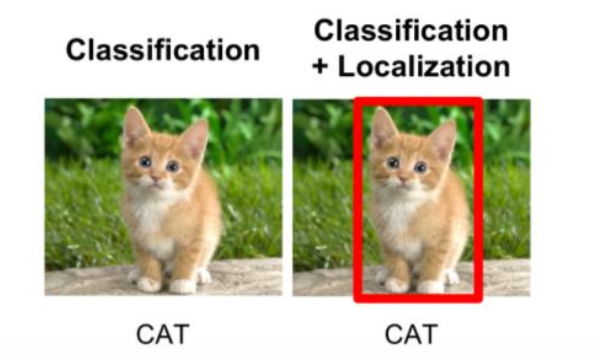

# 深度学习入门-以卷积神经网络为例

## 1 卷积神经网络基础

### 1.1 卷积神经网络的发展历程

+ 卷积神经网络的兴起：1989年，LeCun提出的LeNet模型是神经认知机的一个重大改进，其中使用误差反向传播来学习模型参数。该CNN模型成功应用与识别手写数字。


> MNIST是一个计算机视觉数据集，来自美国国家标准与技术研究
所，它包含70000张手写数字的灰度图片，其中每一张图片包含 28 * 28 个像素点。


+ 卷积神经网络的快速发展：2012年，AlexNet在ImageNet图像分类竞赛中取得了显著的成绩，标志着深度学习在计算机视觉领域的突破。随后，VGG、GoogLeNet和ResNet等更深层次的卷积神经网络模型相继出现，进一步提升了图像识别的性能。

### 1.2 图像识别技术
+ `1.0目标分类`：核心是判断图像中主要目标的类别，仅关注 “是什么”，不关注目标的具体位置。**任务是将图像归类到预定义的类别中（如区分猫、狗、汽车等）**
+ `2.0目标检测`：不仅要识别目标类别，还要定位目标在图像中的具体位置（**用矩形边界框标记**），代表算法：YOLO、Faster R-CNN 等。
+ `3.0语义分割（按大类分割）`：对图像进行像素级的类别划分，**将每个像素分配到对应的 “语义大类” 中**（如区分道路、行人、车辆、建筑等），但不区分同一类别中的不同实例（比如所有行人都归为 “行人” 类，不区分张三、李四）。
+ `4.0实例分割`：是语义分割的进阶，**既要对像素进行语义类别划分，又要区分同一类别中的不同实例**（比如区分图像中不同的行人个体、不同的车辆个体）。
+ `5.0全景分割`：是目标检测、语义分割、实例分割的融合任务，需要对图像中所有像素进行处理，对 “stuff 类”（无固定形状的类别，如道路、天空）进行语义分割；对 “thing 类”（有个体实例的类别，如人、车）进行实例分割。


### 1.3 卷积神经网络的基本结构
卷积神经网络主要是将数据的特征不断抽象提取（可理解为特征浓缩），然后将特征提取完备之后进入分类器分类(全连接层)。

一个卷积神经网络主要由五层组成，**分别是：数据输入层(Input 
Layer)、卷积计算层(Conv Layer)、激活层(Active Layer)、池化层(Pooling Layer)、全连接层(FC Layer)。**

卷积神经网络（CNN）：卷积+池化+全连接，为了防止过拟合问题，
全连接中还增加了Dropout层。

卷积：
+ 局部特征提取
+ 训练中进行参数学习
+ 每个卷积核提取特定模式的特征

池化（下采样）：
+ 降低数据维度，避免过拟合
+ 增强局部感受野
+ 提高平移不变性

全连接：
+ 特征提取到分类的桥梁


#### 1.3.1 卷积层
局部感知：在处理图像这样的高维度输入时，每个神经元只与
输入数据的一个局部区域连接。该连接的空间大小叫做神经元的感
知野。


# 深度学习之目标分类

## 一、目标分类概述

### 1.1 目标分类的定义
- 目标分类（Classification）：将图像结构化为某一类别的信息，用事先确定好的类别来描述图片，解决图中内容是什么的问题。



### 1.2 传统目标分类总体框架
- 传统目标分类主要包含以下几个阶段：预处理、特征选择和提取、建模、匹配。


#### 1.2.1 预处理
- 预处理是尽可能在不改变图像承载的本质信息的前提下，使得每张图像的表观特性（如**颜色分布、整体明暗、尺寸大小**等）尽可能的一致，有利于之后的处理过程。
- 预处理通常包括三种基本运算：
  1. 格式转换：统一格式，实现模式的有效描述，适合下一步的运算。
  2. 滤波运算：凸显一些特征，抑制一些特征。
  3. 归一化（正则化）：规范数值范围。

#### 1.2.2 特征提取
- 由图像或波形所获得的数据量是相当大的。为了有效地实现分类识别，就要对原始数据进行变换，得到最能反映分类本质的特征。
- 特征提取方法：
  1. 颜色特征：颜色特征描述了图像或图像区域所对应的景物的表面性质，常用的颜色特征有颜色通道直方图特征等。
  2. 纹理特征：图像的某种局部性质，比如水平纹理等。
  3. 形状特征：形状是刻画物体的基本特征之一，用形状特征区别物体非常直观，形状特征分析在模式识别和视觉检测中具有重要的作用。
  4. 空间特征：空间特征是指图像中分割出来的多个目标之间的相互的空间位置。

### 1.3 传统目标分类方法

#### 1.3.1 支持向量机（SVM）
- SVM是一种二分类模型，它的目的是寻找一个超平面对样本进行分割，分割的原则是间隔最大化，最终转化为一个凸二次规划问题来求解。


#### 1.3.2 KNN (K-Nearest Neighbor)
- KNN（K最近邻）就是K个最近邻居的意思，说的是每个样本都可以用它最接近的K个邻近值来代表。
- KNN分类算法步骤：
  1. 准备数据，对数据进行预处理。
  2. 计算测试样本点（也就是待分类点）到其它每个样本点的距离。
  3. 对每个距离进行排序，然后选择出距离最小的K个点。
  4. 对K个点所属的类别进行比较，根据少数服从多数的原则，将测试样本点归入在K个点中占比最高的那一类。


#### 决策树（Decision Tree）
- 决策树是一种依托于策略抉择而建立起来的树。机器学习中，决策树是一个预测模型，它代表的是对象属性与对象值之间的一种映射关系。
- 树中每个节点表示某个对象，而每个分叉路径则代表的某个可能的属性值，从根节点到叶节点所经历的路径对应一个判定测试序列。


## 二、经典目标分类网络

### 2.1 卷积神经网络发展


**左侧：早期背景（Neocognitron → LeCun → LeNet）**
+ Neocognitron（1980s，早期受生物启发模型）
首个提出“层级、局部感受野、特征池化”概念的模型，为 CNN 思想打基础。
+ LeCun1989 / LeNet（1990s）
经典的卷积 + 池化 + 全连接结构，被用于手写数字识别（MNIST）。这条线说明：现代 CNN 的思想有历史根源，但规模和训练方法还比较浅。

**中心：AlexNet（2012）——历史突破**
+ 为什么重要：在 ImageNet 大规模分类竞赛上大幅领先，标志着深度学习在视觉领域进入实用阶段。
+ 关键技术/因素：
	+ ReLU（非线性激活）：加快训练收敛、缓解梯度衰减。
	+	Dropout（随机失活）：缓解过拟合。
	+	GPU 加速 + 大数据：训练更深、更大的网络成为可能。
	+	更大的模型与数据增强。
	+	图上把 AlexNet 标为“历史突破”，并以它为分叉点，指向后续多个研究方向。


**分支一：网络加深（Deeper Networks）**
+ VGG16 → VGG19
用一系列小卷积核（3×3）堆叠来变深，证明“更深、更统一的卷积堆栈”能提升性能。结构简单、易复现，但参数多、计算量大。
+ MSRANet（图中写法）
图中这里表示微软研究院等提出的一些更深/改进网络（可理解为朝着更深/更复杂结构演进的尝试）。
+ ResNet（残差网络）（图右侧）
通过**残差连接（skip connections）** 解决了更深网络的训练困难（梯度消失/退化问题），允许堆叠成百层甚至上千层。ResNet 是“加深网络”方向的重大突破。
+ Inception-ResNet（结合）
将 Inception 模块（多尺度卷积）与残差连接结合，既利用多尺度特征又获益于残差加速收敛。


**分支二：增强卷积模块功能（模块化设计）**
+ NIN（Network-in-Network）
提出在卷积层中使用小型的“可学习网络”（如 1×1 卷积）来提升非线性表达能力，强调“用更强的局部函数近似代替单纯卷积”。
+ GoogLeNet（Inception v1）
引入 Inception 模块（并行不同大小卷积 + 池化然后拼接），实现多尺度特征融合，参数效率高。GoogLeNet 在 ImageNet 上表现优异，参数比 VGG 少很多。
+ Inception V3 / V4
对 Inception 模块做多轮改进（如分解卷积、更深的 factorization、批量归一化等），进一步提升性能与效率。
+ 这一支线体现的思想是：不是单靠变深，而是设计更强、更高效的模块来提升表示能力。

**网络加深 + 收敛加速” → ResNet / Inception-ResNet**

这部分强调两条重要策略的结合：
1.	把网络做更深（多层）以获得更强表达；
2.	用结构/连接（如残差）加速收敛并保留训练稳定性。

因此 ResNet（残差）和 Inception-ResNet（把两个思想结合）成为后来热门的设计模式。

**分支三：从分类任务到检测任务（目标检测发展）**
+ R-CNN（Region-based CNN） 和 SPP-Net（Spatial Pyramid Pooling）
  + R-CNN：先用外部算法（Selective Search）生成候选区域（region proposals），对每个候选区域裁剪并用 CNN 分类。昂贵但开创了基于 CNN 的检测路线。
  + SPP-Net：提出 Spatial Pyramid Pooling，解决不同候选框大小输入到固定全连接层的问题，从而加速检测。
+ Fast R-CNN
将整个图像送入 CNN 得到特征图，再在特征图上对每个候选区域做 RoI pooling，显著加速并提高精度。
+ Faster R-CNN
引入 Region Proposal Network (RPN)，用网络自己生成候选框，检测流程端到端，速度和精度都有质的提升。
+ 这条线展示从“把图像分成很多小任务再分类”到“端到端候选框生成与分类”的演变。

**分支四：增加新的功能单元（用于语义分割、对齐、时序等）**
+ Inception V2（图中作为增强模块的延续）
类似前述，是 Inception 系列的另一个改进版本。
+ FCN（Fully Convolutional Network）
把全连接层替换为卷积层，能输出与输入相同空间分辨率的预测，主要用于 语义分割（每像素分类）。
+ STNet（图中写法，实际常见的是 STN — Spatial Transformer Network）
空间变换网络：提供可学习的空间变换（旋转、缩放、平移等）以实现对图像/特征的对齐或变换不变性，提高模型对几何变形的鲁棒性。
+ CNN + RNN / LSTM
将 CNN 用作特征提取器，再用 RNN/LSTM 处理序列信息（例如图像描述生成 caption、视频帧序列分析、OCR 中的序列识别等）。适用于需要时序建模的视觉任务。

### 2.2 LeNet5

- LeNet5是手写字体识别模型，发表于1998年。
- LeNet5通过巧妙的设计，利用卷积、参数共享、池化等操作提取特征，避免了大量的计算成本，最后再使用全连接神经网络进行分类识别。
- LeNet5具备的特点：
  1. 卷积神经网络使用三个层作为一个系列：卷积，池化，非线性。
  2. 使用卷积提取空间特征。
  3. 使用池化技术进行下采样（subsample）。
  4. 使用双曲线（tanh）或S型（sigmoid）形式的非线性激活函数。
  5. 多层神经网络（MLP）作为最后的分类器。
  6. 使用权值共享技术，层与层之间进行局部稀疏连接，避免大的计算成本。

```python
import torch
import torch.nn as nn

class LeNet(nn.Module):
    def __init__(self):
        super().__init__()
        self.conv = nn.Sequential(
            nn.Conv2d(1, 6, 5),       # ⭐ 引入卷积层
            nn.Tanh(),
            nn.AvgPool2d(2),          # ⭐ 引入池化
            nn.Conv2d(6, 16, 5),
            nn.Tanh(),
            nn.AvgPool2d(2)
        )
        self.fc = nn.Sequential(
            nn.Linear(16*5*5, 120),
            nn.Tanh(),
            nn.Linear(120, 84),
            nn.Tanh(),
            nn.Linear(84, 10)
        )

    def forward(self, x):
        x = self.conv(x)
        return self.fc(x.view(x.size(0), -1))
```
### 2.3 AlexNet

- AlexNet在LeNet基础上进行了更宽更深的网络设计，首次在CNN中引入了**ReLU、Dropout和Local Response Norm (LRN)** 等技巧。
- 技术特点：
  - 使用ReLU（Rectified Linear Units）作为CNN的激活函数，解决了Sigmoid在网络较深时的梯度弥散问题。
  - **为避免过拟合，训练时前两个全连接层使用Dropout，随机忽略一部分神经元。**
  
  - 使用重叠的**最大池化**(max pooling)，避免平均池化的模糊化效果。
  - 提出了**LRN层（卷积之后进行归一化处理）**，对局部神经元的活动创建竞争机制。
  - 数据增强：利用**随机裁剪和镜像翻转操作**增加训练数据量，降低过拟合。
  - 利用GPU强大的并行计算能力加速网络训练过程，并采用GPU分块训练的方式解决显存对网络规模的限制。
  

```python
class AlexNet(nn.Module):
    def __init__(self):
        super().__init__()
        self.conv = nn.Sequential(
            nn.Conv2d(3, 64, 11, 4, 2),
            nn.ReLU(),                 # ⭐ ReLU，大幅加速训练
            nn.MaxPool2d(3, 2),
            nn.Conv2d(64, 192, 5, padding=2),
            nn.ReLU(),
            nn.MaxPool2d(3, 2),
            nn.Conv2d(192, 384, 3, padding=1),
            nn.ReLU(),
            nn.Conv2d(384, 256, 3, padding=1),
            nn.ReLU(),
            nn.Conv2d(256, 256, 3, padding=1),
            nn.ReLU(),
            nn.MaxPool2d(3, 2)
        )
        self.fc = nn.Sequential(
            nn.Dropout(),              # ⭐ Dropout 防过拟合
            nn.Linear(256*6*6, 4096),
            nn.ReLU(),
            nn.Dropout(),
            nn.Linear(4096, 4096),
            nn.ReLU(),
            nn.Linear(4096, 1000)
        )

    def forward(self, x):
        x = self.conv(x)
        return self.fc(x.view(x.size(0), -1))
```

**随机裁剪有什么作用？**
+ 数据增强：对原始图像（如图中的猫）随机裁剪不同区域，生成多样的训练样本，间接扩大数据集规模，为模型提供更丰富的视觉输入。
+ 提升泛化能力：让模型在训练中学习到目标在不同位置、不同局部的特征，避免对图像布局的过度依赖，从而在测试时能适应目标位置的变化，有效缓解过拟合。
+ 增强特征鲁棒性：迫使模型聚焦目标的核心特征（如猫的形态、纹理），而非背景或边缘的次要信息，使学到的特征更具通用性，即使目标在图像中位置改变，也能稳定识别。


**卷积的参数量**：
> 参数量=卷积长✖️卷积宽✖️Cin(输入通道数)✖️Cout(卷积核个数)


### 2.4 Network in Network (NiN)
- NiN使用较少参数就取得了AlexNet的效果（参数大小为230M，而NiN仅为29M）。
- 主要创新点：
  1. MLP Convolution Layers：在常规卷积后接若干1x1卷积，增强网络抽象能力。所谓MLPConv其实就是在常规卷积（感受野大于1的）后接若干1x1卷积，输入的每个特征图视为一个神经元，特征图通过1x1卷积就类似多个神经元线性组合，这样就像是MLP（多层感知机）。该网络相对于普通卷积层（感受视野大于1 ）的抽象能力得以增强。
  

  2. Global Average Pooling：NiN最后使用全局平均值池化，然后全连接，因为没有参数，可以避免产生过拟合，同时可以对空间信息进行汇总，因此对输入的空间转换具有更强的鲁棒性。替代全连接层效果：减少参数数量，减少计算量，减少过拟合。

```python
class NIN(nn.Module):
    def __init__(self):
        super().__init__()
        self.model = nn.Sequential(
            nn.Conv2d(3, 192, 5, padding=2),
            nn.ReLU(),
            nn.Conv2d(192, 160, 1),  # ⭐ 1×1卷积增强非线性
            nn.ReLU(),
            nn.Conv2d(160, 96, 1),
            nn.ReLU(),
        )

    def forward(self, x):
        return self.model(x)
```
### 2.5 VGGNet
- VGGNet探索了卷积神经网络的深度和其性能之间的关系，通过反复的堆叠`3*3`的小型卷积核和`2*2`的最大池化层，成功的构建了16~19层深的卷积神经网络。

- 结构特点：
  - 网络包含5组卷积操作，每组包含1-4个连续的卷积层，每两个卷积层之间为ReLU层。
  - 不同级别的网络层数逐渐加深，网络的表达能力也逐渐增强。
  - 对卷积核和池化大小进行了统一，网络中进行3×3的卷积操作和2×2的最大池化操作。
  - 采用卷积层堆叠的策略，将多个连续的卷积层构成卷积层组。
  - 和单个卷积层相比，卷积组可以提高感受野范围，增强网络的学习能力和特征表达能力；和具有较大核相比，采用多个具有小卷积核的卷积层串联的方式能够减少网络参数。
  - 在前两个全连接层中使用dropout技术
- 训练和测试：
  - 多尺度策略：训练阶段，将图像缩放到不同尺寸S，并随机裁剪224×224的训练样本；测试阶段，将图像缩放到尺寸Q，并对网络最后的卷积层使用滑动窗口进行分类预测，对不同窗口的分类结果取平均。

```python
class VGGBlock(nn.Module):
    def __init__(self, in_ch, out_ch, n_convs):
        super().__init__()
        layers = []
        for _ in range(n_convs):
            layers += [
                nn.Conv2d(in_ch, out_ch, 3, padding=1),
                nn.ReLU()               # ⭐ 小卷积 + 堆叠
            ]
            in_ch = out_ch
        layers.append(nn.MaxPool2d(2))
        self.block = nn.Sequential(*layers)

    def forward(self, x):
        return self.block(x)


class VGG16(nn.Module):
    def __init__(self):
        super().__init__()
        self.features = nn.Sequential(
            VGGBlock(3, 64, 2),
            VGGBlock(64, 128, 2),
            VGGBlock(128, 256, 3),
            VGGBlock(256, 512, 3),
            VGGBlock(512, 512, 3)
        )
        self.classifier = nn.Sequential(
            nn.Linear(512*7*7, 4096),
            nn.ReLU(),
            nn.Linear(4096, 4096),
            nn.ReLU(),
            nn.Linear(4096, 1000)
        )

    def forward(self, x):
        x = self.features(x)
        return self.classifier(x.view(x.size(0), -1))

```
### 2.6 GoogleNet（Inception）
- 经典的Inception模块的基本结构有四个分支：1×1卷积、1×1卷积后接3×3卷积、1×1卷积后接5×5卷积、3×3最大池化后接1×1卷积。

- Inception V1最大改变是设计Inception模块叠加的形式构造网络。
- Inception V1参数少效果好的原因：去除全连接层，用全局平均池化层；中间层中的多个输出分支的可用性；使用dropout技术进行正则化。
- Inception V2：借鉴了VGG用两个3×3的卷积代替5×5的大卷积的方法，提出了著名的Batch Normalization（BN）方法。
- Inception V3：引入了Factorization into small convolutions的思想，将一个较大的二维卷积拆成两个较小的一维卷积，节约了大量参数，加速运算并减轻了过拟合。
- Inception V4：结合了微软的ResNet，将错误率进一步减少到3.08%。

Inception v1（2014）

```python
class Inception(nn.Module):
    def __init__(self, in_c):
        super().__init__()
        self.branch1 = nn.Conv2d(in_c, 16, 1)

        self.branch3 = nn.Sequential(
            nn.Conv2d(in_c, 16, 1),
            nn.Conv2d(16, 24, 3, padding=1)
        )

        self.branch5 = nn.Sequential(
            nn.Conv2d(in_c, 16, 1),
            nn.Conv2d(16, 24, 5, padding=2)
        )

        self.pool = nn.Sequential(
            nn.MaxPool2d(3, stride=1, padding=1),
            nn.Conv2d(in_c, 24, 1)
        )

    def forward(self, x):
        # ⭐ 多路径（多尺度）卷积
        return torch.cat([
            self.branch1(x),
            self.branch3(x),
            self.branch5(x),
            self.pool(x)
        ], dim=1)
```
Inception V3 / V4（2015-2016）

```python
class FactorizedConv(nn.Module):
    def __init__(self, in_c, out_c):
        super().__init__()
        self.conv = nn.Sequential(
            nn.Conv2d(in_c, out_c, kernel_size=(1,5), padding=(0,2)),
            nn.Conv2d(out_c, out_c, kernel_size=(5,1), padding=(2,0))  # ⭐ 卷积分解
        )

    def forward(self, x):
        return self.conv(x)
```


### 2.7 ResNet（深度残差网络）
- ResNet由微软研究院提出，通过使用Residual Unit成功训练152层深的神经网络，在ILSVRC 2015比赛中获得了冠军，取得3.57%的错误率。
- 问题解决：网络深度增加带来的梯度弥散和爆炸现象，以及网络性能退化问题（Degradation问题）。
- 残差块原理：通过全等映射，直接前一层输出到后面的思想，实现了对非常深的模型的稳定学习。残差特征映射通常比在传统架构中学习的无参考映射简单得多。
- 残差结构：ResNet有很多旁路的支线将输入直接连到后面的层，使得后面的层可以直接学习残差。这种结构也被称为快捷连接。
- 两种残差学习单元：两层及三层残差学习单元，三层残差学习单元使用了"瓶颈架构"。

```python
class ResidualBlock(nn.Module):
    def __init__(self, in_c, out_c):
        super().__init__()
        self.conv = nn.Sequential(
            nn.Conv2d(in_c, out_c, 3, padding=1),
            nn.ReLU(),
            nn.Conv2d(out_c, out_c, 3, padding=1)
        )
        self.shortcut = nn.Conv2d(in_c, out_c, 1) if in_c != out_c else nn.Identity()

    def forward(self, x):
        # ⭐ 残差连接
        return nn.ReLU()(self.conv(x) + self.shortcut(x))
```
### ResNeXt
- ResNeXt融合了GoogleNet和ResNet设计的优势，可以看作是ResNet网络的升级版。
- 利用残差网络中提出的跳跃式连接，并将它们与Inception模块中的多分支架构相结合。
- 与ResNet的区别：每个分支采用相同的拓扑结构，本质是分组卷积（Group Convolution），通过变量基数（Cardinality）来控制组的数量。
- 优点：网络结构更加模块化，简单明了；需要手动调节的超参数更少，仅需调节基数（cardinality），即分支数；相同的参数，效果更好。

### FractalNet
- FractalNet（分型网络）通过一种分形的结构，达到了类似于教师-学生机制、深度监督的效果。
- 分形设计模块由多个分支组成，每个分支具有不同数量的卷积层，且每一层的输入来自前面所有层的输出。
- 在训练时利用"路径丢弃"策略来实现网络的正则化："局部路径丢弃"和"全局路径丢弃"。

### DenseNet
- DenseNet从特征的角度考虑，通过特征重用和旁路(Bypass)设置达到更好的效果和更少的参数。
- 优点：加强了feature的传递，减轻了梯度消失；加强了特征的重用；一定程度上减少了参数数量。
- Dense Block结构：在传统的卷积神经网络中，如果L层，那么就会有L个连接，但在DenseNet中，会有L(L+1)/2个连接。

### AdderNet
- AdderNet被称为CVPR2020最佳分类网络，主要思想是用加法代替卷积层特征计算的乘法，从而实现减少深度网络的计算。
- 创新：使用加法网络(AdderNets)来交换深度神经网络中的这些大规模乘法，采用L1距离代替欧氏距离，全程不涉及乘法。
- 优点：计算成本更低，更适合在移动设备运行。

## 三、数据集介绍

### ImageNet数据集
- ImageNet数据集是目前深度学习图像领域非常重要的一个数据集，有1400多万幅图片，涵盖2万多个类别；其中有超过百万的图片有明确的类别标注和图像中物体位置的标注。
- 在计算机视觉领域研究论文中应用非常广。

### WebVision数据集
- WebVision所用数据集直接从互联网爬取，数据含有很多噪音，且数据类别的数量存在着极大不平衡，难度提高许多，同时也更加贴近于实际应用中的场景。
- 包含1000个类别，涵盖直接从网络收集到的240万张图像，包括来自谷歌搜索的100万张，以及来自Flickr的140万张图像。

### Open Images数据集
- OpenImages是由谷歌推出的大规模图像数据集，包含大约900万张图片及数千个类别。
- 训练集包含174万张图片、1460万个矩形框和600个类别，是世界上最大的带有目标位置标注的数据集。
- 图片种类多种多样、场景复杂，平均每张图片包含8.4个物体。


