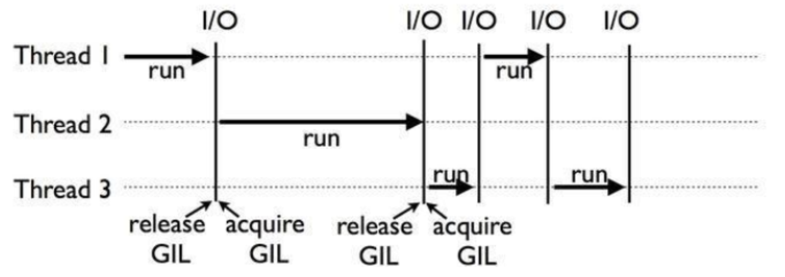
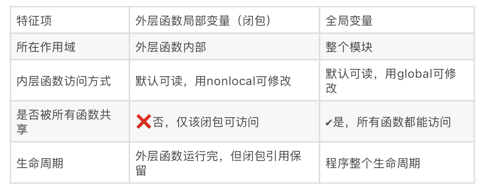
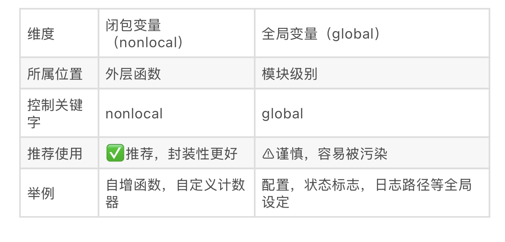
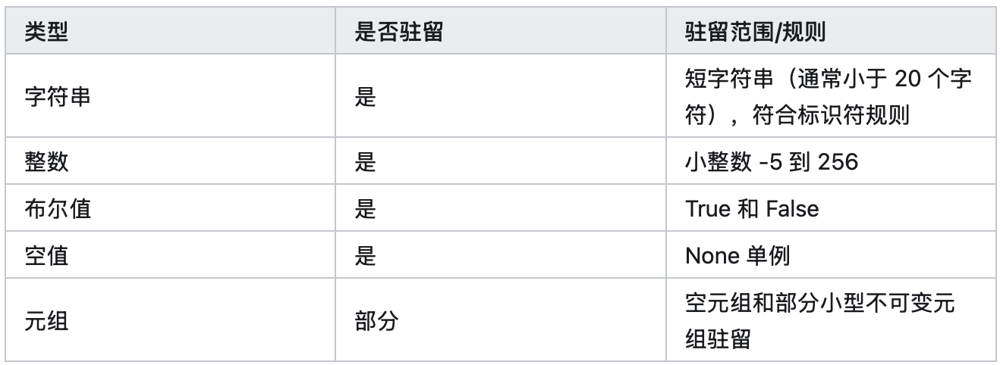
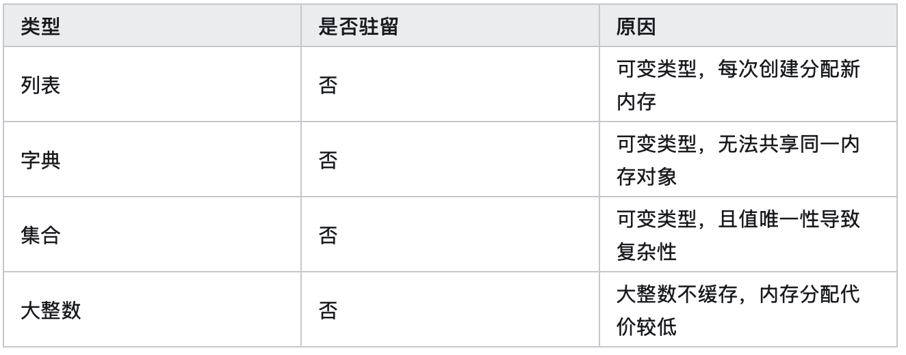

# Python Advanced Techniques 

## 1. 执行模型

### 1.1 运行机制

#### 1.1.1 Python解释器如何工作
Python 解释器不止一种，有 **CPython、IPython、Jython、PyPy**等。顾名思义，CPython 就是用 C 语言开发的了，是官方标准实现，拥有良好的生态，所以应用也就最为广泛了。而 IPython 是在 CPython 的基础之上在交互式方面得到增强的解释器。Jython 是专为 Java 平台设计的 Python 解释器，它把 Python 代码编译成 Java 字节码执行。PyPy 是 Python 语言（2.7.13和3.5.3）的一种快速、兼容的替代实现，以速度快著称。


**字节码**是介于源代码和机器码之间的中间代码，由编译器将高级编程语言（如 Java、Python）的源代码编译生成，以字节（8 位）为基本单位的指令集。它不依赖具体硬件架构，需通过虚拟机（VM）解释或编译为机器码后执行。


#### 1.1.2 CPython 解释器如何执行代码
Python 代码在执行前会经过以下步骤：

1. **源代码** → **字节码**（编译）
2. **字节码** → **机器码**（解释执行）

```python
import dis

def hello():
    x = 5
    y = 10
    return x + y

# 反编译查看字节码
dis.dis(hello)
```
结果如下：
```
  3           0 RESUME                   0

  4           2 LOAD_CONST               1 (5)
              4 STORE_FAST               0 (x)

  5           6 LOAD_CONST               2 (10)
              8 STORE_FAST               1 (y)

  6          10 LOAD_FAST                0 (x)
             12 LOAD_FAST                1 (y)
             14 BINARY_OP                0 (+)
             18 RETURN_VALUE
```
当使用 PyTorch DataLoader 时，每个 worker 进程都需要独立执行字节码，这就涉及到下面的 GIL 问题。

#### 1.1.3 深入理解 GIL（全局解释器锁 Global Interpreter Lock）

**GIL是什么？**

GIL 是 CPython 解释器中的一个机制，用于保护内存管理，防止多个线程同时执行 Python 字节码时出现数据竞争和内存破坏的问题。

> GIL是在实现Python解析器(**CPython**)时所引入的一个概念。Python是一套语言（语法）标准，同样一段代码可以通过CPython，PyPy，Psyco等不同的Python执行环境来执行。像其中的JPython就没有GIL。然而因为CPython是大部分环境下默认的Python执行环境。所以在很多人的概念里CPython就是Python，也就想当然的把GIL归结为Python语言的缺陷。所以这里要先明确一点：**GIL并不是Python的特性，Python完全可以不依赖于GIL。**

**GIL为什么会存在？**

GIL的问题其实是由于近十几年来应用程序和操作系统逐步从多任务单核心演进到多任务多核心导致的 , 在一个古老的单核CPU上调度多个线程任务，大家相互共享一个全局锁，谁在CPU执行，谁就占有这把锁，直到这个线程因为IO操作或者Timer Tick到期让出CPU，没有在执行的线程就安静的等待着这把锁（除了等待之外，他们应该也无事可做）。下面这个图演示了一个单核CPU的线程调度方式：


然而，在多核CPU上，多个线程可以同时在不同的CPU核心上执行，这时GIL就成了一个瓶颈，因为它限制了同一时刻只能有一个线程在执行Python字节码，导致多线程无法充分利用多核CPU的优势。

为了解决这个问题，Python社区引入了**多进程（multiprocessing）模块**，通过创建多个独立的进程来实现真正的并行计算，每个进程都有自己的Python解释器和GIL，从而绕过了GIL的限制。

**多线程 vs 多进程**

在 Python 中，多线程和多进程各有优缺点：
- **多线程**：
  - 优点：线程间切换开销小，内存占用低，适合 IO 密集型任务。
  - 缺点：受 GIL 限制，无法充分利用多核 CPU，适合轻量级任务。
  - 适用场景：网络请求、文件读写等 IO 密集型任务。
- **多进程**：
  - 优点：每个进程有独立的 GIL，能充分利用多核 CPU，适合 CPU 密集型任务。
  - 缺点：进程间切换开销大，内存占用高，适合重量级任务。
  - 适用场景：数据处理、科学计算等 CPU 密集型任务。

根据以上分析，有两个建议：

1. 在以IO操作为主的IO密集型应用中，多线程和多进程的性能区别并不大，原因在于即使在Python中有GIL锁的存在，由于线程中的IO操作会使得线程立即释放GIL，切换到其他非IO线程继续操作，提高程序执行效率。相比进程操作，线程操作更加轻量级，线程之间的通讯复杂度更低，建议使用多线程。

2. 如果是计算密集型的应用，尽量使用多进程或者协程来代替多线程。


**GIL的实际影响示例**
```python
import threading
import time

def cpu_intensive():
    """CPU 密集型任务"""
    total = 0
    for i in range(10**8):
        total += i
    return total

if __name__ == '__main__':
    # 多线程版本 - 反而更慢（因为 GIL）
    start = time.time()
    t1 = threading.Thread(target=cpu_intensive)
    t2 = threading.Thread(target=cpu_intensive)
    t1.start()
    t2.start()
    t1.join()
    t2.join()
    print(f"多线程耗时: {time.time() - start:.2f}s")  

    # 多进程版本 - 真正并行
    from multiprocessing import Process
    start = time.time()
    p1 = Process(target=cpu_intensive)
    p2 = Process(target=cpu_intensive)
    p1.start()
    p2.start()
    p1.join()
    p2.join()
    print(f"多进程耗时: {time.time() - start:.2f}s")  
```
多线程耗时: 3.38s
多进程耗时: 1.65s


**为什么 AI 代码中常常用多进程而不是多线程？**

因为：
- 数据加载 = CPU 密集型（数据增强、预处理都是 CPU 操作）
- PyTorch DataLoader 默认用 `num_workers > 0` 时，使用多进程加载数据，绕过 GIL 限制，实现真正并行。


### 1.2 变量、作用域与内存管理

#### 1.2.1 Python引用计数机制
在python中的垃圾回收机制主要是以引用计数为主要手段以标记清除和隔代回收机制为辅的手段 。可以对内存中无效数据的自动管理，怎么知道一个对象能不能被调用了呢？

**回顾内存地址**

Python中的任何变量都有对应的内存引用，也就是内存地址。如果不是容器类型，那么直接引用和赋值，内存地址都是不会的。

```
>>> a = 1
>>> b = 1
>>> id(a)
140709385600544
>>> id(b)
140709385600544
```
如果在内存中创建了一个list对象（容器），而且对该对象进行了引用。那么b = [1,2]和c = a有什么区别？
```
>>> a = [1,2]
>>> b = [1,2]
>>> id(a)
1966828025736
>>> id(b)
1966828044488
>>> c = a
>>> id(c)
1966828025736
```
首先在内存1966828025736处创建了一个列表 [1,2]，然后定义了一个名为a的变量。b = [1,2]会新开一个内存地址，c = a直接赋值直接引用[1,2]的内存地址。

**引用计数**

在一些代码中，如果存在一些变量但是没有用，会造成内存空间，因此叫做垃圾，所以要回收。

引用计数也是一种最直观，最简单的垃圾收集技术。原理非常简单，每一个对象都包含了两个头部信息，一个是类型标志符，标识这个对象的类型；另一个是计数器，记录当前指向该对象的引用数目，表示这个对象被多少个变量名所引用。

CPython 使用引用计数来管理内存，所有 Python 脚本中创建的实例，都会有一个引用计数，来记录有多少个指针指向它。当引用计数只有 0 时，则会自动释放内存。

在Python中通过sys.getrefcount查看引用计数的方法：

```python
print(sys.getrefcount())
```

**注意:调用getrefcount()函数会临时增加一次引用计数，得到的结果比预期的多一次。**

比如，下面这个例子中，a 的引用计数是 3，因为有 a、b 和作为参数传递的 getrefcount 这三个地方，都引用了一个空列表。

```
>>> import sys
>>> a = []
>>> b = a
>>> print(sys.getrefcount(a))
3
```
Python 用引用计数来管理内存：
- 每个对象都有一个 `refcount`（引用计数）
- 当 refcount = 0 时，垃圾回收器立即释放内存

```python
import sys

x = [1, 2, 3]
print(sys.getrefcount(x))  # 至少 2（x 的引用 + getrefcount 参数的引用）

y = x  # 引用计数 +1
print(sys.getrefcount(x))  # 现在是 3

del y  # 引用计数 -1
print(sys.getrefcount(x))  # 回到 2
```

**计数增加和减少**

下面引用计数增加的场景：

+ 对象被创建并赋值给某个变量，比如：a = 'ABC'
+ 变量间的相互引用（相当于变量指向了同一个对象），比如：b=a
+ 变量作为参数传到函数中。比如：ref_method(a)，
+ 将对象放到某个容器对象中(列表、元组、字典)。比如：c = [1, a, 'abc']

引用计数减少的场景：

+ 当一个变量离开了作用域，比如：函数执行完成时，执行方法前后的引用计数保持不变，这就是因为方法执行完后，对象的引用计数也会减少，如果在方法内打印，则能看到引用计数增加的效果。
+ 对象的引用变量被销毁时，比如del a或者del b。注意如果del a，再去获取a的引用计数会直接报错。
+ 对象被从容器对象中移除，比如：c.remove(a)
+ 直接将整个容器销毁，比如：del c
+ 对象的引用被赋值给其他对象，相当于变量不指向之前的对象，而是指向了一个新的对象，这种情况，引用计数肯定会发生改变。(排除两个对象默认引用计一致的场景)。


#### 1.2.2 全局变量 vs 闭包变量
**局部变量**
```python
def func():
    x = 10    # x 是局部变量
    print(x)
 
func()
#print(x) # 报错：x 未定义（超出作用域）

```
**全局变量**
```python
name = "Alice"  #全局变量
def greet():
    print(f"你好,{name}")  # 可以访问全局变量
 
greet()
print(name)  #同样可访问
```
**函数中修改全局变量**
```python
count = 0
 
def add():
    # count += 1 # 报错：UnboundLocalError,解释器认为count是局部变量但未赋值
    print(count)

add()
```
**使用global关键字修改全局变量**
```python
count = 0
 
def add():
    global count  #声明我们相用的是全局变量
    conut += 1
    print("当前计数:",count)
 
 
add()
print(count)       #输出：1
```
**嵌套函数与闭包（Closure）**
什么是闭包（Closure）？

一个内部函数引用了它外部函数的局部变量，即使外部函数已经执行完毕，这个内部函数依然“记得”它外部的变量
```python
def outer():
    captured = [1, 2, 3]  # 闭包中被捕获的变量
    
    def inner():
        print(captured)  # 可访问外层变量
        local_var = 99   # 仅在 inner 内有效
    
    return inner

func = outer()
# captured 仍然在内存中，因为被 inner 引用（闭包）
```
结构特征（三个条件）：
1. 函数嵌套：函数里面定义函数
2. 内部函数使用了外部函数的局部变量
3. 外部函数返回内部函数

**为什么闭包重要？**
1. 延迟执行+记住状态：闭包允许函数在未来某个时间点执行，并且记住当时的环境状态
2. 不污染全局变量：用函数内变量存状态而不暴露外部，避免命名冲突
3. 函数工厂，回调封装：闭包可以动态生成函数，常用于回调、事件处理等场景


这在数据引入代码中很关键：
```python
def create_data_loader(data_list):
    """工厂函数"""
    def load_batch():
        # data_list 被捕获在闭包中，不会被释放
        return data_list[:10]
    return load_batch

loader = create_data_loader([1,2,3,...,1000000])
# 即使数据集很大，只要 loader 被引用，data_list 就一直在内存中
```

**闭包变量 vs 全局变量的区别**





#### 1.2.3 id ( ) 与对象驻留机制
**驻留机制是什么？**

驻留机制是 Python 为了优化内存使用和提升性能的一种缓存机制。对于一些不可变对象，Python 会在内存中保留这些对象的一个副本（驻留池）。当需要创建相同值的对象时，直接引用已有的对象，而不是重新分配内存。


**具有驻留机制的类型**


符合标识符规则的字符串：仅由字母、数字、下划线组成，不以数字开头

**不具备驻留机制的类型**



**手动驻留**

如果字符串是通过表达式（如 +、join）动态生成的，默认不会驻留。对于动态生成的字符串和其他不符合自动驻留条件的对象，可以使用 sys.intern() 手动驻留。不符合标识符规则的字符串，可以使用 sys.intern() 强制驻留。
```python
import sys

a = "hello, world"
b = "hello, world"
print(a is b)  # False

c = sys.intern("hello, world")
d = sys.intern("hello, world")
print(c is d)  # True
```
```python
# 使用 join 动态生成字符串
a = "".join(["hello", "world"])
b = "helloworld"
print(a, b)
print(a is b)  # False，因为 a 是动态生成的，b 是字面量字符串
print(a == b)  # True，因为内容相同
```
对动态生成的字符串，可以使用 sys.intern() 强制驻留
```python
import sys

s1 = "hello, " + "world"         # 动态生成
s2 = sys.intern("hello, world")  # 手动驻留
print(s1 is s2)                  # False
print(sys.intern(s1) is s2)      # True  
```
这看似无关，但在处理数据增强时，如果你不小心多次复制了数据，引用计数和驻留机制可能导致内存泄漏。


避免数据增强/加载时出现隐性复制 → 降低显存/内存消耗。例如：

```python
# 错误方式：多次复制数据
def bad_augment(image):
    img1 = image.copy()      # 多余复制
    img2 = img1.copy()       # 又复制了
    return img2

# 正确方式：原地操作或少复制
import numpy as np
def good_augment(image):
    # 直接修改，减少内存开销
    image = image.astype(np.float32) / 255.0
    return image
```

## 2. 迭代器与生成器

### 2.1 迭代器协议

任何实现了 `__iter__()` 和 `__next__()` 的对象都是**迭代器**。

```python
# 自定义迭代器
class CountUp:
    def __init__(self, max):
        self.max = max
        self.current = 0
    
    def __iter__(self):
        return self  # 返回自己
    
    def __next__(self):
        if self.current < self.max:
            self.current += 1
            return self.current
        else:
            raise StopIteration  # 迭代结束

# 使用
for num in CountUp(3):
    print(num)  # 输出 1, 2, 3
```

**可迭代对象 vs 迭代器对象**

- **可迭代对象**：实现了 `__iter__()` 的对象（如列表、字符串、集合）
- **迭代器对象**：实现了 `__iter__()` 和 `__next__()` 的对象

```python
# 列表是可迭代的，但不是迭代器
lst = [1, 2, 3]
print(hasattr(lst, '__iter__'))  # True
print(hasattr(lst, '__next__'))  # False

# iter() 将可迭代对象转为迭代器
iterator = iter(lst)
print(hasattr(iterator, '__next__'))  # True
print(next(iterator))  # 1
print(next(iterator))  # 2
```

### 2.2 生成器基础：从列表到流

**yield 的来历和本质**

在 Python 2.2 之前，如果你要遍历大数据集，必须一次性加载到内存中。这对 AI 来说是灾难性的——想象 ImageNet（数百GB），你无法全部加载。

生成器通过 `yield` 提供了解决方案：**函数可以在中途暂停，保存状态，等待下一次唤醒**。这种"延迟计算"思想是现代数据处理的基础。

具体工作原理：
- 首次 `next()`：函数执行至 `yield`，返回值，然后暂停
- 再次 `next()`：从暂停处继续执行，直到下一个 `yield`
- 函数返回或抛出 `StopIteration`：迭代结束

这使得生成器是**有状态的迭代器**——它记住上次执行到哪里。

```python
def simple_generator():
    print("开始")
    yield 1
    print("继续")
    yield 2
    print("结束")
    yield 3

gen = simple_generator()
print(next(gen))  # "开始", 返回 1
print(next(gen))  # "继续", 返回 2
print(next(gen))  # "结束", 返回 3
```

**为什么生成器对 AI 至关重要？**

对比两种方式：
```python
# 方式 1：列表 - 一次性创建
big_list = [x**2 for x in range(10**6)]  # 立即占用 ~40MB

# 方式 2：生成器 - 按需计算
big_gen = (x**2 for x in range(10**6))  # 只占用几 KB
```

在训练中，生成器允许你：
- 处理超大数据集（只在内存中放一小批）
- 实时数据增强（每个 epoch 看到不同增强）
- 无限数据流（Online Learning）

PyTorch 的 `DataLoader` 和 `IterableDataset` 都基于生成器思想。

### 2.3 面向 AI 的生成器应用场景

**自定义数据集加载器**

在 PyTorch 中，继承 `IterableDataset` 并实现 `__iter__()` 方法。它返回一个生成器，比 `Map-style Dataset` 更灵活——可以动态决定生成什么数据，无需预先定义大小。

```python
class CustomDataset:
    def __iter__(self):
        for i in range(1000):
            yield (f"sample_{i}", i)
```

优势：
- **内存高效**：不需要预先加载所有数据
- **灵活性**：根据需要动态生成（数据增强、采样）
- **无限流**：可以无限 yield

**流式读取大标注文件（如 COCO annotations）**

COCO annotations 可能数GB 大。用列表一次加载会 OOM。但生成器可逐行读取，**无论文件多大，内存中同时只有一个批次**：

```python
def read_annotations_stream(filepath, batch_size=32):
    import json
    batch = []
    with open(filepath) as f:
        for line in f:
            batch.append(json.loads(line))
            if len(batch) == batch_size:
                yield batch
                batch = []
    if batch:
        yield batch
```

这比 `json.load(open(file))` 一次性加载节省 95% 以上内存。

**数据增强与在线学习**

有些场景需要实时生成训练样本（对抗训练、在线学习）。生成器完美适应：

```python
def online_augment_generator(base_samples):
    while True:  # 无限循环
        for sample in base_samples:
            augmented = apply_random_augmentation(sample)
            yield augmented
```

这让模型每个 epoch 看到不同增强版本，提升泛化。PyTorch DataLoader + num_workers 就是在后台多进程运行这样的生成器。

**为什么生成器是 AI 数据处理的核心**

现代框架（PyTorch、TensorFlow）的数据加载机制都围绕生成器设计：
1. **内存效率**：无需一次性加载
2. **CPU 预加载**：后台生成下一批，GPU 训练当前批，CPU-GPU 并行
3. **灵活性**：支持动态增强、采样、在线学习
4. **可扩展**：处理 TB 级数据集

**对 AI 的重要性**：

大型数据集 & 数据流处理的核心技能。例如在图像分类中：

```python
# PyTorch Dataset 的核心就是迭代器
import torch.utils.data as data

class CustomImageDataset(data.Dataset):
    def __init__(self, image_paths, labels, transform=None):
        self.image_paths = image_paths
        self.labels = labels
        self.transform = transform
    
    def __len__(self):
        return len(self.image_paths)
    
    def __getitem__(self, idx):
        # 这是一个 "延迟加载" 模式
        # 只在需要时加载图像，而不是全部预加载
        image = load_image(self.image_paths[idx])
        if self.transform:
            image = self.transform(image)
        return image, self.labels[idx]
```


## 3. 装饰器：函数的增强

装饰器是 Python 最强大的特性之一，但也是最容易被误用的。在 AI 工程中，装饰器用于记录训练日志、自动重试、性能监控等。掌握它，能让你的代码更简洁、可维护。

### 3.1 装饰器的核心思想

**来历：函数作为一等对象**

Python 中函数是一等对象（First-class object），意味着函数可以像数据一样被赋值、传递、返回。这是装饰器的基础：

```python
def greet(name):
    return f"Hello, {name}!"

say_hello = greet          # 赋值
result = apply_func(greet) # 作为参数传递
```

**闭包与 *args / **kwargs**

装饰器的技术基础是**闭包**（closure）——一个函数"记住"它外层作用域的变量。另外，`*args` 和 `**kwargs` 允许装饰器接受任意参数的函数：

```python
def multiplier(factor):        # 返回一个"记住" factor 的函数
    def multiply(x):
        return x * factor
    return multiply

times_3 = multiplier(3)
print(times_3(10))  # 30
```

`*args` 接收任意位置参数，`**kwargs` 接收任意关键字参数。这让装饰器能适用于任何函数签名。

**无参数装饰器：最简单的形式**

装饰器本质上是一个函数，接受另一个函数，返回一个增强版的函数：

```python
def timer_decorator(func):
    def wrapper(*args, **kwargs):
        import time
        start = time.time()
        result = func(*args, **kwargs)
        print(f"{func.__name__} 耗时: {time.time() - start:.4f}s")
        return result
    return wrapper

@timer_decorator
def train_epoch():
    import time
    time.sleep(1)
    return "完成"

train_epoch()  # 打印耗时，然后返回结果
```

`@timer_decorator` 这个语法糖等价于 `train_epoch = timer_decorator(train_epoch)`。

**有参数装饰器：多层嵌套**

有时你需要给装饰器传参。这需要多一层函数嵌套：

```python
def repeat_decorator(times):     # 第一层：装饰器工厂
    def decorator(func):         # 第二层：装饰器
        def wrapper(*args, **kwargs):  # 第三层：包装器
            for _ in range(times):
                func(*args, **kwargs)
        return wrapper
    return decorator

@repeat_decorator(times=3)
def predict():
    print("预测中...")

predict()  # 打印三遍"预测中..."
```

理解这三层嵌套很关键——它允许你自定义装饰器的行为。

### 3.2 装饰器的工程实践

**functools.wraps：保持元信息**

当你装饰一个函数时，被包装函数的 `__name__`、`__doc__` 等元信息会丢失，变成 `wrapper`。这在调试时很困扰。`functools.wraps` 解决了这个问题：

```python
from functools import wraps

def good_decorator(func):
    @wraps(func)  # 复制原函数的元信息
    def wrapper(*args, **kwargs):
        return func(*args, **kwargs)
    return wrapper

@good_decorator
def important_function():
    """这是重要函数"""
    pass

print(important_function.__name__)  # 保留原名
print(important_function.__doc__)   # 保留文档
```

**缓存装饰器：避免重复计算**

如果某个函数在相同输入下总是返回相同结果，可以缓存结果：

```python
from functools import lru_cache

@lru_cache(maxsize=128)
def expensive_function(n):
    import time
    time.sleep(1)  # 模拟昂贵计算
    return n * n

result1 = expensive_function(5)  # 耗时 1 秒，计算并缓存
result2 = expensive_function(5)  # 立即返回（从缓存）
```

在 AI 推理中，这很有用——避免重复推理相同输入。

### 3.3 AI 工程中的装饰器应用

**训练过程的计时与监控**

在深度学习中，你需要监控各部分的耗时（加载数据、前向传播、反向传播等）。装饰器可以自动化这个过程，而无需在函数内部散布计时代码：

```python
def training_timer(func):
    from functools import wraps
    import time
    
    @wraps(func)
    def wrapper(*args, **kwargs):
        start = time.time()
        result = func(*args, **kwargs)
        elapsed = time.time() - start
        print(f"[{func.__name__}] 耗时: {elapsed:.3f}s")
        return result
    return wrapper

@training_timer
def load_batch(dataloader, batch_idx):
    # 加载数据逻辑
    return batch

@training_timer
def train_step(model, batch):
    # 训练逻辑
    return loss
```

这让你可以轻松添加/移除监控，而无需修改函数本身。

**自动重试装饰器：容错能力**

网络请求、数据加载等操作可能失败。装饰器可以自动重试：

```python
def retry(max_attempts=3, delay=1):
    def decorator(func):
        from functools import wraps
        import time
        
        @wraps(func)
        def wrapper(*args, **kwargs):
            for attempt in range(1, max_attempts + 1):
                try:
                    return func(*args, **kwargs)
                except Exception as e:
                    if attempt == max_attempts:
                        raise
                    print(f"Attempt {attempt} failed, retrying in {delay}s...")
                    time.sleep(delay)
        return wrapper
    return decorator

@retry(max_attempts=3, delay=2)
def download_dataset(url):
    # 下载逻辑，可能失败
    import requests
    return requests.get(url).content
```

**日志记录装饰器**

自动记录函数调用、参数和返回值，对调试很有帮助：

```python
def log_execution(func):
    from functools import wraps
    import logging
    
    @wraps(func)
    def wrapper(*args, **kwargs):
        logging.info(f"Calling {func.__name__} with args={args}, kwargs={kwargs}")
        result = func(*args, **kwargs)
        logging.info(f"{func.__name__} returned {type(result)}")
        return result
    return wrapper

@log_execution
def predict(model, image):
    return model(image)
```

**💡 装饰器的最大优势**

装饰器让你在不修改原函数代码的情况下，为其添加新功能。在大型 AI 项目中，这意味着：
- 代码复用：一次定义，到处使用
- 关注点分离：分离业务逻辑和监控/日志
- 易维护：修改装饰器时，所有使用它的函数自动更新

---

## 4. 并行与并发：加速数据处理

**训练计时器 decorator**

```python
from functools import wraps
import time

def training_timer(func):
    """记录训练过程中各部分的耗时"""
    @wraps(func)
    def wrapper(*args, **kwargs):
        print(f"【{func.__name__}】开始执行...")
        start = time.time()
        result = func(*args, **kwargs)
        elapsed = time.time() - start
        print(f"【{func.__name__}】完成！耗时 {elapsed:.2f}s")
        return result
    return wrapper

@training_timer
def train_epoch():
    import time
    time.sleep(0.5)
    return "epoch完成"

train_epoch()
# 【train_epoch】开始执行...
# 【train_epoch】完成！耗时 0.50s
```

**自动日志记录 decorator**

```python
import logging
from functools import wraps

def auto_logger(func):
    """自动记录函数的输入和输出"""
    @wraps(func)
    def wrapper(*args, **kwargs):
        logging.info(f"调用 {func.__name__}，参数: {args}, {kwargs}")
        try:
            result = func(*args, **kwargs)
            logging.info(f"{func.__name__} 返回: {result}")
            return result
        except Exception as e:
            logging.error(f"{func.__name__} 异常: {e}")
            raise
    return wrapper

@auto_logger
def forward_pass(input_tensor):
    return "模型输出"

forward_pass(torch.randn(1, 3, 224, 224))
```

**自动重试（容错训练任务）decorator**

```python
from functools import wraps
import time

def retry(max_attempts=3, delay=1):
    """失败后自动重试的装饰器"""
    def decorator(func):
        @wraps(func)
        def wrapper(*args, **kwargs):
            for attempt in range(max_attempts):
                try:
                    return func(*args, **kwargs)
                except Exception as e:
                    if attempt == max_attempts - 1:
                        raise
                    print(f"第 {attempt+1} 次失败: {e}，{delay}秒后重试...")
                    time.sleep(delay)
        return wrapper
    return decorator

@retry(max_attempts=3, delay=2)
def download_model():
    """下载模型权重"""
    import random
    if random.random() < 0.7:
        raise ConnectionError("网络错误")
    return "模型加载成功"

# 会自动重试，直到成功或达到最大次数
```

**缓存模型推理结果（避免重复计算）**

```python
from functools import lru_cache

@lru_cache(maxsize=1000)
def model_inference(input_hash):
    """缓存推理结果，避免重复计算"""
    # input_hash 是输入的哈希值
    # 这样可以避免对同一输入的重复推理
    return model(input_hash)

# 使用示例
image_hash = hash(str(image_array.tostring()))
result = model_inference(image_hash)  # 首次计算
result = model_inference(image_hash)  # 直接从缓存返回
```

**💡 对 AI 的重要性**：

训练流程可控、自动化、模块化写法的基础。装饰器让你的代码更简洁、更易维护。


---

## 4. 并行 / 并发

### 4.1 Threading 多线程

多线程适合 **IO 密集型** 任务（如网络请求、文件 IO）。但由于 GIL，不适合 CPU 密集型任务。

```python
import threading
import time

def io_intensive_task(task_id):
    """模拟 IO 操作（如下载数据集）"""
    print(f"任务 {task_id} 开始")
    time.sleep(2)  # 模拟网络延迟
    print(f"任务 {task_id} 完成")

# 单线程：2个任务耗时 4秒
start = time.time()
io_intensive_task(1)
io_intensive_task(2)
print(f"单线程耗时: {time.time() - start:.2f}s")  # 4秒

# 多线程：2个任务耗时 2秒（真正并发）
start = time.time()
t1 = threading.Thread(target=io_intensive_task, args=(1,))
t2 = threading.Thread(target=io_intensive_task, args=(2,))
t1.start()
t2.start()
t1.join()  # 等待线程完成
t2.join()
print(f"多线程耗时: {time.time() - start:.2f}s")  # 2秒
```

### 4.2 Multiprocessing（多进程）

多进程突破 GIL 限制，适合 **CPU 密集型** 任务。每个进程有独立的解释器和内存。

```python
from multiprocessing import Process, Pool
import time

def cpu_intensive_task(n):
    """CPU 密集型任务"""
    total = sum(i*i for i in range(n))
    return total

# 单进程：耗时约 8秒
start = time.time()
cpu_intensive_task(10**8)
cpu_intensive_task(10**8)
print(f"单进程耗时: {time.time() - start:.2f}s")  # 8秒

# 多进程：耗时约 4秒（真正并行）
start = time.time()
p1 = Process(target=cpu_intensive_task, args=(10**8,))
p2 = Process(target=cpu_intensive_task, args=(10**8,))
p1.start()
p2.start()
p1.join()
p2.join()
print(f"多进程耗时: {time.time() - start:.2f}s")  # 4秒
```

**进程池（Pool）**

```python
from multiprocessing import Pool

def square(x):
    return x * x

# 使用进程池批量处理
with Pool(4) as pool:
    # map 相当于内置 map，但分布在 4 个进程上
    results = pool.map(square, range(100))

print(results[:10])  # [0, 1, 4, 9, 16, 25, 36, 49, 64, 81]
```

**共享内存与数据复制**

```python
from multiprocessing import Process, Queue
import numpy as np

def worker(queue, data):
    """子进程接收数据"""
    # ⚠️ data 被复制到子进程！这很耗时
    processed = data * 2
    queue.put(processed)

# 用队列（Queue）传递数据
q = Queue()
large_data = np.random.randn(1000, 1000)
p = Process(target=worker, args=(q, large_data))
p.start()
result = q.get()  # 从队列获取结果
p.join()
```

👉 **为什么 PyTorch DataLoader 默认用多进程？**

因为：
1. **数据加载 = CPU 密集型**（图像解码、数据增强都很耗 CPU）
2. **多线程被 GIL 卡住**，无法真正并行
3. **多进程能真正并行**，充分利用多核 CPU

```python
# PyTorch DataLoader 内部使用多进程
from torch.utils.data import DataLoader, TensorDataset
import torch

dataset = TensorDataset(torch.randn(1000, 3, 224, 224))
# num_workers=4 意味着 4 个独立进程加载数据
loader = DataLoader(dataset, batch_size=32, num_workers=4)

for batch in loader:
    # 背后：4 个进程同时加载和预处理数据
    pass
```

### 4.3 concurrent.futures（高级并行 API）

提供更简洁的接口来管理线程和进程池。

```python
from concurrent.futures import ThreadPoolExecutor, ProcessPoolExecutor
import time

def task(n):
    time.sleep(1)
    return n * n

# 多线程池
with ThreadPoolExecutor(max_workers=4) as executor:
    # submit 提交单个任务
    future = executor.submit(task, 5)
    result = future.result()  # 等待结果
    print(f"结果: {result}")

# 进程池 + map 批量处理
with ProcessPoolExecutor(max_workers=4) as executor:
    results = list(executor.map(task, range(10)))
    print(results)

# Future 对象用于异步编程
futures = []
with ThreadPoolExecutor(max_workers=4) as executor:
    for i in range(10):
        future = executor.submit(task, i)
        futures.append(future)

# 等待所有任务完成
for future in futures:
    print(future.result())
```

### 4.4 Asyncio（协程）

```python
import asyncio

async def async_task(n):
    """异步函数"""
    print(f"任务 {n} 开始")
    await asyncio.sleep(1)  # 非阻塞等待
    print(f"任务 {n} 完成")
    return n * n

# 运行协程
async def main():
    # 并发运行多个协程
    tasks = [async_task(i) for i in range(5)]
    results = await asyncio.gather(*tasks)
    return results

results = asyncio.run(main())
print(results)
```

**💡 对 AI 的重要性**：

异步编程适合 **IO 密集且需要高吞吐** 的场景（如异步数据预处理、异步推理服务）。

---

## 5. 性能优化（AI 工程非常关键）

### 5.1 内存优化

**深拷贝 vs 浅拷贝**

```python
import copy

# 浅拷贝：只复制一层
original = [[1, 2], [3, 4]]
shallow = copy.copy(original)
shallow[0][0] = 999
print(original)  # [[999, 2], [3, 4]] 原列表被修改了！

# 深拷贝：完全独立复制
original = [[1, 2], [3, 4]]
deep = copy.deepcopy(original)
deep[0][0] = 999
print(original)  # [[1, 2], [3, 4]] 原列表未被修改
```

在数据增强中的应用：

```python
import numpy as np

def bad_augment(images):
    """浅拷贝导致原数据被修改"""
    batch = images.copy()  # 浅拷贝
    batch[:, 0] = 0  # 设置第一列为 0
    return batch

images = np.random.randn(32, 3, 224, 224)
augmented = bad_augment(images)
# 如果实际工作中需要原数据，这会导致问题
```

**避免 numpy → python 列表大量转换**

```python
# ❌ 低效：转换为 Python 列表
import numpy as np
data = np.random.randn(1000000)
python_list = data.tolist()  # 转换，很慢
for x in python_list:
    process(x)

# ✅ 高效：直接迭代 numpy
for x in data:
    process(x)

# ✅ 更高效：向量化操作
result = np.vectorize(process)(data)
```

**使用生成器替代列表**

```python
# ❌ 低效：一次性加载整个数据集
def load_images_bad():
    images = []
    for file in file_list:
        images.append(load_image(file))
    return images  # 返回大列表，占用大量内存

# ✅ 高效：延迟加载
def load_images_good():
    for file in file_list:
        yield load_image(file)  # 用生成器，内存高效
```

### 5.2 加速技巧

**向量化操作**

```python
import numpy as np
import time

# ❌ 循环版本：慢
def slow_sum(arr):
    total = 0
    for x in arr:
        total += x
    return total

# ✅ 向量化版本：快
def fast_sum(arr):
    return np.sum(arr)

arr = np.random.randn(10**7)

start = time.time()
slow_sum(arr)
print(f"循环版本耗时: {time.time()-start:.4f}s")  # ~0.5s

start = time.time()
fast_sum(arr)
print(f"向量化版本耗时: {time.time()-start:.4f}s")  # ~0.001s
```

**NumPy 的广播优化**

```python
import numpy as np

# 广播自动扩展数组维度，避免显式循环
a = np.random.randn(1000, 1)     # (1000, 1)
b = np.random.randn(1, 100)      # (1, 100)

# 自动广播到 (1000, 100)
result = a + b  # 高效、简洁

# 等价的低效写法：
result_slow = np.zeros((1000, 100))
for i in range(1000):
    for j in range(100):
        result_slow[i, j] = a[i, 0] + b[0, j]
```

**Memory Pinning（加速 GPU 复制）**

```python
import torch

# ❌ 普通内存 → GPU：涉及 DMA 转移
data = torch.randn(1000, 1000)  # CPU 内存
gpu_data = data.cuda()  # 复制到 GPU（较慢）

# ✅ 锁定内存 → GPU：更快
pinned_data = torch.randn(1000, 1000, pin_memory=True)
gpu_data = pinned_data.cuda()  # 复制更快（DMA 优化）

# DataLoader 中使用 pin_memory
from torch.utils.data import DataLoader
loader = DataLoader(dataset, pin_memory=True)  # 加速数据转移
```

**高效文件 IO（mmap）**

```python
import numpy as np

# ❌ 普通方式：一次性加载
large_data = np.load('huge_file.npy')  # 占用大量内存

# ✅ mmap 方式：虚拟映射，按需加载
large_data = np.load('huge_file.npy', mmap_mode='r')
print(large_data[0:100])  # 只加载前 100 行到内存
```

### 5.3 代码剖析（profiler）

**timeit**

```python
import timeit

def function_to_profile():
    return sum(range(1000))

# 测量执行时间
time_taken = timeit.timeit(function_to_profile, number=100000)
print(f"平均时间: {time_taken/100000*1e6:.2f} μs")
```

**cProfile**

```python
import cProfile

def slow_function():
    total = 0
    for i in range(10**6):
        total += i
    return total

# 分析函数性能
cProfile.run('slow_function()')
# 输出每个函数的调用次数、执行时间等
```

**PyTorch 的 profiler**

```python
import torch
from torch.profiler import profile, record_function

# 分析模型前向传播
model = YourModel()
x = torch.randn(1, 3, 224, 224)

with profile(activities=[ProfilerActivity.CPU, ProfilerActivity.CUDA]) as prof:
    with record_function("forward"):
        output = model(x)

print(prof.key_averages().table(sort_by="cpu_time_total", row_limit=10))
```

**💡 对 AI 的重要性**：

训练速度提升 20%–50% 是常见的收益。通过分析，你能发现真正的性能瓶颈。

---

## 6. Python 设计模式（写可维护 AI 代码的关键）

### 6.1 工厂模式

用工厂函数/类来创建对象，避免硬编码。

```python
# ❌ 硬编码创建不同模型
def train(model_name):
    if model_name == "resnet":
        model = ResNet()
    elif model_name == "vgg":
        model = VGG()
    elif model_name == "mobilenet":
        model = MobileNet()
    return model

# ✅ 工厂模式
class ModelFactory:
    models = {
        "resnet": ResNet,
        "vgg": VGG,
        "mobilenet": MobileNet,
    }
    
    @classmethod
    def create(cls, model_name):
        model_class = cls.models.get(model_name)
        if not model_class:
            raise ValueError(f"未知模型: {model_name}")
        return model_class()

# 使用
model = ModelFactory.create("resnet")
```

**Dataset 工厂**

```python
class DatasetFactory:
    datasets = {
        "imagenet": ImageNetDataset,
        "cifar10": CIFAR10Dataset,
        "coco": COCODataset,
    }
    
    @classmethod
    def create(cls, dataset_name, **kwargs):
        dataset_class = cls.datasets[dataset_name]
        return dataset_class(**kwargs)

# 使用
dataset = DatasetFactory.create("cifar10", root="/data/cifar10")
```

### 6.2 策略模式

不同的算法/策略独立封装，易于切换。

```python
# 定义优化器策略
class OptimizerStrategy:
    def __call__(self, params, lr):
        raise NotImplementedError

class SGDStrategy(OptimizerStrategy):
    def __call__(self, params, lr):
        return torch.optim.SGD(params, lr=lr)

class AdamStrategy(OptimizerStrategy):
    def __call__(self, params, lr):
        return torch.optim.Adam(params, lr=lr)

class CosineAnnealingStrategy(OptimizerStrategy):
    """学习率策略"""
    def __call__(self, optimizer, T_max):
        return torch.optim.lr_scheduler.CosineAnnealingLR(optimizer, T_max)

# 使用：易于切换策略
class Trainer:
    def __init__(self, optimizer_strategy, scheduler_strategy):
        self.opt_strategy = optimizer_strategy
        self.sched_strategy = scheduler_strategy
    
    def setup(self, model, lr):
        optimizer = self.opt_strategy(model.parameters(), lr)
        scheduler = self.sched_strategy(optimizer, T_max=100)
        return optimizer, scheduler

# 配置不同策略
trainer = Trainer(AdamStrategy(), CosineAnnealingStrategy())
```

### 6.3 单例模式

确保全局只有一个实例（如日志、配置）。

```python
class Logger:
    _instance = None
    
    def __new__(cls):
        if cls._instance is None:
            cls._instance = super().__new__(cls)
        return cls._instance

# 使用
logger1 = Logger()
logger2 = Logger()
print(logger1 is logger2)  # True

# 更简洁的单例：装饰器
def singleton(cls):
    instances = {}
    def get_instance(*args, **kwargs):
        if cls not in instances:
            instances[cls] = cls(*args, **kwargs)
        return instances[cls]
    return get_instance

@singleton
class Config:
    def __init__(self):
        self.lr = 0.001

cfg1 = Config()
cfg2 = Config()
print(cfg1 is cfg2)  # True
```

**💡 对 AI 的重要性**：

大项目（CV / NLP / RL）必须保证代码可扩展性。设计模式让代码更灵活、易维护。

---

## 7. AI 工程中的 Python 实战能力

### 7.1 Dataset / DataLoader 自定义

**自定义迭代器**

```python
import torch
from torch.utils.data import Dataset, DataLoader

class CustomDataset(Dataset):
    def __init__(self, file_list, transform=None):
        self.file_list = file_list
        self.transform = transform
    
    def __len__(self):
        return len(self.file_list)
    
    def __getitem__(self, idx):
        # 延迟加载：只在需要时加载图像
        image = load_image(self.file_list[idx])
        if self.transform:
            image = self.transform(image)
        return image

# 使用
dataset = CustomDataset(file_list)
loader = DataLoader(dataset, batch_size=32, num_workers=4)
for images in loader:
    # 多进程加载数据
    pass
```

**多进程加载**

```python
# num_workers > 0 会启用多进程
loader = DataLoader(
    dataset,
    batch_size=32,
    num_workers=4,      # 4 个进程
    pin_memory=True,    # 锁定内存加速 GPU 转移
    prefetch_factor=2,  # 预加载因子
)

# 每个进程独立调用 __getitem__
```

**动态数据增强**

```python
from torchvision import transforms

# 定义增强策略
transform = transforms.Compose([
    transforms.RandomHorizontalFlip(),
    transforms.ColorJitter(brightness=0.2),
    transforms.RandomRotation(10),
    transforms.ToTensor(),
])

class AugmentedDataset(Dataset):
    def __init__(self, images, labels):
        self.images = images
        self.labels = labels
        self.transform = transform
    
    def __getitem__(self, idx):
        image = self.images[idx]
        # 每次返回不同的增强版本
        image = self.transform(image)
        return image, self.labels[idx]
```

### 7.2 训练框架封装

**装饰器记录训练过程**

```python
from functools import wraps
import logging

def log_training(func):
    """记录训练过程"""
    @wraps(func)
    def wrapper(self, *args, **kwargs):
        logging.info(f"【开始】{func.__name__}")
        result = func(self, *args, **kwargs)
        logging.info(f"【完成】{func.__name__}")
        return result
    return wrapper

class Trainer:
    @log_training
    def train_epoch(self):
        # 训练代码
        pass
    
    @log_training
    def validate(self):
        # 验证代码
        pass
```

**异步数据预处理**

```python
from concurrent.futures import ThreadPoolExecutor

class AsyncDataLoader:
    def __init__(self, dataset, batch_size=32, num_workers=4):
        self.dataset = dataset
        self.batch_size = batch_size
        self.executor = ThreadPoolExecutor(max_workers=num_workers)
    
    def __iter__(self):
        for i in range(0, len(self.dataset), self.batch_size):
            # 提交预处理任务
            future = self.executor.submit(
                self._load_batch,
                i, i + self.batch_size
            )
            yield future.result()
    
    def _load_batch(self, start, end):
        batch = [self.dataset[i] for i in range(start, end)]
        return batch
```

**模型自动保存/恢复**

```python
import torch
import os

class CheckpointManager:
    def __init__(self, save_dir):
        self.save_dir = save_dir
        os.makedirs(save_dir, exist_ok=True)
    
    def save(self, model, optimizer, epoch, metrics):
        path = os.path.join(self.save_dir, f"checkpoint_epoch_{epoch}.pt")
        torch.save({
            'model': model.state_dict(),
            'optimizer': optimizer.state_dict(),
            'epoch': epoch,
            'metrics': metrics,
        }, path)
        print(f"保存检查点: {path}")
    
    def load(self, model, optimizer, path):
        checkpoint = torch.load(path)
        model.load_state_dict(checkpoint['model'])
        optimizer.load_state_dict(checkpoint['optimizer'])
        epoch = checkpoint['epoch']
        print(f"加载检查点: {path}，恢复到 epoch {epoch}")
        return epoch

# 使用
ckpt_mgr = CheckpointManager('./checkpoints')
ckpt_mgr.save(model, optimizer, epoch=10, metrics={'acc': 0.95})
```

### 7.3 模型部署

**TorchScript**

```python
import torch

class SimpleModel(torch.nn.Module):
    def forward(self, x):
        return x * 2

model = SimpleModel()
# 转为 TorchScript（可脱离 Python 环境运行）
scripted = torch.jit.script(model)
scripted.save('model.pt')

# 加载并推理
loaded_model = torch.jit.load('model.pt')
output = loaded_model(torch.randn(1, 10))
```

**多进程推理服务**

```python
from multiprocessing import Process, Queue
import torch

class InferenceWorker:
    def __init__(self, model_path, input_queue, output_queue):
        self.model = torch.jit.load(model_path)
        self.input_queue = input_queue
        self.output_queue = output_queue
    
    def run(self):
        while True:
            request_id, input_data = self.input_queue.get()
            output = self.model(input_data)
            self.output_queue.put((request_id, output))

# 启动多个推理进程
input_q = Queue()
output_q = Queue()
workers = [
    InferenceWorker('model.pt', input_q, output_q)
    for _ in range(4)
]
for w in workers:
    p = Process(target=w.run)
    p.start()

# 提交推理请求
input_q.put(('req_1', torch.randn(1, 3, 224, 224)))
request_id, output = output_q.get()
```

**异步 API 推理服务**

```python
import asyncio
import torch
from aiohttp import web

class AsyncInferenceServer:
    def __init__(self, model_path):
        self.model = torch.jit.load(model_path)
    
    async def infer(self, request):
        data = await request.json()
        input_tensor = torch.tensor(data['input'])
        
        # 异步推理（不阻塞其他请求）
        output = await asyncio.to_thread(
            self._sync_infer,
            input_tensor
        )
        
        return web.json_response({'output': output.tolist()})
    
    def _sync_infer(self, x):
        return self.model(x)

# 启动服务
app = web.Application()
server = AsyncInferenceServer('model.pt')
app.router.add_post('/infer', server.infer)
web.run_app(app, port=8080)

# 客户端请求
# curl -X POST http://localhost:8080/infer -d '{"input": [1, 2, 3]}'
```

---

## 总结

| 主题 | 核心概念 | AI 应用场景 |
|------|--------|----------|
| **执行模型** | GIL、引用计数 | 理解为什么 DataLoader 用多进程 |
| **迭代器/生成器** | yield、延迟计算 | 高效加载大数据集 |
| **装饰器** | 闭包、元编程 | 训练日志、性能监控、自动重试 |
| **并行/并发** | 多进程、异步 | 多核数据加载、异步推理服务 |
| **性能优化** | 向量化、内存管理 | 加速训练、减少显存占用 |
| **设计模式** | 工厂、策略、单例 | 大项目代码结构、易扩展性 |
| **工程实战** | Dataset、训练框架、部署 | 完整的 AI 开发流程 |

掌握这些知识，你就能写出**高效、可维护、易扩展**的 AI 代码！


