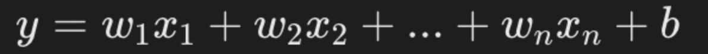

# 深度学习框架 Pytorch
在深度学习初始阶段，每个深度学习研究者都需要写大量的重复代码。为了提高工作效率，这些研究者就将这些代码写成了一个框架放到网上让所有研究者一起使用。接着，网上就出现了不同的框架。随着时间的推移，最为好用的几个框架被大量的人使用从而流行了起来。这些框架对底层细节进行抽象，而不用耗费大量时间编写底层 CUDA 或 C++ 代码。


全世界比较有影响力的深度学习框架有Tensorflow、Keras、Caffe、Torch和PyTorch、 MXNet、CNTK、PaddlePaddle。


## 1 PyTorch 简介
PyTorch 是一个开源的 Python 机器学习库，基于 Torch 库，底层由 C++ 实现，应用于人工智能领域，如计算机视觉和自然语言处理。PyTorch 最初由 Meta Platforms 的人工智能研究团队开发，现在属于Linux 基金会的一部分。

许多深度学习软件都是基于 PyTorch 构建的，包括特斯拉自动驾驶、Uber 的 Pyro、Hugging Face 的 Transformers、 PyTorch Lightning 和 Catalyst。


**动态计算图（Dynamic Computation Graph）**
+ PyTorch 最显著的特点之一是其动态计算图的机制。与 TensorFlow 的静态计算图（graph）不同，PyTorch 在执行时构建计算图，这意味着在每次计算时，图都会根据输入数据的形状自动变化。

**张量（Tensor）与自动求导（Autograd）**
+ PyTorch 中的核心数据结构是张量（Tensor），它是一个多维矩阵，可以在 CPU 或 GPU 上高效地进行计算。张量的操作支持自动求导（Autograd）机制，使得在反向传播过程中自动计算梯度，这对于深度学习中的梯度下降优化算法至关重要。
+ 张量（Tensor）支持在 CPU 和 GPU 之间进行切换。提供了类似 NumPy 的接口，支持元素级运算。支持自动求导，可以方便地进行梯度计算。
+ 自动求导（Autograd），PyTorch 内置的自动求导引擎，能够自动追踪所有张量的操作，并在反向传播时计算梯度。通过 requires_grad 属性，可以指定张量需要计算梯度。支持高效的反向传播，适用于神经网络的训练。

## 2 TensorFlow 与 PyTorch 对比


## 3 PyTorch 基础
PyTorch 主要有以下几个基础概念：**张量（Tensor）、自动求导（Autograd）、神经网络模块（nn.Module）、优化器（optim）** 等。

+ 张量（Tensor）：PyTorch 的核心数据结构，支持多维数组，并可以在 CPU 或 GPU 上进行加速计算。
+ 自动求导（Autograd）：PyTorch 提供了自动求导功能，可以轻松计算模型的梯度，便于进行反向传播和优化。
+ 神经网络（nn.Module）：PyTorch 提供了简单且强大的 API 来构建神经网络模型，可以方便地进行前向传播和模型定义。
+ 优化器（Optimizers）：使用优化器（如 Adam、SGD 等）来更新模型的参数，使得损失最小化。
+ 设备（Device）：可以将模型和张量移动到 GPU 上以加速计算。

-------------

`张量（Tensor）`是 PyTorch 中的核心数据结构，用于存储和操作多维数组。张量可以视为一个多维数组，支持加速计算的操作。在 PyTorch 中，张量的概念类似于 NumPy 中的数组，但是 PyTorch 的张量可以运行在不同的设备上，比如 CPU 和 GPU，这使得它们非常适合于进行大规模并行计算，特别是在深度学习领域。

+ 维度（Dimensionality）：张量的维度指的是数据的多维数组结构。例如，一个标量（0维张量）是一个单独的数字，一个向量（1维张量）是一个一维数组，一个矩阵（2维张量）是一个二维数组，以此类推。
+ 形状（Shape）：张量的形状是指每个维度上的大小。例如，一个形状为(3, 4)的张量意味着它有3行4列。
+ 数据类型（Dtype）：张量中的数据类型定义了存储每个元素所需的内存大小和解释方式。PyTorch支持多种数据类型，包括整数型（如torch.int8、torch.int32）、浮点型（如torch.float32、torch.float64）和布尔型（torch.bool）。

**张量创建**
```python
import torch

# 创建一个 2x3 的全 0 张量
a = torch.zeros(2, 3)
print(a)

# 创建一个 2x3 的全 1 张量
b = torch.ones(2, 3)
print(b)

# 创建一个 2x3 的随机数张量
c = torch.randn(2, 3)
print(c)

# 从 NumPy 数组创建张量
import numpy as np
a= np.array([[1, 2], [3, 4]])
b= torch.from_numpy(a)
print(b)

# 在指定设备（CPU/GPU）上创建张量
device = torch.device("cuda" if torch.cuda.is_available() else "cpu")
d = torch.randn(2, 3, device=device)
print(d)
```

输出结果类似如下：

```
tensor([[0., 0., 0.],
        [0., 0., 0.]])
tensor([[1., 1., 1.],
        [1., 1., 1.]])
tensor([[ 1.0189, -0.5718, -1.2814],
        [-0.5865,  1.0855,  1.1727]])
tensor([[1, 2],
        [3, 4]])
tensor([[-0.3360,  0.2203,  1.3463],
        [-0.5982, -0.2704,  0.5429]])
```
**常用张量操作：**
```python
# 张量相加
e = torch.randn(2, 3)
f = torch.randn(2, 3)
print(e + f)

# 逐元素乘法
print(e * f)

# 张量的转置
g = torch.randn(3, 2)
print(g.t())  # 或者 g.transpose(0, 1)

# 张量的形状
print(g.shape)  # 返回形状
```

-----------------

`自动求导（Automatic Differentiation，简称Autograd）`是深度学习框架中的一个核心特性，它允许计算机自动计算数学函数的导数。

在深度学习中，自动求导主要用于两个方面：**一是在训练神经网络时计算梯度，二是进行反向传播算法的实现。**

自动求导基于链式法则（Chain Rule），这是一个用于计算复杂函数导数的数学法则。链式法则表明，复合函数的导数是其各个组成部分导数的乘积。在深度学习中，模型通常是由许多层组成的复杂函数，自动求导能够高效地计算这些层的梯度。


PyTorch 提供了自动求导功能，通过 autograd 模块来自动计算梯度。torch.Tensor 对象有一个 **requires_grad** 属性，用于指示是否需要计算该张量的梯度。当你创建一个requires_grad=True 的张量时，PyTorch 会自动跟踪所有对它的操作，以便在之后计算梯度。

创建需要梯度的张量:
```python
# 创建一个需要计算梯度的张量
x = torch.randn(2, 2, requires_grad=True)
print(x)

# 执行某些操作
y = x + 2
z = y * y * 3
out = z.mean()

print(out)
```
输出结果类似如下：
```python
tensor([[0., 0., 0.],
        [0., 0., 0.]])
tensor([[1., 1., 1.],
        [1., 1., 1.]])
tensor([[ 1.0189, -0.5718, -1.2814],
        [-0.5865,  1.0855,  1.1727]])
tensor([[1, 2],
        [3, 4]])
tensor([[-0.3360,  0.2203,  1.3463],
        [-0.5982, -0.2704,  0.5429]])
tianqixin@Mac-mini runoob-test % python3 test.py
tensor([[-0.1908,  0.2811],
        [ 0.8068,  0.8002]], requires_grad=True)
tensor(18.1469, grad_fn=<MeanBackward0>)
```

--------------

`神经网络（nn.Module）`是一种模仿人脑神经元连接的计算模型，由多层节点（神经元）组成，用于学习数据之间的复杂模式和关系。神经网络通过调整神经元之间的连接权重来优化预测结果，这一过程涉及前向传播、损失计算、反向传播和参数更新。

神经网络的类型包括**前馈神经网络、卷积神经网络（CNN）、循环神经网络（RNN）和长短期记忆网络（LSTM）**，它们在图像识别、语音处理、自然语言处理等多个领域都有广泛应用。

PyTorch 提供了一个非常方便的接口来构建神经网络模型，即 torch.nn.Module。我们可以继承 nn.Module 类并定义自己的网络层。

```python
import torch.nn as nn
import torch.optim as optim

# 定义一个简单的全连接神经网络
class SimpleNN(nn.Module):
    def __init__(self):
        super(SimpleNN, self).__init__()
        self.fc1 = nn.Linear(2, 2)  # 输入层到隐藏层
        self.fc2 = nn.Linear(2, 1)  # 隐藏层到输出层
    
    def forward(self, x):
        x = torch.relu(self.fc1(x))  # ReLU 激活函数
        x = self.fc2(x)
        return x

# 创建网络实例
model = SimpleNN()

# 打印模型结构
print(model)
```
输出结果
```
SimpleNN(
  (fc1): Linear(in_features=2, out_features=2, bias=True)
  (fc2): Linear(in_features=2, out_features=1, bias=True)
)
```

**训练过程：**
+ 前向传播（Forward Propagation）： 在前向传播阶段，输入数据通过网络层传递，每层应用权重和激活函数，直到产生输出。
+ 计算损失（Calculate Loss）： 根据网络的输出和真实标签，计算损失函数的值。
+ 反向传播（Backpropagation）： 反向传播利用自动求导技术计算损失函数关于每个参数的梯度。
+ 参数更新（Parameter Update）： 使用优化器根据梯度更新网络的权重和偏置。
+ 迭代（Iteration）： 重复上述过程，直到模型在训练数据上的性能达到满意的水平。

**前向传播与损失计算:**
```python
# 随机输入
x = torch.randn(1, 2)

# 前向传播
output = model(x)
print(output)

# 定义损失函数（例如均方误差 MSE）
criterion = nn.MSELoss()

# 假设目标值为 1
target = torch.randn(1, 1)

# 计算损失
loss = criterion(output, target)
print(loss)
```
优化器（Optimizers）在训练过程中更新神经网络的参数，以减少损失函数的值。PyTorch 提供了多种优化器，例如 SGD、Adam 等。

使用优化器进行参数更新：
```python
# 定义优化器（使用 Adam 优化器）
optimizer = optim.Adam(model.parameters(), lr=0.001)

# 训练步骤
optimizer.zero_grad()  # 清空梯度
loss.backward()  # 反向传播
optimizer.step()  # 更新参数
```

一个实例:
```python
import torch
import torch.nn as nn
import torch.optim as optim

# 1. 定义一个简单的神经网络模型
class SimpleNN(nn.Module):
    def __init__(self):
        super(SimpleNN, self).__init__()
        self.fc1 = nn.Linear(2, 2)  # 输入层到隐藏层
        self.fc2 = nn.Linear(2, 1)  # 隐藏层到输出层
    
    def forward(self, x):
        x = torch.relu(self.fc1(x))  # ReLU 激活函数
        x = self.fc2(x)
        return x

# 2. 创建模型实例
model = SimpleNN()

# 3. 定义损失函数和优化器
criterion = nn.MSELoss()  # 均方误差损失函数
optimizer = optim.Adam(model.parameters(), lr=0.001)  # Adam 优化器

# 4. 假设我们有训练数据 X 和 Y
X = torch.randn(10, 2)  # 10 个样本，2 个特征
Y = torch.randn(10, 1)  # 10 个目标值

# 5. 训练循环
for epoch in range(100):  # 训练 100 轮
    optimizer.zero_grad()  # 清空之前的梯度
    output = model(X)  # 前向传播
    loss = criterion(output, Y)  # 计算损失
    loss.backward()  # 反向传播
    optimizer.step()  # 更新参数
    
    # 每 10 轮输出一次损失
    if (epoch+1) % 10 == 0:
        print(f'Epoch [{epoch+1}/100], Loss: {loss.item():.4f}')
```
在每 10 轮，程序会输出当前的损失值，帮助我们跟踪模型的训练进度。随着训练的进行，损失值应该会逐渐降低，表示模型在不断学习并优化其参数。

训练模型是一个迭代的过程，需要不断地调整和优化，直到达到满意的性能。这个过程涉及到大量的实验和调优，目的是使模型在新的、未见过的数据上也能有良好的泛化能力。

## 4 PyTorch张量


+ 1D Tensor / Vector（一维张量/向量）: 最基本的张量形式，可以看作是一个数组，图中的例子是一个包含 10 个元素的向量。
+ 2D Tensor / Matrix（二维张量/矩阵）: 二维数组，通常用于表示矩阵，图中的例子是一个 4x5 的矩阵，包含了 20 个元素。
+ 3D Tensor / Cube（三维张量/立方体）: 三维数组，可以看作是由多个矩阵堆叠而成的立方体，图中的例子展示了一个 3x4x5 的立方体，其中每个 5x5 的矩阵代表立方体的一个"层"。
+ 4D Tensor / Vector of Cubes（四维张量/立方体向量）: 四维数组，可以看作是由多个立方体组成的向量，图中的例子没有具体数值，但可以理解为一个包含多个 3D 张量的集合。
+ 5D Tensor / Matrix of Cubes（五维张量/立方体矩阵）: 五维数组，可以看作是由多个4D张量组成的矩阵，图中的例子同样没有具体数值，但可以理解为一个包含多个 4D 张量的集合。

### 4.1 创建张量
张量创建的方式有：

| 方法                          | 说明                                     | 示例代码                                      |
|-----------------------------|----------------------------------------|---------------------------------------------|
| `torch.tensor(data)`        | 从 Python 列表或 NumPy 数据创建张量。     | `x = torch.tensor([[1, 2], [3, 4]])`         |
| `torch.zeros(size)`         | 创建一个全为 0 的张量。                   | `x = torch.zeros(2, 3)`                      |
| `torch.ones(size)`          | 创建一个全为 1 的张量。                   | `x = torch.ones(2, 3)`                       |
| `torch.empty(size)`         | 创建一个未初始化的张量。                  | `x = torch.empty(2, 3)`                      |
| `torch.rand(size)`          | 创建一个从均匀分布的随机数张量。          | `x = torch.rand(2, 3)`                       |
| `torch.randn(size)`         | 创建一个从正态分布的随机数张量。          | `x = torch.randn(2, 3)`                      |
| `torch.arange(start, end, step)` | 创建一个范围张量，类似于 Python 的 range。 | `x = torch.arange(1, 10, 2)`                 |
| `torch.linspace(start, end, steps)` | 创建一个线性间隔的张量。               | `x = torch.linspace(0, 1, 5)`                |
| `torch.eye(size)`           | 创建一个单位张量（对角线为 1，其他为 0）。 | `x = torch.eye(3)`                           |
| `torch.from_numpy(ndarray)` | 将 NumPy 数据转换为张量。                 | `x = torch.from_numpy(np.array([[1, 2], [2, 3]]))` |


使用 torch.tensor() 函数，你可以将一个列表或数组转换为张量：
```python
import torch

tensor = torch.tensor([1, 2, 3])
print(tensor)
```
如果你有一个 NumPy 数组，可以使用 torch.from_numpy() 将其转换为张量：
```python
import numpy as np

np_array = np.array([1, 2, 3])
tensor = torch.from_numpy(np_array)
print(tensor)
```
创建 2D 张量（矩阵）：
```python
import torch

tensor_2d = torch.tensor([
    [-9, 4, 2, 5, 7],
    [3, 0, 12, 8, 6],
    [1, 23, -6, 45, 2],
    [22, 3, -1, 72, 6]
])
print("2D Tensor (Matrix):\n", tensor_2d)
print("Shape:", tensor_2d.shape)  # 形状
```
其他维度的创建：
```python
# 创建 3D 张量（立方体）
tensor_3d = torch.stack([tensor_2d, tensor_2d + 10, tensor_2d - 5])  # 堆叠 3 个 2D 张量
print("3D Tensor (Cube):\n", tensor_3d)
print("Shape:", tensor_3d.shape)  # 形状

# 创建 4D 张量（向量的立方体）
tensor_4d = torch.stack([tensor_3d, tensor_3d + 100])  # 堆叠 2 个 3D 张量
print("4D Tensor (Vector of Cubes):\n", tensor_4d)
print("Shape:", tensor_4d.shape)  # 形状

# 创建 5D 张量（矩阵的立方体）
tensor_5d = torch.stack([tensor_4d, tensor_4d + 1000])  # 堆叠 2 个 4D 张量
print("5D Tensor (Matrix of Cubes):\n", tensor_5d)
print("Shape:", tensor_5d.shape)  # 形状
```

-------------

### 4.2 张量的属性
张量的属性如下表：
| 属性               | 说明                                 | 示例                          |
|--------------------|--------------------------------------|-------------------------------|
| `.shape`           | 获取张量的形状                        | `tensor.shape`                |
| `.size()`          | 获取张量的形状                        | `tensor.size()`               |
| `.dtype`           | 获取张量的数据类型                    | `tensor.dtype`                |
| `.device`          | 查看张量所在的设备（CPU/GPU）         | `tensor.device`               |
| `.dim()`           | 获取张量的维度                        | `tensor.dim()`                |
| `.requires_grad`   | 是否自动求导计算                      | `tensor.requires_grad`        |
| `.numel()`         | 获取张量的元素数量                    | `tensor.numel()`              |
| `.is_cuda`         | 检查张量是否在 GPU 上                 | `tensor.is_cuda`              |
| `.T`               | 获取张量的转置（适用于 2D 张量）       | `tensor.T`                    |
| `.item()`          | 获取单个元素张量的值                  | `tensor.item()`               |
| `.is_contiguous()` | 检查张量是否是连续的                  | `tensor.is_contiguous()`      |
```python
import torch

# 创建一个 2D 张量
tensor = torch.tensor([[1, 2, 3], [4, 5, 6]], dtype=torch.float32)

# 张量的属性
print("Tensor:\n", tensor)
print("Shape:", tensor.shape)  # 获取形状
print("Size:", tensor.size())  # 获取形状（另一种方法）
print("Data Type:", tensor.dtype)  # 数据类型
print("Device:", tensor.device)  # 设备
print("Dimensions:", tensor.dim())  # 维度数
print("Total Elements:", tensor.numel())  # 元素总数
print("Requires Grad:", tensor.requires_grad)  # 是否启用梯度
print("Is CUDA:", tensor.is_cuda)  # 是否在 GPU 上
print("Is Contiguous:", tensor.is_contiguous())  # 是否连续存储

# 获取单元素值
single_value = torch.tensor(42)
print("Single Element Value:", single_value.item())

# 转置张量
tensor_T = tensor.T
print("Transposed Tensor:\n", tensor_T)
```

输出结果：
```
Tensor:
 tensor([[1., 2., 3.],
         [4., 5., 6.]])
Shape: torch.Size([2, 3])
Size: torch.Size([2, 3])
Data Type: torch.float32
Device: cpu
Dimensions: 2
Total Elements: 6
Requires Grad: False
Is CUDA: False
Is Contiguous: True
Single Element Value: 42
Transposed Tensor:
 tensor([[1., 4.],
         [2., 5.],
         [3., 6.]])
```

### 4.3 张量的操作
张量操作方法说明如下。

**基础操作**
| 操作                        | 说明                             | 示例代码                          |
|-----------------------------|----------------------------------|-----------------------------------|
| `+`, `-`, `*`, `/`          | 元素级加法、减法、乘法、除法       | `z = x + y`                       |
| `torch.matmul(x, y)`        | 矩阵乘法                          | `z = torch.matmul(x, y)`         |
| `torch.dot(x, y)`           | 向量点积（仅适用于 1D 张量）       | `z = torch.dot(x, y)`            |
| `torch.sum(x)`              | 求和                              | `z = torch.sum(x)`               |
| `torch.mean(x)`             | 求均值                            | `z = torch.mean(x)`              |
| `torch.min(x)`              | 求最小值                          | `z = torch.min(x)`               |
| `torch.max(x)`              | 求最大值                          | `z = torch.max(x)`               |
| `torch.argmax(x)`           | 求最大值的索引                    | `z = torch.argmax(x)`            |
| `torch.softmax(x, dim)`     | 计算 softmax（指定维度）           | `z = torch.softmax(x, dim=1)`    |


**形状操作**
| 操作                             | 说明                                 | 示例代码                          |
|----------------------------------|--------------------------------------|-----------------------------------|
| `x.view(shape)`                  | 改变张量的形状（不改变数据）          | `z = x.view(3, 4)`                |
| `x.reshape(shape)`               | 改变形状类似于 view，但更灵活         | `z = x.reshape(3, 4)`             |
| `x.unsqueeze(dim)`              | 在指定维度插入一个维度                | `z = x.unsqueeze(0)`              |
| `x.squeeze(dim)`                | 删除指定维度                          | `z = x.squeeze(0)`                |
| `torch.cat([x, y], dim)`        | 按指定维度拼接张量                    | `z = torch.cat([x, y], dim=1)`    |


```python
import torch

# 创建一个 2D 张量
tensor = torch.tensor([[1, 2, 3], [4, 5, 6]], dtype=torch.float32)
print("原始张量:\n", tensor)

# 1. **索引和切片操作**
print("\n【索引和切片】")
print("获取第一行:", tensor[0])  # 获取第一行
print("获取第一行第一列的元素:", tensor[0, 0])  # 获取特定元素
print("获取第二列的所有元素:", tensor[:, 1])  # 获取第二列所有元素

# 2. **形状变换操作**
print("\n【形状变换】")
reshaped = tensor.view(3, 2)  # 改变张量形状为 3x2
print("改变形状后的张量:\n", reshaped)
flattened = tensor.flatten()  # 将张量展平成一维
print("展平后的张量:\n", flattened)

# 3. **数学运算操作**
print("\n【数学运算】")
tensor_add = tensor + 10  # 张量加法
print("张量加 10:\n", tensor_add)
tensor_mul = tensor * 2  # 张量乘法
print("张量乘 2:\n", tensor_mul)
tensor_sum = tensor.sum()  # 计算所有元素的和
print("张量元素的和:", tensor_sum.item())

# 4. **与其他张量的操作**
print("\n【与其他张量操作】")
tensor2 = torch.tensor([[1, 1, 1], [1, 1, 1]], dtype=torch.float32)
print("另一个张量:\n", tensor2)
tensor_dot = torch.matmul(tensor, tensor2.T)  # 张量矩阵乘法
print("矩阵乘法结果:\n", tensor_dot)

# 5. **条件判断和筛选**
print("\n【条件判断和筛选】")
mask = tensor > 3  # 创建一个布尔掩码
print("大于 3 的元素的布尔掩码:\n", mask)
filtered_tensor = tensor[tensor > 3]  # 筛选出符合条件的元素
print("大于 3 的元素:\n", filtered_tensor)

```
输出结果：
```
原始张量:
 tensor([[1., 2., 3.],
         [4., 5., 6.]])

【索引和切片】
获取第一行: tensor([1., 2., 3.])
获取第一行第一列的元素: tensor(1.)
获取第二列的所有元素: tensor([2., 5.])

【形状变换】
改变形状后的张量:
 tensor([[1., 2.],
         [3., 4.],
         [5., 6.]])
展平后的张量:
 tensor([1., 2., 3., 4., 5., 6.])

【数学运算】
张量加 10:
 tensor([[11., 12., 13.],
         [14., 15., 16.]])
张量乘 2:
 tensor([[ 2.,  4.,  6.],
         [ 8., 10., 12.]])
张量元素的和: 21.0

【与其他张量操作】
另一个张量:
 tensor([[1., 1., 1.],
         [1., 1., 1.]])
矩阵乘法结果:
 tensor([[ 6.,  6.],
         [15., 15.]])

【条件判断和筛选】
大于 3 的元素的布尔掩码:
 tensor([[False, False, False],
         [ True,  True,  True]])
大于 3 的元素:
 tensor([4., 5., 6.])
```

## 5 PyTorch 神经网络基础
神经网络是一种模仿人脑处理信息方式的计算模型，它由许多相互连接的节点（神经元）组成，这些节点按层次排列。神经网络的强大之处在于其能够自动从大量数据中学习复杂的模式和特征，无需人工设计特征提取器。随着深度学习的发展，神经网络已经成为解决许多复杂问题的关键技术。


神经元的输出可以看作是输入的加权和加上偏置（bias），神经元的数学表示：


这里，wj 是权重，xj 是输入，而 Bias 是偏置项。


-------


**1. 前馈神经网络（Feedforward Neural Network，FNN）** ,是神经网络家族中的基本单元。前馈神经网络特点是数据从输入层开始，经过一个或多个隐藏层，最后到达输出层，全过程没有循环或反馈。

前馈神经网络的基本结构：
+ 输入层： 数据进入网络的入口点。输入层的每个节点代表一个输入特征。
+ 隐藏层：一个或多个层，用于捕获数据的非线性特征。每个隐藏层由多个神经元组成，每个神经元通过激活函数增加非线性能力。
+ 输出层：输出网络的预测结果。节点数和问题类型相关，例如分类问题的输出节点数等于类别数。
+ 连接权重与偏置：每个神经元的输入通过权重进行加权求和，并加上偏置值，然后通过激活函数传递。


**2. 循环神经网络(Recurrent Neural Network, RNN)** ,是一类专门处理序列数据的神经网络，能够捕获输入数据中时间或顺序信息的依赖关系。
RNN 的特别之处在于它具有"记忆能力"，可以在网络的隐藏状态中保存之前时间步的信息。
循环神经网络用于处理随时间变化的数据模式。
在 RNN 中，相同的层被用来接收输入参数，并在指定的神经网络中显示输出参数。


**3. 循环神经网络（Recurrent Neural Networks, RNNs）**,适用于序列数据，如时间序列分析和自然语言处理，允许信息反馈循环。

**4. 长短期记忆网络（Long Short-Term Memory, LSTM）**,一种特殊的RNN，能够学习长期依赖关系。

-------
PyTorch 提供了强大的工具来构建和训练神经网络。
神经网络在 PyTorch 中是通过 `torch.nn` 模块来实现的。
`torch.nn` 模块提供了各种网络层（如全连接层、卷积层等）、损失函数和优化器，让神经网络的构建和训练变得更加方便。


在 PyTorch 中，构建神经网络通常需要继承 `nn.Module `类。
nn.Module 是所有神经网络模块的基类，你需要定义以下两个部分：
+ `__init__()`：定义网络层。
+ `forward()`：定义数据的前向传播过程。

简单的全连接神经网络（Fully Connected Network）：
```python
import torch
import torch.nn as nn

# 定义一个简单的神经网络模型
class SimpleNN(nn.Module):
    def __init__(self):
        super(SimpleNN, self).__init__()
        # 定义一个输入层到隐藏层的全连接层
        self.fc1 = nn.Linear(2, 2)  # 输入 2 个特征，输出 2 个特征
        # 定义一个隐藏层到输出层的全连接层
        self.fc2 = nn.Linear(2, 1)  # 输入 2 个特征，输出 1 个预测值
    
    def forward(self, x):
        # 前向传播过程
        x = torch.relu(self.fc1(x))  # 使用 ReLU 激活函数
        x = self.fc2(x)  # 输出层
        return x

# 创建模型实例
model = SimpleNN()

# 打印模型
print(model)
```

输出结果如下：
```
SimpleNN(
  (fc1): Linear(in_features=2, out_features=2, bias=True)
  (fc2): Linear(in_features=2, out_features=1, bias=True)
)
```
PyTorch 提供了许多常见的神经网络层，以下是几个常见的：
+ nn.Linear(in_features, out_features)：全连接层，输入 in_features 个特征，输出 out_features 个特征。
+ nn.Conv2d(in_channels, out_channels, kernel_size)：2D 卷积层，用于图像处理。
+ nn.MaxPool2d(kernel_size)：2D 最大池化层，用于降维。
+ nn.ReLU()：ReLU 激活函数，常用于隐藏层。
+ nn.Softmax(dim)：Softmax 激活函数，通常用于输出层，适用于多类分类问题。


### 5.1 激活函数（Activation Function）
激活函数决定了神经元是否应该被激活。它们是非线性函数，使得神经网络能够学习和执行更复杂的任务。常见的激活函数包括：
+ Sigmoid：用于二分类问题，输出值在 0 和 1 之间。
+ Tanh：输出值在 -1 和 1 之间，常用于输出层之前。
+ ReLU（Rectified Linear Unit）：目前最流行的激活函数之一，定义为 f(x) = max(0, x)，有助于解决梯度消失问题。
+ Softmax：常用于多分类问题的输出层，将输出转换为概率分布。


#### ReLU 激活
output = F.relu(input_tensor)

#### Sigmoid 激活
output = torch.sigmoid(input_tensor)

#### Tanh 激活
output = torch.tanh(input_tensor)


### 5.2 损失函数（Loss Function）
损失函数用于衡量模型的预测值与真实值之间的差异。
常见的损失函数包括：
+ 均方误差（MSELoss）：回归问题常用，计算输出与目标值的平方差。
+ 交叉熵损失（CrossEntropyLoss）：分类问题常用，计算输出和真实标签之间的交叉熵。
+ BCEWithLogitsLoss：二分类问题，结合了 Sigmoid 激活和二元交叉熵损失。

#### 均方误差损失
criterion = nn.MSELoss()

#### 交叉熵损失
criterion = nn.CrossEntropyLoss()

#### 二分类交叉熵损失
criterion = nn.BCEWithLogitsLoss()


### 5.3 优化器（Optimizer）
优化器负责在训练过程中更新网络的权重和偏置。
常见的优化器包括：
+ SGD（随机梯度下降）
+ Adam（自适应矩估计）
+ RMSprop（均方根传播）

```python
import torch.optim as optim

# 使用 SGD 优化器
optimizer = optim.SGD(model.parameters(), lr=0.01)

# 使用 Adam 优化器
optimizer = optim.Adam(model.parameters(), lr=0.001)
```
训练过程（Training Process）训练神经网络涉及以下步骤：
+ 准备数据：通过 DataLoader 加载数据。
+ 定义损失函数和优化器。
+ 前向传播：计算模型的输出。
+ 计算损失：与目标进行比较，得到损失值。
+ 反向传播：通过 loss.backward() 计算梯度。
+ 更新参数：通过 optimizer.step() 更新模型的参数。

重复上述步骤，直到达到预定的训练轮数。

```python
# 假设已经定义好了模型、损失函数和优化器

# 训练数据示例
X = torch.randn(10, 2)  # 10 个样本，每个样本有 2 个特征
Y = torch.randn(10, 1)  # 10 个目标标签

# 训练过程
for epoch in range(100):  # 训练 100 轮
    model.train()  # 设置模型为训练模式
    optimizer.zero_grad()  # 清除梯度
    output = model(X)  # 前向传播
    loss = criterion(output, Y)  # 计算损失
    loss.backward()  # 反向传播
    optimizer.step()  # 更新权重
    
    if (epoch + 1) % 10 == 0:  # 每 10 轮输出一次损失
        print(f'Epoch [{epoch + 1}/100], Loss: {loss.item():.4f}')
```

## 6 PyTorch 第一个神经网络
本章节我们将介绍如何用 PyTorch 实现一个简单的前馈神经网络，完成一个二分类任务。以下实例展示了如何使用 PyTorch 实现一个简单的神经网络进行二分类任务训练。

+ 网络结构包括输入层、隐藏层和输出层，使用了 ReLU 激活函数和 Sigmoid 激活函数。
+ 采用了均方误差损失函数和随机梯度下降优化器。
+ 训练过程是通过前向传播、计算损失、反向传播和参数更新来逐步调整模型参数。

```python
# 导入PyTorch库
import torch
import torch.nn as nn
import matplotlib.pyplot as plt

n_in, n_h, n_out, batch_size = 10, 5, 1, 10
#n_in：输入层大小为 10，即每个数据点有 10 个特征。n_h：隐藏层大小为 5，即隐藏层包含 5 个神经元。n_out：输出层大小为 1，即输出一个标量，表示二分类结果（0 或 1）。batch_size：每个批次包含 10 个样本。


x = torch.randn(batch_size, n_in) 
# x：随机生成一个形状为 (10, 10) 的输入数据矩阵，表示 10 个样本，每个样本有 10 个特征。
y = torch.tensor([[1.0], [0.0], [0.0], 
                 [1.0], [1.0], [1.0], [0.0], [0.0], [1.0], [1.0]])  
# y：目标输出数据（标签），表示每个输入样本的类别标签（0 或 1），是一个 10×1 的张量。


# 创建顺序模型，包含线性层、ReLU激活函数和Sigmoid激活函数
model = nn.Sequential(
   nn.Linear(n_in, n_h),  #定义输入层到隐藏层的线性变换，输入特征是10个，隐藏层有5个神经元。
   nn.ReLU(), #在隐藏层后添加 ReLU 激活函数，增加非线性。
   nn.Linear(n_h, n_out),  #定义隐藏层到输出层的线性变换，输出为 1 个神经元。
   nn.Sigmoid() #输出层使用 Sigmoid 激活函数，将结果映射到 0 到 1 之间，用于二分类任务。
)

# 定义均方误差损失函数和随机梯度下降优化器
criterion = torch.nn.MSELoss()
optimizer = torch.optim.SGD(model.parameters(), lr=0.01)  # 学习率为0.01

# 执行梯度下降算法进行模型训练
for epoch in range(50):  # 迭代50次
   y_pred = model(x)  # 前向传播，计算预测值
   loss = criterion(y_pred, y)  # 计算损失
   print('epoch: ', epoch, 'loss: ', loss.item())  # 打印损失值

   optimizer.zero_grad()  # 清零梯度
   loss.backward()  # 反向传播，计算梯度
   optimizer.step()  # 更新模型参数

# 用于存储每轮的损失值
losses = []

# 执行梯度下降算法进行模型训练
for epoch in range(50):  # 迭代50次
    y_pred = model(x)  # 前向传播，计算预测值
    loss = criterion(y_pred, y)  # 计算损失
    losses.append(loss.item())  # 记录损失值
    print(f'Epoch [{epoch+1}/50], Loss: {loss.item():.4f}')  # 打印损失值

    optimizer.zero_grad()  # 清零梯度
    loss.backward()  # 反向传播，计算梯度
    optimizer.step()  # 更新模型参数

# 可视化损失变化曲线
plt.figure(figsize=(8, 5))
plt.plot(range(1, 51), losses, label='Loss')
plt.xlabel('Epoch')
plt.ylabel('Loss')
plt.title('Training Loss Over Epochs')
plt.legend()
plt.grid()
plt.show()

# 可视化预测结果与实际目标值对比
y_pred_final = model(x).detach().numpy()  # 最终预测值
y_actual = y.numpy()  # 实际值

plt.figure(figsize=(8, 5))
plt.plot(range(1, batch_size + 1), y_actual, 'o-', label='Actual', color='blue')
plt.plot(range(1, batch_size + 1), y_pred_final, 'x--', label='Predicted', color='red')
plt.xlabel('Sample Index')
plt.ylabel('Value')
plt.title('Actual vs Predicted Values')
plt.legend()
plt.grid()
plt.show()
```

```
epoch:  0 loss:  0.2591968774795532
epoch:  1 loss:  0.25902628898620605
epoch:  2 loss:  0.25885599851608276
epoch:  3 loss:  0.25868603587150574
epoch:  4 loss:  0.25851646065711975
```

另一个实例：
```python
import torch
import torch.nn as nn
import torch.optim as optim
import matplotlib.pyplot as plt

# 生成一些随机数据
n_samples = 100
data = torch.randn(n_samples, 2)  # 生成 100 个二维数据点
labels = (data[:, 0]**2 + data[:, 1]**2 < 1).float().unsqueeze(1)  # 点在圆内为1，圆外为0

# 可视化数据
plt.scatter(data[:, 0], data[:, 1], c=labels.squeeze(), cmap='coolwarm')
plt.title("Generated Data")
plt.xlabel("Feature 1")
plt.ylabel("Feature 2")
plt.show()

# 定义前馈神经网络
class SimpleNN(nn.Module):
    def __init__(self):
        super(SimpleNN, self).__init__()
        # 定义神经网络的层
        self.fc1 = nn.Linear(2, 4)  # 输入层有 2 个特征，隐藏层有 4 个神经元
        self.fc2 = nn.Linear(4, 1)  # 隐藏层输出到 1 个神经元（用于二分类）
        self.sigmoid = nn.Sigmoid()  # 二分类激活函数

    def forward(self, x):
        x = torch.relu(self.fc1(x))  # 使用 ReLU 激活函数
        x = self.sigmoid(self.fc2(x))  # 输出层使用 Sigmoid 激活函数
        return x

# 实例化模型
model = SimpleNN()

# 定义损失函数和优化器
criterion = nn.BCELoss()  # 二元交叉熵损失
optimizer = optim.SGD(model.parameters(), lr=0.1)  # 使用随机梯度下降优化器

# 训练
epochs = 100
for epoch in range(epochs):
    # 前向传播
    outputs = model(data)
    loss = criterion(outputs, labels)

    # 反向传播
    optimizer.zero_grad()
    loss.backward()
    optimizer.step()

    # 每 10 轮打印一次损失
    if (epoch + 1) % 10 == 0:
        print(f'Epoch [{epoch + 1}/{epochs}], Loss: {loss.item():.4f}')

# 可视化决策边界
def plot_decision_boundary(model, data):
    x_min, x_max = data[:, 0].min() - 1, data[:, 0].max() + 1
    y_min, y_max = data[:, 1].min() - 1, data[:, 1].max() + 1
    xx, yy = torch.meshgrid(torch.arange(x_min, x_max, 0.1), torch.arange(y_min, y_max, 0.1), indexing='ij')
    grid = torch.cat([xx.reshape(-1, 1), yy.reshape(-1, 1)], dim=1)
    predictions = model(grid).detach().numpy().reshape(xx.shape)
    plt.contourf(xx, yy, predictions, levels=[0, 0.5, 1], cmap='coolwarm', alpha=0.7)
    plt.scatter(data[:, 0], data[:, 1], c=labels.squeeze(), cmap='coolwarm', edgecolors='k')
    plt.title("Decision Boundary")
    plt.show()

plot_decision_boundary(model, data)
```
训练时的损失输出：
```
Epoch [10/100], Loss: 0.5247
Epoch [20/100], Loss: 0.3142
...
Epoch [100/100], Loss: 0.0957
```
图中显示了原始数据点（红色和蓝色），以及模型学习到的分类边界。


## 7 PyTorch 数据处理与加载
在 PyTorch 中，处理和加载数据是深度学习训练过程中的关键步骤。为了高效地处理数据，PyTorch 提供了强大的工具，包括 `torch.utils.data.Dataset` 和 `torch.utils.data.DataLoader`，帮助我们管理数据集、批量加载和数据增强等任务。

PyTorch 数据处理与加载的介绍：
+ 自定义 Dataset：通过继承 torch.utils.data.Dataset 来加载自己的数据集。
+ DataLoader：DataLoader 按批次加载数据，支持多线程加载并进行数据打乱。
+ 数据预处理与增强：使用 torchvision.transforms 进行常见的图像预处理和增强操作，提高模型的泛化能力。
+ 加载标准数据集：torchvision.datasets 提供了许多常见的数据集，简化了数据加载过程。
+ 多个数据源：通过组合多个 Dataset 实例来处理来自不同来源的数据。


### 7.1 自定义 Dataset
torch.utils.data.Dataset 是一个抽象类，允许你从自己的数据源中创建数据集。

我们需要继承该类并实现以下两个方法：

+ `__len__(self)`：返回数据集中的样本数量。
+ `__getitem__(self, idx)`：通过索引返回一个样本。

假设我们有一个简单的 CSV 文件或一些列表数据，我们可以通过继承 Dataset 类来创建自己的数据集。

```python
import torch
from torch.utils.data import Dataset

# 自定义数据集类
class MyDataset(Dataset):
    def __init__(self, X_data, Y_data):
        """
        初始化数据集，X_data 和 Y_data 是两个列表或数组
        X_data: 输入特征
        Y_data: 目标标签
        """
        self.X_data = X_data
        self.Y_data = Y_data

    def __len__(self):
        """返回数据集的大小"""
        return len(self.X_data)

    def __getitem__(self, idx):
        """返回指定索引的数据"""
        x = torch.tensor(self.X_data[idx], dtype=torch.float32)  # 转换为 Tensor
        y = torch.tensor(self.Y_data[idx], dtype=torch.float32)
        return x, y

# 示例数据
X_data = [[1, 2], [3, 4], [5, 6], [7, 8]]  # 输入特征
Y_data = [1, 0, 1, 0]  # 目标标签

# 创建数据集实例
dataset = MyDataset(X_data, Y_data)
```

### 7.2 使用 DataLoader 加载数据
DataLoader 是 PyTorch 提供的一个重要工具，用于从 Dataset 中按批次（batch）加载数据。DataLoader 允许我们批量读取数据并进行多线程加载，从而提高训练效率。
```python
from torch.utils.data import DataLoader

# 创建 DataLoader 实例，batch_size 设置每次加载的样本数量
dataloader = DataLoader(dataset, batch_size=2, shuffle=True)

# 打印加载的数据
for epoch in range(1):
    for batch_idx, (inputs, labels) in enumerate(dataloader):
        print(f'Batch {batch_idx + 1}:')
        print(f'Inputs: {inputs}')
        print(f'Labels: {labels}')
```
+ batch_size: 每次加载的样本数量。
+ shuffle: 是否对数据进行洗牌，通常训练时需要将数据打乱。
+ drop_last: 如果数据集中的样本数不能被 batch_size 整除，设置为 True 时，丢弃最后一个不完整的 batch。

输出：
```
Batch 1:
Inputs: tensor([[3., 4.], [1., 2.]])
Labels: tensor([0., 1.])
Batch 2:
Inputs: tensor([[7., 8.], [5., 6.]])
Labels: tensor([0., 1.])
```
每次循环中，DataLoader 会返回一个批次的数据，包括输入特征（inputs）和目标标签（labels）。


### 7.3 预处理与数据增强

数据预处理和增强对于提高模型的性能至关重要。
PyTorch 提供了 `torchvision.transforms` 模块来进行常见的图像预处理和增强操作，如旋转、裁剪、归一化等。

常见的图像预处理操作:
```python
import torchvision.transforms as transforms
from PIL import Image

# 定义数据预处理的流水线
transform = transforms.Compose([
    transforms.Resize((128, 128)),  # 将图像调整为 128x128
    transforms.ToTensor(),  # 将图像转换为张量
    transforms.Normalize(mean=[0.485, 0.456, 0.406], std=[0.229, 0.224, 0.225])  # 标准化
])

# 加载图像
image = Image.open('image.jpg')

# 应用预处理
image_tensor = transform(image)
print(image_tensor.shape)  # 输出张量的形状
```

+ transforms.Compose()：将多个变换操作组合在一起。
+ transforms.Resize()：调整图像大小。
+ transforms.ToTensor()：将图像转换为 PyTorch 张量，值会被归一化到 [0, 1] 范围。
+ transforms.Normalize()：标准化图像数据，通常使用预训练模型时需要进行标准化处理。


**图像数据增强**

数据增强技术通过对训练数据进行随机变换，增加数据的多样性，帮助模型更好地泛化。例如，随机翻转、旋转、裁剪等。

```python
transform = transforms.Compose([
    transforms.RandomHorizontalFlip(),  # 随机水平翻转
    transforms.RandomRotation(30),  # 随机旋转 30 度
    transforms.RandomResizedCrop(128),  # 随机裁剪并调整为 128x128
    transforms.ToTensor(),
    transforms.Normalize(mean=[0.485, 0.456, 0.406], std=[0.229, 0.224, 0.225])
])
```
这些数据增强方法可以通过 `transforms.Compose()` 组合使用，保证每个图像在训练时具有不同的变换。

**加载图像数据集**

对于图像数据集，`torchvision.datasets` 提供了许多常见数据集（如 CIFAR-10、ImageNet、MNIST 等）以及用于加载图像数据的工具。

加载 MNIST 数据集:
```python
import torchvision.datasets as datasets
import torchvision.transforms as transforms

# 定义预处理操作
transform = transforms.Compose([
    transforms.ToTensor(),
    transforms.Normalize((0.5,), (0.5,))  # 对灰度图像进行标准化
])

# 下载并加载 MNIST 数据集
train_dataset = datasets.MNIST(root='./data', train=True, download=True, transform=transform)
test_dataset = datasets.MNIST(root='./data', train=False, download=True, transform=transform)

# 创建 DataLoader
train_loader = DataLoader(train_dataset, batch_size=64, shuffle=True)
test_loader = DataLoader(test_dataset, batch_size=64, shuffle=False)

# 迭代训练数据
for inputs, labels in train_loader:
    print(inputs.shape)  # 每个批次的输入数据形状
    print(labels.shape)  # 每个批次的标签形状
```
+ datasets.MNIST() 会自动下载 MNIST 数据集并加载。
+ transform 参数允许我们对数据进行预处理。
+ train=True 和 train=False 分别表示训练集和测试集。


### 7.4 用多个数据源（Multi-source Dataset）
如果你的数据集由多个文件、多个来源（例如多个图像文件夹）组成，可以通过继承 Dataset 类自定义加载多个数据源。PyTorch 提供了 ConcatDataset 和 ChainDataset 等类来连接多个数据集。

例如，假设我们有多个图像文件夹的数据，可以将它们合并为一个数据集：
```python
from torch.utils.data import ConcatDataset

# 假设 dataset1 和 dataset2 是两个 Dataset 对象
combined_dataset = ConcatDataset([dataset1, dataset2])
combined_loader = DataLoader(combined_dataset, batch_size=64, shuffle=True)
```


## 8 PyTorch 线性回归
线性回归是最基本的机器学习算法之一，用于预测一个连续值。线性回归是一种简单且常见的回归分析方法，目的是通过拟合一个线性函数来预测输出。对于一个简单的线性回归问题，模型可以表示为：


+ y 是预测值（目标值）。
+ x1，x2，xn 是输入特征。
+ w1，w2，wn是待学习的权重（模型参数）。
+ b 是偏置项。


在 PyTorch 中，线性回归模型可以通过继承 nn.Module 类来实现。我们将通过一个简单的示例来详细说明如何使用 PyTorch 实现线性回归模型。


### 8.1 数据准备
我们首先准备一些假数据，用于训练我们的线性回归模型。这里，我们可以生成一个简单的线性关系的数据集，其中每个样本有两个特征 x1，x2。

```python
import torch
import numpy as np
import matplotlib.pyplot as plt

# 随机种子，确保每次运行结果一致
torch.manual_seed(42)

# 生成训练数据
X = torch.randn(100, 2)  # 100 个样本，每个样本 2 个特征
true_w = torch.tensor([2.0, 3.0])  # 假设真实权重
true_b = 4.0  # 偏置项
Y = X @ true_w + true_b + torch.randn(100) * 0.1  # 加入一些噪声

# 打印部分数据
print(X[:5])
print(Y[:5])
```
输出结果如下：
```
tensor([[ 1.9269,  1.4873],
        [ 0.9007, -2.1055],
        [ 0.6784, -1.2345],
        [-0.0431, -1.6047],
        [-0.7521,  1.6487]])
tensor([12.4460, -0.4663,  1.7666, -0.9357,  7.4781])
```
这段代码创建了一个带有噪声的线性数据集，输入 X 为 100x2 的矩阵，每个样本有两个特征，输出 Y 由真实的权重和偏置生成，并加上了一些随机噪声。

### 8.2 定义线性回归模型
我们可以通过继承 nn.Module 来定义一个简单的线性回归模型。在 PyTorch 中，线性回归的核心是 nn.Linear() 层，它会自动处理权重和偏置的初始化。
```python
import torch.nn as nn

# 定义线性回归模型
class LinearRegressionModel(nn.Module):
    def __init__(self):
        super(LinearRegressionModel, self).__init__()
        # 定义一个线性层，输入为2个特征，输出为1个预测值
        self.linear = nn.Linear(2, 1)  # 输入维度2，输出维度1
    
    def forward(self, x):
        return self.linear(x)  # 前向传播，返回预测结果

# 创建模型实例
model = LinearRegressionModel()
```
这里的 nn.Linear(2, 1) 表示一个线性层，它有 2 个输入特征和 1 个输出。forward 方法定义了如何通过这个层进行前向传播。

### 8.3 定义损失函数和优化器
线性回归的常见损失函数是 均方误差损失（MSELoss），用于衡量预测值与真实值之间的差异。PyTorch 中提供了现成的 MSELoss 函数。
我们将使用 SGD（随机梯度下降） 或 Adam 优化器来最小化损失函数。
```python
# 损失函数（均方误差）
criterion = nn.MSELoss()

# 优化器（使用 SGD 或 Adam）
optimizer = torch.optim.SGD(model.parameters(), lr=0.01)  # 学习率设置为0.01
```

+ MSELoss：计算预测值与真实值的均方误差。
+ SGD：使用随机梯度下降法更新参数。


**训练模型**

在训练过程中，我们将执行以下步骤：
+ 使用输入数据 X 进行前向传播，得到预测值。
+ 计算损失（预测值与实际值之间的差异）。 
+ 使用反向传播计算梯度。
+ 更新模型参数（权重和偏置）。
+ 我们将训练模型 1000 轮，并在每 100 轮打印一次损失。

```python
# 训练模型
num_epochs = 1000  # 训练 1000 轮
for epoch in range(num_epochs):
    model.train()  # 设置模型为训练模式

    # 前向传播
    predictions = model(X)  # 模型输出预测值
    loss = criterion(predictions.squeeze(), Y)  # 计算损失（注意预测值需要压缩为1D）

    # 反向传播
    optimizer.zero_grad()  # 清空之前的梯度
    loss.backward()  # 计算梯度
    optimizer.step()  # 更新模型参数

    # 打印损失
    if (epoch + 1) % 100 == 0:
        print(f'Epoch [{epoch + 1}/1000], Loss: {loss.item():.4f}')
```
+ predictions.squeeze()：我们在这里将模型的输出从 2D 张量压缩为 1D，因为目标值 Y 是一个一维数组。
+ optimizer.zero_grad()：每次反向传播前需要清空之前的梯度。
+ loss.backward()：计算梯度。
+ optimizer.step()：更新权重和偏置。


### 8.4 评估模型
训练完成后，我们可以通过查看模型的权重和偏置来评估模型的效果。我们还可以在新的数据上进行预测并与实际值进行比较。
```python
# 查看训练后的权重和偏置
print(f'Predicted weight: {model.linear.weight.data.numpy()}')
print(f'Predicted bias: {model.linear.bias.data.numpy()}')

# 在新数据上做预测
with torch.no_grad():  # 评估时不需要计算梯度
    predictions = model(X)

# 可视化预测与实际值
plt.scatter(X[:, 0], Y, color='blue', label='True values')
plt.scatter(X[:, 0], predictions, color='red', label='Predictions')
plt.legend()
plt.show()
```
+ model.linear.weight.data 和 model.linear.bias.data：这些属性存储了模型的权重和偏置。
+ torch.no_grad()：在评估模式下，不需要计算梯度，节省内存。


## 9 PyTorch 卷积神经网络CNN

**PyTorch 卷积神经网络 (Convolutional Neural Networks, CNN) 是一类专门用于处理具有网格状拓扑结构数据（如图像）的深度学习模型**，CNN 是计算机视觉任务（如图像分类、目标检测和分割）的核心技术。下面这张图展示了一个典型的卷积神经网络（CNN）的结构和工作流程，用于图像识别任务。


在图中，CNN 的输出层给出了三个类别的概率：Donald（0.2）、Goofy（0.1）和Tweety（0.7），这表明网络认为输入图像最有可能是 Tweety。

以下是各个部分的简要说明：

+ 输入图像（Input Image）：网络接收的原始图像数据。
卷积（Convolution）：使用卷积核（Kernel）在输入图像上滑动，提取特征，生成特征图（Feature Maps）。
+ 池化（Pooling）：通常在卷积层之后，通过最大池化或平均池化减少特征图的尺寸，同时保留重要特征，生成池化特征图（Pooled Feature Maps）。
+ 特征提取（Feature Extraction）：通过多个卷积和池化层的组合，逐步提取图像的高级特征。
+ 展平层（Flatten Layer）：将多维的特征图转换为一维向量，以便输入到全连接层。
+ 全连接层（Fully Connected Layer）：类似于传统的神经网络层，用于将提取的特征映射到输出类别。
+ 分类（Classification）：网络的输出层，根据全连接层的输出进行分类。
+ 概率分布（Probabilistic Distribution）：输出层给出每个类别的概率，表示输入图像属于各个类别的可能性。


**卷积神经网络的基本结构**

1. 输入层（Input Layer）
接收原始图像数据，图像通常被表示为一个三维数组，其中两个维度代表图像的宽度和高度，第三个维度代表颜色通道（例如，RGB图像有三个通道）。
2. 卷积层（Convolutional Layer）
用卷积核提取局部特征，如边缘、纹理等。
公式：

+ x：输入图像。
+ k：卷积核（权重矩阵）。
+ b：偏置。

> 应用一组可学习的**滤波器（或卷积核）**在输入图像上进行卷积操作，以提取局部特征。每个滤波器在输入图像上滑动，生成一个**特征图（Feature Map）**，表示滤波器在不同位置的激活。卷积层可以有多个滤波器，每个滤波器生成一个特征图，所有特征图组成一个特征图集合。

3. 激活函数（Activation Function）
通常在卷积层之后应用非线性激活函数，如 ReLU（Rectified Linear Unit），以引入非线性特性，使网络能够学习更复杂的模式。
> ReLU 函数定义为 ：f(x)=max(0,x)，即如果输入小于 0 则输出 0，否则输出输入值。

4. 池化层（Pooling Layer）
用于降低特征图的空间维度，减少计算量和参数数量，同时保留最重要的特征信息。最常见的池化操作是最大池化（Max Pooling）和平均池化（Average Pooling）。最大池化选择区域内的最大值，而平均池化计算区域内的平均值。

5. 归一化层（Normalization Layer，可选）
例如，局部响应归一化（Local Response Normalization, LRN）或批归一化（Batch Normalization）。
这些层有助于加速训练过程，提高模型的稳定性。

6. 全连接层（Fully Connected Layer）
在 CNN 的末端，将前面层提取的特征图展平（Flatten）成一维向量，然后输入到全连接层。
全连接层的每个神经元都与前一层的所有神经元相连，用于综合特征并进行最终的分类或回归。

7. 输出层（Output Layer）
根据任务的不同，输出层可以有不同的形式。
对于分类任务，通常使用 Softmax 函数将输出转换为概率分布，表示输入属于各个类别的概率。

8. 损失函数（Loss Function）
用于衡量模型预测与真实标签之间的差异。
常见的损失函数包括交叉熵损失（Cross-Entropy Loss）用于多分类任务，均方误差（Mean Squared Error, MSE）用于回归任务。

9. 优化器（Optimizer）
用于根据损失函数的梯度更新网络的权重。常见的优化器包括随机梯度下降（SGD）、Adam、RMSprop等。

10. 正则化（Regularization，可选）
包括 Dropout、L1/L2 正则化等技术，用于防止模型过拟合。
这些层可以堆叠形成更深的网络结构，以提高模型的学习能力。
CNN 的深度和复杂性可以根据任务的需求进行调整。


## 10 PyTorch 实现CNN 实例
以下示例展示如何用 PyTorch 构建一个简单的 CNN 模型，用于 MNIST 数据集的数字分类。

主要步骤：

+ 数据加载与预处理：使用 torchvision 加载和预处理 MNIST 数据。
+ 模型构建：定义卷积层、池化层和全连接层。
+ 训练：通过损失函数和优化器进行模型训练。
+ 评估：测试集上计算模型的准确率。
+ 可视化：展示部分测试样本及其预测结果。


```python
import torch
import torch.nn as nn
import torch.nn.functional as F
import torch.optim as optim
from torchvision import datasets, transforms


# 1. 数据加载与预处理
transform = transforms.Compose([
    transforms.ToTensor(),  # 转为张量
    transforms.Normalize((0.5,), (0.5,))  # 归一化到 [-1, 1]
])

# 加载 MNIST 数据集
train_dataset = datasets.MNIST(root='./data', train=True, transform=transform, download=True)
test_dataset = datasets.MNIST(root='./data', train=False, transform=transform, download=True)

train_loader = torch.utils.data.DataLoader(dataset=train_dataset, batch_size=64, shuffle=True)
test_loader = torch.utils.data.DataLoader(dataset=test_dataset, batch_size=64, shuffle=False)

# 2. 定义 CNN 模型
class SimpleCNN(nn.Module):
    def __init__(self):
        super(SimpleCNN, self).__init__()
        # 定义卷积层
        self.conv1 = nn.Conv2d(1, 32, kernel_size=3, stride=1, padding=1)  # 输入1通道，输出32通道
        self.conv2 = nn.Conv2d(32, 64, kernel_size=3, stride=1, padding=1)  # 输入32通道，输出64通道
        # 定义全连接层
        self.fc1 = nn.Linear(64 * 7 * 7, 128)  # 展平后输入到全连接层
        self.fc2 = nn.Linear(128, 10)  # 10 个类别

    def forward(self, x):
        x = F.relu(self.conv1(x))  # 第一层卷积 + ReLU
        x = F.max_pool2d(x, 2)     # 最大池化
        x = F.relu(self.conv2(x))  # 第二层卷积 + ReLU
        x = F.max_pool2d(x, 2)     # 最大池化
        x = x.view(-1, 64 * 7 * 7) # 展平
        x = F.relu(self.fc1(x))    # 全连接层 + ReLU
        x = self.fc2(x)            # 最后一层输出
        return x

# 创建模型实例
model = SimpleCNN()

# 3. 定义损失函数与优化器
criterion = nn.CrossEntropyLoss()  # 多分类交叉熵损失
optimizer = optim.SGD(model.parameters(), lr=0.01, momentum=0.9)

# 4. 模型训练
num_epochs = 5
model.train()  # 设置模型为训练模式

for epoch in range(num_epochs):
    total_loss = 0
    for images, labels in train_loader:
        outputs = model(images)  # 前向传播
        loss = criterion(outputs, labels)  # 计算损失

        optimizer.zero_grad()  # 清空梯度
        loss.backward()  # 反向传播
        optimizer.step()  # 更新参数

        total_loss += loss.item()

    print(f"Epoch [{epoch+1}/{num_epochs}], Loss: {total_loss / len(train_loader):.4f}")

# 5. 模型测试
model.eval()  # 设置模型为评估模式
correct = 0
total = 0

with torch.no_grad():  # 关闭梯度计算
    for images, labels in test_loader:
        outputs = model(images)
        _, predicted = torch.max(outputs, 1)
        total += labels.size(0)
        correct += (predicted == labels).sum().item()

accuracy = 100 * correct / total
print(f"Test Accuracy: {accuracy:.2f}%")
```


## 11 PyTorch 循环神经网络RNN
**循环神经网络（Recurrent Neural Networks, RNN）**，是一类神经网络架构，专门用于处理**序列数据**，能够捕捉时间序列或有序数据的动态信息，能够处理序列数据，如文本、时间序列或音频。

RNN 在自然语言处理（NLP）、语音识别、时间序列预测等任务中有着广泛的应用。
RNN 的关键特性是其能够保持隐状态（hidden state），使得网络能够记住先前时间步的信息，这对于处理序列数据至关重要。

### 11.1 **RNN 的基本结构**

在传统的前馈神经网络（Feedforward Neural Network）中，数据是从输入层流向输出层的，而在 RNN 中，数据不仅沿着网络层级流动，还会在每个时间步骤上传播到当前的隐层状态，从而将之前的信息传递到下一个时间步骤。

> **隐状态（Hidden State）**： RNN 通过隐状态来记住序列中的信息。隐状态是通过上一时间步的隐状态和当前输入共同计算得到的。

循环单元的结构如下：
+ 输入 $x_t$ ：在时间步t的输入向量。
+ 隐藏状态 $h_t$  ：在时间步 t 的隐藏状态向量，用于存储之前时间步的信息。
+ 输出 $y_t$ ：在时间步t的输出向量（可选，取决于具体任务）。

**公式**

$$
h_t = f(W_{hh}h_{t-1} + W_{xh}x_t + b_h)
$$

**参数说明**

- $h_t$：当前时刻的隐状态
- $h_{t-1}$：前一时刻的隐状态
- $x_t$：当前时刻的输入
- $W_{hh}, W_{xh}$：权重矩阵
- $b_h$：偏置项
- $f$：激活函数（如 Tanh 或 ReLU）

### 11.2 **输出（Output）**

RNN 的输出不仅依赖当前的输入，还依赖于隐状态的历史信息。

**公式**

$$
y_t = W_{hy}h_t + b_y
$$


**参数说明**
- $y_t$：在时间步 t的输出向量（可选，取决于具体任务）
- $W_{hy}$：隐藏状态到输出的权重矩阵
- $h_t$：当前时刻的隐状态
- $b_y$：输出层的偏置项


### 11.3 RNN 如何处理序列数据
循环神经网络（RNN）在处理序列数据时的展开（unfold）视图如下：


RNN 是一种处理序列数据的神经网络，它通过循环连接来处理序列中的每个元素，并在每个时间步传递信息，以下是图中各部分的说明：
+ 输入序列（Xt, Xt-1, Xt+1, ...）：图中的粉色圆圈代表输入序列中的各个元素，如Xt表示当前时间步的输入，Xt-1表示前一个时间步的输入，以此类推。
+ 隐藏状态（ht, ht-1, ht+1, ...）：绿色矩形代表RNN的隐藏状态，它在每个时间步存储有关序列的信息。ht是当前时间步的隐藏状态，ht-1是前一个时间步的隐藏状态。
+ 权重矩阵（U, W, V）：
U：输入到隐藏状态的权重矩阵，用于将输入Xt转换为隐藏状态的一部分。
W：隐藏状态到隐藏状态的权重矩阵，用于将前一时间步的隐藏状态ht-1转换为当前时间步隐藏状态的一部分。
V：隐藏状态到输出的权重矩阵，用于将隐藏状态ht转换为输出Yt。
+ 输出序列（Yt, Yt-1, Yt+1, ...）：蓝色圆圈代表RNN在每个时间步的输出，如Yt是当前时间步的输出。
+ 循环连接：RNN的特点是隐藏状态的循环连接，这允许网络在处理当前时间步的输入时考虑到之前时间步的信息。
+ 展开（Unfold）：图中展示了RNN在序列上的展开过程，这有助于理解RNN如何在时间上处理序列数据。在实际的RNN实现中，这些步骤是并行处理的，但在概念上，我们可以将其展开来理解信息是如何流动的。
+ 信息流动：信息从输入序列通过权重矩阵U传递到隐藏状态，然后通过权重矩阵W在时间步之间传递，最后通过权重矩阵V从隐藏状态传递到输出序列。


## 12 PyTorch 实现RNN 实例
在 PyTorch 中，RNN 可以用于构建复杂的序列模型。
PyTorch 提供了几种 RNN 模块，包括：
+ torch.nn.RNN：基本的RNN单元。
+ torch.nn.LSTM：长短期记忆单元，能够学习长期依赖关系。
+ torch.nn.GRU：门控循环单元，是LSTM的简化版本，但通常更容易训练。

使用 RNN 类时，您需要指定输入的维度、隐藏层的维度以及其他一些超参数。


**PyTorch 实现一个简单的 RNN 实例**
```python
import torch
import torch.nn as nn
import torch.optim as optim
import matplotlib.pyplot as plt
import numpy as np

# 数据集：字符序列预测（Hello -> Elloh）
char_set = list("hello")
char_to_idx = {c: i for i, c in enumerate(char_set)}
idx_to_char = {i: c for i, c in enumerate(char_set)}

# 数据准备
input_str = "hello"
target_str = "elloh"
input_data = [char_to_idx[c] for c in input_str]
target_data = [char_to_idx[c] for c in target_str]

# 转换为独热编码
input_one_hot = np.eye(len(char_set))[input_data]

# 转换为 PyTorch Tensor
inputs = torch.tensor(input_one_hot, dtype=torch.float32)
targets = torch.tensor(target_data, dtype=torch.long)

# 模型超参数
input_size = len(char_set)
hidden_size = 8
output_size = len(char_set)
num_epochs = 200
learning_rate = 0.1

# 定义 RNN 模型
class RNNModel(nn.Module):
    def __init__(self, input_size, hidden_size, output_size):
        super(RNNModel, self).__init__()
        self.rnn = nn.RNN(input_size, hidden_size, batch_first=True)
        self.fc = nn.Linear(hidden_size, output_size)

    def forward(self, x, hidden):
        out, hidden = self.rnn(x, hidden)
        out = self.fc(out)  # 应用全连接层
        return out, hidden

model = RNNModel(input_size, hidden_size, output_size)

# 定义损失函数和优化器
criterion = nn.CrossEntropyLoss()
optimizer = optim.Adam(model.parameters(), lr=learning_rate)

# 训练 RNN
losses = []
hidden = None  # 初始隐藏状态为 None
for epoch in range(num_epochs):
    optimizer.zero_grad()

    # 前向传播
    outputs, hidden = model(inputs.unsqueeze(0), hidden)
    hidden = hidden.detach()  # 防止梯度爆炸

    # 计算损失
    loss = criterion(outputs.view(-1, output_size), targets)
    loss.backward()
    optimizer.step()
    losses.append(loss.item())

    if (epoch + 1) % 20 == 0:
        print(f"Epoch [{epoch + 1}/{num_epochs}], Loss: {loss.item():.4f}")

# 测试 RNN
with torch.no_grad():
    test_hidden = None
    test_output, _ = model(inputs.unsqueeze(0), test_hidden)
    predicted = torch.argmax(test_output, dim=2).squeeze().numpy()

    print("Input sequence: ", ''.join([idx_to_char[i] for i in input_data]))
    print("Predicted sequence: ", ''.join([idx_to_char[i] for i in predicted]))
```


+ 数据准备：
使用字符序列 hello，并将其转化为独热编码。
目标序列为 elloh，即向右旋转一个字符。
+ 模型构建：
使用 torch.nn.RNN 创建循环神经网络。
加入全连接层 torch.nn.Linear 用于映射隐藏状态到输出。
+ 训练部分：
每一轮都计算损失并反向传播。
隐藏状态通过 hidden.detach() 防止梯度爆炸。
+ 测试部分：
模型输出字符的预测结果。


## 13 PyTorch 数据集
在深度学习任务中，数据加载和处理是至关重要的一环。
PyTorch 提供了强大的数据加载和处理工具，主要包括：
+ torch.utils.data.Dataset：数据集的抽象类，需要自定义并实现 `__len__`（数据集大小）和 `__getitem__`（按索引获取样本）。
+ torch.utils.data.TensorDataset：基于张量的数据集，适合处理数据-标签对，直接支持批处理和迭代。
+ torch.utils.data.DataLoader：封装 Dataset 的迭代器，提供批处理、数据打乱、多线程加载等功能，便于数据输入模型训练。
+ torchvision.datasets.ImageFolder：从文件夹加载图像数据，每个子文件夹代表一个类别，适用于图像分类任务。


### 13.1 PyTorch 内置数据集
PyTorch 通过 torchvision.datasets 模块提供了许多常用的数据集，例如：
+ MNIST：手写数字图像数据集，用于图像分类任务。
+ CIFAR：包含 10 个类别、60000 张 32x32 的彩色图像数据集，用于图像分类任务。
+ COCO：通用物体检测、分割、关键点检测数据集，包含超过 330k 个图像和 2.5M 个目标实例的大规模数据集。
+ ImageNet：包含超过 1400 万张图像，用于图像分类和物体检测等任务。
+ STL-10：包含 100k 张 96x96 的彩色图像数据集，用于图像分类任务。
+ Cityscapes：包含 5000 张精细注释的城市街道场景图像，用于语义分割任务。
+ SQUAD：用于机器阅读理解任务的数据集。

以上数据集可以通过 torchvision.datasets 模块中的函数进行加载，也可以通过自定义的方式加载其他数据集。

**torchvision 和 torchtext**

+ torchvision： 一个图形库，提供了图片数据处理相关的 API 和数据集接口，包括数据集加载函数和常用的图像变换。
+ torchtext： 自然语言处理工具包，提供了文本数据处理和建模的工具，包括数据预处理和数据加载的方式。


### 13.2 torch.utils.data.Dataset
Dataset 是 PyTorch 中用于数据集抽象的类。自定义数据集需要继承 torch.utils.data.Dataset 并重写以下两个方法：
+ `__len__`：返回数据集的大小。
+ `__getitem__`：按索引获取一个数据样本及其标签。

```python
import torch
from torch.utils.data import Dataset

# 自定义数据集
class MyDataset(Dataset):
    def __init__(self, data, labels):
        # 数据初始化
        self.data = data
        self.labels = labels

    def __len__(self):
        # 返回数据集大小
        return len(self.data)

    def __getitem__(self, idx):
        # 按索引返回数据和标签
        sample = self.data[idx]
        label = self.labels[idx]
        return sample, label

# 生成示例数据
data = torch.randn(100, 5)  # 100 个样本，每个样本有 5 个特征
labels = torch.randint(0, 2, (100,))  # 100 个标签，取值为 0 或 1

# 实例化数据集
dataset = MyDataset(data, labels)

# 测试数据集
print("数据集大小:", len(dataset))
print("第 0 个样本:", dataset[0])
```


### 13.3 torch.utils.data.DataLoader
DataLoader 是 PyTorch 提供的数据加载器，用于批量加载数据集。提供了以下功能：
+ 批量加载：通过设置 batch_size。
+ 数据打乱：通过设置 shuffle=True。
+ 多线程加速：通过设置 num_workers。
+ 迭代访问：方便地按批次访问数据。

```python
import torch
from torch.utils.data import Dataset
from torch.utils.data import DataLoader

# 自定义数据集
class MyDataset(Dataset):
    def __init__(self, data, labels):
        # 数据初始化
        self.data = data
        self.labels = labels

    def __len__(self):
        # 返回数据集大小
        return len(self.data)

    def __getitem__(self, idx):
        # 按索引返回数据和标签
        sample = self.data[idx]
        label = self.labels[idx]
        return sample, label

# 生成示例数据
data = torch.randn(100, 5)  # 100 个样本，每个样本有 5 个特征
labels = torch.randint(0, 2, (100,))  # 100 个标签，取值为 0 或 1

# 实例化数据集
dataset = MyDataset(data, labels)
# 实例化 DataLoader
dataloader = DataLoader(dataset, batch_size=10, shuffle=True, num_workers=0)

# 遍历 DataLoader
for batch_idx, (batch_data, batch_labels) in enumerate(dataloader):
    print(f"批次 {batch_idx + 1}")
    print("数据:", batch_data)
    print("标签:", batch_labels)
    if batch_idx == 2:  # 仅显示前 3 个批次
        break
```

### 13.4 使用内置数据集
PyTorch 提供了多个常用数据集，存放在 torchvision 中，特别适合图像任务。

加载 MNIST 数据集:
```python
import torchvision
import torchvision.transforms as transforms
from torch.utils.data import DataLoader

# 定义数据预处理
transform = transforms.Compose([
    transforms.ToTensor(),  # 转换为张量
    transforms.Normalize((0.5,), (0.5,))  # 标准化
])

# 加载训练数据集
train_dataset = torchvision.datasets.MNIST(
    root='./data', train=True, transform=transform, download=True)

# 使用 DataLoader 加载数据
train_loader = DataLoader(train_dataset, batch_size=32, shuffle=True)

# 查看一个批次的数据
data_iter = iter(train_loader)
images, labels = next(data_iter)
print(f"批次图像大小: {images.shape}")  # 输出形状为 [batch_size, 1, 28, 28]
print(f"批次标签: {labels}")
```


## 14 PyTorch 数据转换
在 PyTorch 中，数据转换（Data Transformation） 是一种在加载数据时对数据进行处理的机制，将原始数据转换成适合模型训练的格式，主要通过 torchvision.transforms 提供的工具完成。

数据转换不仅可以实现基本的数据预处理（如归一化、大小调整等），还能帮助进行数据增强（如随机裁剪、翻转等），提高模型的泛化能力。

**为什么需要数据转换？**

+ 数据预处理：
调整数据格式、大小和范围，使其适合模型输入。
例如，图像需要调整为固定大小、张量格式并归一化到 [0,1]。
+ 数据增强：
在训练时对数据进行变换，以增加多样性。
例如，通过随机旋转、翻转和裁剪增加数据样本的变种，避免过拟合。
+ 灵活性：
通过定义一系列转换操作，可以动态地对数据进行处理，简化数据加载的复杂度。在 PyTorch 中，torchvision.transforms 模块提供了多种用于图像处理的变换操作。

### 14.1 **基础变换操作**

| 变换函数名称 | 描述 | 实例 |
|---|---|---|
| transforms.ToTensor() | 将PIL图像或NumPy数组转换为PyTorch张量，并自动将像素值归一化到 [0,1]。 | transform = transforms.ToTensor() |
| transforms.Normalize(mean, std) | 对图像进行标准化，使数据符合零均值和单位方差。 | transform = transforms.Normalize(mean=[0.485, 0.456, 0.406], std=[0.229, 0.224, 0.225]) |
| transforms.Resize(size) | 调整图像尺寸，确保输入到网络的图像大小一致。 | transform = transforms.Resize((256, 256)) |
| transforms.CenterCrop(size) | 从图像中心裁剪指定大小的区域。 | transform = transforms.CenterCrop(224) |


### 14.2 **数据增强操作**
| 变换函数名称 | 描述 | 实例 |
|---|---|---|
| transforms.RandomHorizontalFlip(p) | 随机水平翻转图像。 | transform = transforms.RandomHorizontalFlip(p=0.5) |
| transforms.RandomRotation(degrees) | 随机旋转图像。 | transform = transforms.RandomRotation(degrees=45) |
| transforms.ColorJitter(brightness, contrast, saturation, hue) | 调整图像的亮度、对比度、饱和度和色调。 | transform = transforms.ColorJitter(brightness=0.2, contrast=0.2, saturation=0.2, hue=0.1) |
| transforms.RandomCrop(size) | 随机裁剪指定大小的区域。 | transform = transforms.RandomCrop(224) |
| transforms.RandomResizedCrop(size) | 随机裁剪图像并调整到指定大小。 | transform = transforms.RandomResizedCrop(224) |

### 14.3 **组合变换**
| 变换函数名称 | 描述 | 实例 |
|---|---|---|
| transforms.Compose | 将多个变换组合在一起，按照顺序依次应用。 | `transform = transforms.Compose([transforms.ToTensor(), transforms.Normalize(mean=[0.485, 0.456, 0.406], std=[0.229, 0.224, 0.225]), transforms.Resize((256, 256))])` |


## 15 PyTorch torch.nn 详细介绍
1. nn.Module 类：
nn.Module 是所有自定义神经网络模型的基类。用户通常会从这个类派生自己的模型类，并在其中定义网络层结构以及前向**传播函数（forward pass）**。
2. 预定义层（Modules）：
包括各种类型的层组件，例如**卷积层**（nn.Conv1d, nn.Conv2d, nn.Conv3d）、**全连接层**（nn.Linear）、**激活函数**（nn.ReLU, nn.Sigmoid, nn.Tanh）等。
3. 容器类：
`nn.Sequential`：允许将多个层按顺序组合起来，形成简单的线性堆叠网络。
`nn.ModuleList` 和 `nn.ModuleDict`：可以动态地存储和访问子模块，支持可变长度或命名的模块集合。
4. 损失函数（Loss Functions）：
torch.nn 包含了一系列用于衡量模型预测与真实标签之间差异的损失函数，例如均方误差损失（nn.MSELoss）、交叉熵损失（nn.CrossEntropyLoss）等。
5. 实用函数接口（Functional Interface）：
nn.functional（通常简写为 F），包含了许多可以直接作用于张量上的函数，它们实现了与层对象相同的功能，但不具有参数保存和更新的能力。例如，可以使用 F.relu() 直接进行 ReLU 操作，或者 F.conv2d() 进行卷积操作。
6. 初始化方法：
torch.nn.init 提供了一些常用的权重初始化策略，比如 Xavier 初始化 (nn.init.xavier_uniform_()) 和 Kaiming 初始化 (nn.init.kaiming_uniform_())，这些对于成功训练神经网络至关重要。


## Transformer 模型
Transformer 模型是一种基于注意力机制的深度学习模型，最初由 Vaswani 等人在 2017 年的论文《Attention is All You Need》中提出。
Transformer 彻底改变了自然语言处理（NLP）领域，并逐渐扩展到计算机视觉（CV）等领域。
Transformer 的核心思想是完全摒弃传统的循环神经网络（RNN）结构，仅依赖注意力机制来处理序列数据，从而实现更高的并行性和更快的训练速度。
以下是 Transformer 架构图，左边为编码器，右边为解码器。


